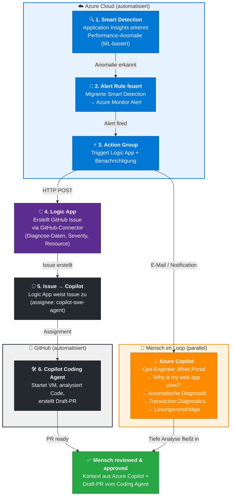

## 1. Root-Cause Analysis: Wo hört „netter Assistent, der ein bisschen Code schreibt" auf – und wo fängt das an, was Du meinst?

**Kernaussage:** Der Paradigmenwechsel liegt im **Datenraum**. GitHub Copilot arbeitet auf statischem Quellcode zur Entwicklungszeit. Azure Copilot arbeitet auf **Live-Telemetrie, Metriken, Logs und Alerts** zur Laufzeit — das ist eine völlig andere Dimension.

Konkret: Du sagst im Azure Portal "Warum ist meine Web-App langsam?" und [Azure Copilot](https://learn.microsoft.com/en-us/azure/copilot/troubleshoot-app-service) **wählt automatisch das richtige Diagnose-Tool**, führt Checks durch, identifiziert Ursachen und schlägt Lösungen vor. Das ist kein Autocomplete — das ist ein operativer Diagnostiker, der auf deine gesamte Infrastruktur schaut.

Der eigentliche Gamechanger ist **[Application Insights Transaction Diagnostics](https://learn.microsoft.com/en-us/azure/azure-monitor/app/transaction-search-and-diagnostics)**: Es zeigt dir eine End-to-End-Gantt-Chart, die einen Request vom Browser über Frontend, Backend bis zu Datenbank-Dependencies verfolgt — über Service-Grenzen hinweg. **[Smart Detection](https://learn.microsoft.com/en-us/azure/azure-monitor/alerts/proactive-diagnostics)** nutzt Machine Learning, um Failure Anomalies, Performance-Degradation und sogar Memory Leaks automatisch zu erkennen, bevor ein Mensch es merkt.

Also: "Netter Assistent" = Copilot schlägt dir in der IDE `async/await` statt Callbacks vor. **Was wir meinen** = Du hast einen Latenz-Spike in der Checkout-API, und die KI korreliert in Sekunden, dass das Problem eine veraltete Library ist, die bei 500 gleichzeitigen Requests eine Connection-Pool-Exhaustion verursacht — und zeigt dir die exakte Codezeile im Distributed Trace. **Von "ich vermute" zu "ich sehe".**

### End-to-End-Ablauf: Von Smart Detection bis zum automatisch bearbeiteten GitHub Issue

Der folgende Ablauf beschreibt, wie ein Performance-Problem **vollautomatisch** von der Erkennung in Azure über die Analyse bis hin zur Code-Bearbeitung durch den GitHub Copilot Coding Agent fließen kann — **ohne Azure DevOps**, rein über Azure Cloud + GitHub.

#### Ablauf in 6 Schritten



> **Warum ist Azure Copilot nicht im automatisierten Pfad?** Azure Copilot im Azure Portal ist ein **rein interaktives Tool** — es gibt keine API, um es programmatisch zu triggern. Es kann daher kein automatisierter Schritt sein. Stattdessen ist es der **parallele menschliche Analyse-Kanal**: Der Ops-Engineer erhält über die Action Group eine Benachrichtigung (E-Mail/SMS), öffnet das Portal und nutzt Azure Copilot, um die Ursache tiefgehend zu verstehen. Diese Erkenntnisse fließen dann in die **PR-Review** ein, wo der Mensch den automatisch generierten Fix des Coding Agent mit dem Diagnosewissen aus Azure Copilot bewertet.

#### Schritt 1: Smart Detection erkennt das Problem

[Smart Detection](https://learn.microsoft.com/en-us/azure/azure-monitor/alerts/proactive-diagnostics) in Application Insights läuft **vollständig automatisch** — keine manuelle Konfiguration nötig. Es analysiert die Telemetrie deiner App und erkennt per Machine Learning:

- **[Failure Anomalies](https://learn.microsoft.com/en-us/azure/azure-monitor/alerts/proactive-failure-diagnostics)**: Ungewöhnlicher Anstieg der Fehlerrate außerhalb des erwarteten Korridors
- **[Performance Anomalies](https://learn.microsoft.com/en-us/azure/azure-monitor/alerts/smart-detection-performance)**: Response-Time-Degradation, Dependency-Latenz-Verschlechterung im Vergleich zur historischen Baseline
- **[Memory Leaks](https://learn.microsoft.com/en-us/azure/azure-monitor/alerts/proactive-potential-memory-leak)**, **[Trace-Severity-Degradation](https://learn.microsoft.com/en-us/azure/azure-monitor/alerts/proactive-trace-severity)**, **[Exception-Volume-Anomalien](https://learn.microsoft.com/en-us/azure/azure-monitor/alerts/proactive-exception-volume)**

**Beispiel-Szenario:** Smart Detection erkennt, dass die Checkout-API plötzlich 3x langsamer antwortet als ihre 7-Tage-Baseline — eine "Response Latency Degradation".

#### Schritt 2: Smart Detection als Azure Monitor Alert Rule

Seit der [Migration von Smart Detection zu Alerts](https://learn.microsoft.com/en-us/azure/azure-monitor/alerts/alerts-smart-detections-migration) werden Smart-Detection-Erkennungen als vollwertige **Azure Monitor Alert Rules** behandelt. Für jede Detection-Art wird eine eigene Alert Rule erstellt:

| Smart Detection | Alert Rule Name |
|---|---|
| Degradation in Server Response Time | `Response Latency Degradation - <resource>` |
| Degradation in Dependency Duration | `Dependency Latency Degradation - <resource>` |
| Trace Severity Degradation | `Trace Severity Degradation - <resource>` |
| Abnormal Exception Volume | `Exception Anomalies - <resource>` |
| Memory Leak | `Potential Memory Leak - <resource>` |

> **Hinweis:** Die **Failure Anomalies**-Regel existiert bereits als Alert Rule und erfordert keine Migration.

Der Vorteil: Diese Alert Rules können mit **[Action Groups](https://learn.microsoft.com/en-us/azure/azure-monitor/alerts/action-groups)** verknüpft werden — und genau das ist der Schlüssel zur Automatisierung.

#### Schritt 3: Action Group triggert eine Logic App

Eine **Action Group** ist die Brücke zwischen dem Alert und der Automatisierung. Sie definiert, was passiert, wenn ein Alert feuert — E-Mail, SMS, Webhook, oder eben: **Logic App**.

Die Action Group wird so konfiguriert:
- **Action Type**: `Logic App`
- **Common Alert Schema**: `Yes` (damit hat die Logic App ein einheitliches JSON-Format mit `alertRule`, `severity`, `firedDateTime`, `alertTargetIDs`, `description` etc.)

#### Schritt 4 + 5: Logic App erstellt GitHub Issue und weist es Copilot zu

Die [Logic App](https://learn.microsoft.com/en-us/azure/azure-monitor/alerts/alerts-logic-apps) empfängt den Alert über einen **HTTP-Trigger** und nutzt den [GitHub-Connector](https://learn.microsoft.com/en-us/connectors/github/) (nativ in Logic Apps verfügbar), um:

**a) Ein GitHub Issue zu erstellen** (Action: `CreateIssue`):
- **Title**: z.B. `🔴 Performance Alert: Response Latency Degradation - checkout-api` (zusammengesetzt aus `alertRule` + `severity`)
- **Body**: Strukturierte Informationen aus dem Common Alert Schema:
  ```markdown
  ## Performance Alert
  **Severity:** Sev2
  **Alert Rule:** Response Latency Degradation - checkout-api
  **Fired:** 2026-04-22T14:32:00Z
  **Affected Resource:** /subscriptions/.../providers/microsoft.insights/components/checkout-api
  **Description:** Response time degradation detected. P95 latency increased from 120ms to 380ms.

  ### Nächste Schritte
  - Analysiere die Transaction Diagnostics im Azure Portal
  - Prüfe die Dependencies auf Latenz-Änderungen
  - Portal-Link: https://portal.azure.com/#@.../resource/.../diagnostics
  ```
- **Labels**: `performance`, `automated`, `aiops`

**b) Das Issue an Copilot zuweisen** (Action: `UpdateIssue` mit `assignees: ["copilot-swe-agent"]`):

Der Logic-App-Flow sieht so aus:
1. **Trigger**: "When a HTTP request is received" (Common Alert Schema)
2. **Action**: "Create an issue" (GitHub-Connector) → gibt `issueNumber` zurück
3. **Action**: "Update an Issue" (GitHub-Connector) → setzt `assignees` auf `copilot-swe-agent` und optional Labels

> **Alternativ ohne Logic App**: Die Action Group kann auch direkt einen **Webhook** an die [GitHub REST API](https://docs.github.com/en/rest/issues/issues#create-an-issue) senden (via Azure Function als Middleware, die das Alert-JSON in die GitHub-API-Struktur transformiert). Die Logic-App-Variante ist aber No-Code und in Minuten aufgesetzt.

#### Schritt 6: GitHub Copilot Coding Agent übernimmt

Sobald das Issue [Copilot zugewiesen](https://github.blog/news-insights/product-news/github-copilot-meet-the-new-coding-agent/) wird, passiert folgendes automatisch:

1. Der Agent reagiert mit einem 👀 Emoji auf das Issue
2. Er startet eine **sichere VM via GitHub Actions**, klont das Repo
3. Er analysiert die Codebase mittels **RAG (Retrieval Augmented Generation)** über GitHub Code Search
4. Er nutzt die Issue-Beschreibung (inkl. der Alert-Daten aus Azure), um den Kontext zu verstehen
5. Er erstellt einen **Draft-PR** mit Commits, Session-Logs und Reasoning-Steps
6. Er taggt den Entwickler zur **menschlichen Review**

**Sicherheits-Garantien:**
- Agent kann nur auf Branches pushen, die er selbst erstellt hat
- Der PR-Ersteller kann nicht selbst approven
- GitHub Actions laufen erst nach menschlicher Freigabe

### Was in Azure konfiguriert werden muss (Schritt-für-Schritt)

#### Voraussetzung: Application Insights aktiv

Die Web-App muss mit [Application Insights](https://learn.microsoft.com/en-us/azure/azure-monitor/app/app-insights-overview) instrumentiert sein (SDK oder Auto-Instrumentation). Smart Detection ist per Default aktiv, sobald genug Telemetrie fließt.

#### A. Smart Detection zu Alerts migrieren

1. **Azure Portal** → Application Insights Resource → **Investigate** → **Smart Detection**
2. Banner "Migrate smart detection to alerts (Preview)" anklicken
3. Optional: "Migrate all Application Insights resources in this subscription" aktivieren
4. Action Group auswählen oder Default nutzen → **Migrate**

> **CLI-Alternative:**
> ```bash
> az rest --method POST \
>   --uri /subscriptions/{subId}/providers/Microsoft.AlertsManagement/migrateFromSmartDetection?api-version=2021-01-01-preview \
>   --body '{"scope":["/subscriptions/{subId}/resourceGroups/{rg}/providers/microsoft.insights/components/{appInsights}"],"actionGroupCreationPolicy":"Auto"}'
> ```

#### B. Logic App erstellen

1. **Azure Portal** → Logic Apps → **Create** → Consumption (Multi-tenant)
2. **Trigger**: "When a HTTP request is received"
   - Request Body JSON Schema: [Common Alert Schema](https://learn.microsoft.com/en-us/azure/azure-monitor/alerts/alerts-common-schema) einfügen (enthält `schemaId`, `data.essentials.alertRule`, `severity`, `firedDateTime`, `alertTargetIDs`, `description`)
3. **Action 1**: GitHub → "Create an issue"
   - `repositoryOwner`: dein GitHub-Org/User
   - `repositoryName`: dein Repo
   - `title`: Dynamischer Inhalt aus `alertRule` + `severity`
   - `body`: Dynamischer Inhalt aus `description`, `firedDateTime`, `alertTargetIDs`
4. **Action 2**: GitHub → "Update an Issue"
   - `issueNumber`: Output von Action 1
   - `assignees`: `["copilot-swe-agent"]`
   - `labels`: `["performance", "automated", "aiops"]`

> **Wichtig:** Beim ersten Mal wirst du aufgefordert, dich bei GitHub zu authentifizieren. Die Logic App benötigt **write**-Berechtigungen auf das Ziel-Repository.

#### C. Action Group erstellen und mit Alert Rule verknüpfen

1. **Azure Portal** → Monitor → **Alerts** → **Action groups** → **Create**
2. **Actions Tab**:
   - Action Type: **Logic App**
   - Logic App: die eben erstellte auswählen
   - Common Alert Schema: **Yes**
3. **Save**
4. Zurück zu **Alert Rules** → die migrierten Smart Detection Rules öffnen → die neue Action Group zuweisen

#### D. GitHub-Repo vorbereiten

1. **Copilot Coding Agent aktivieren**: Repository Settings → Features → Copilot → "Copilot coding agent" aktivieren (erfordert Copilot Enterprise oder Pro+)
2. **`.github/copilot-instructions.md`** anlegen mit Kontext für den Agent:
   ```markdown
   # Copilot Instructions
   - Performance-Issues von Azure Smart Detection enthalten Alert-Daten im Issue-Body
   - Prüfe zuerst die in der Alert-Description genannten Endpoints und Dependencies
   - Erstelle einen Fix mit zugehörigem Unit Test
   - Füge eine PR-Summary hinzu, die den Alert-Kontext referenziert
   ```
3. Optional: **MCP-Server** konfigurieren (z.B. GitHub MCP Server), damit der Agent auf erweiterten Kontext zugreifen kann

### Azure Copilot als manueller Analyse-Schritt (Parallel-Pfad)

Zusätzlich zum automatisierten Flow kann ein Ops-Engineer den Alert auch **interaktiv mit Azure Copilot** analysieren:

1. **Azure Portal** → Die betroffene App Service Resource öffnen
2. **Azure Copilot** (Chat-Icon oben rechts) → Prompt: *"Why is my web app slow?"*
3. Azure Copilot wählt automatisch das richtige Diagnose-Tool (z.B. "Web App Slow" Detector) und führt Checks durch
4. Ergebnis: Potenzielle Ursachen + Lösungsvorschläge + Link zu den [Transaction Diagnostics](https://learn.microsoft.com/en-us/azure/azure-monitor/app/transaction-search-and-diagnostics)
5. Follow-up: *"Give me a summary of these diagnostics"* → Copilot fasst die Insights zusammen

Dieser manuelle Pfad ist **komplementär** zum automatisierten Flow — der Mensch bekommt die tiefe Diagnostik, während der Coding Agent parallel bereits am Fix arbeitet.

### Zusammenfassung: Was wo konfiguriert wird

| Komponente | Wo | Was |
|---|---|---|
| **Application Insights** | Azure Portal → App Insights | Telemetrie-Sammlung + Smart Detection (auto-aktiv) |
| **Smart Detection Migration** | App Insights → Smart Detection → Migrate | Smart Detection → Alert Rules konvertieren |
| **Logic App** | Azure Portal → Logic Apps | HTTP-Trigger → GitHub Issue erstellen → Copilot zuweisen |
| **Action Group** | Azure Monitor → Alerts → Action Groups | Verknüpft Alert Rule mit Logic App |
| **Alert Rules** | Azure Monitor → Alerts → Alert Rules | Smart Detection Rules + Action Group zuweisen |
| **GitHub Repo** | github.com → Settings | Copilot Coding Agent aktivieren + Instructions pflegen |

> **Kein Azure DevOps involviert.** Die gesamte Kette läuft über Azure Monitor → Logic Apps → GitHub REST API → GitHub Copilot Coding Agent. Der einzige "Mensch im Loop" ist das finale PR-Review.

---

## 2. Technical Debt ist oft politisch induziert: seid schneller, billiger. Hilft KI wirklich dagegen?

**Kernaussage:** Ja, ABER nur mit Guardrails — sonst macht KI das Problem sogar schlimmer. Die Daten sind hier differenziert.

**Pro-Seite (belastbare Studien):**
- [GitHubs kontrollierte Studie (Nov 2024, n=202)](https://github.blog/news-insights/research/does-github-copilot-improve-code-quality-heres-what-the-data-says/): Code mit Copilot hatte **53% höhere Wahrscheinlichkeit, alle Unit Tests zu bestehen**, +2,5% bessere Maintainability, +3,6% bessere Readability — alles statistisch signifikant.
- [Accenture Enterprise-Studie](https://github.blog/news-insights/research/research-quantifying-github-copilots-impact-in-the-enterprise-with-accenture/): **84% mehr erfolgreiche Builds** — also weniger kaputte Deployments, weniger "schnell was reinpushen und hoffen".
- [Copilot Code Review (60 Mio. Reviews, Stand März 2026)](https://github.blog/ai-and-ml/github-copilot/60-million-copilot-code-reviews-and-counting/) fängt fehlende Dependencies, Endlosschleifen und Anti-Patterns automatisch ab. Bei WEX: ~30% mehr Code shipped mit automatischem Review als Default.

**Contra-Seite (die man kennen muss):**
- **[DORA Gen AI Report](https://dora.dev/ai/gen-ai-report/)**: 25% mehr KI-Adoption korreliert mit **7,2% weniger Delivery Stability**. Warum? Die "Batch Size Trap" — KI erzeugt schneller mehr Code, der in größeren Batches reviewed werden muss. **Schnellere Codeerzeugung ohne disziplinierte kleine Batches untergräbt die Qualität.**
- **[Sonatype 2026](https://www.sonatype.com/state-of-the-software-supply-chain/introduction)**: LLMs halluzinieren nachweislich bei Dependency-Empfehlungen — sie schlagen **Versionen vor, die gar nicht existieren**. Zitat CTO Brian Fox: *"AI should not guess. AI-driven velocity will overwhelm any governance model built on 'we'll review it later.'"*

**Zum politischen Punkt:** Die [Daten zeigen](https://github.blog/news-insights/research/survey-ai-wave-grows/), dass Entwickler nach **Code-Quantität** gemessen werden (33%), aber glauben, sie sollten nach **Code-Qualität und Collaboration** gemessen werden. KI kann hier ein Hebel sein: Wenn du dem Management zeigst, dass Copilot Code Review automatisch Qualitätsprobleme flaggt, verschiebst du die Diskussion von "geht doch schneller" zu "geht schneller UND sauberer" — aber nur, wenn du die Guardrails (automatisierte Tests, kleine Batches, SCA/SBOM) mitlieferst. **KI löst das politische Problem nicht — aber sie gibt dir bessere Argumente.**

---

## 3. Altsysteme dokumentieren „im Vorbeigehen" ... hold my beer. Wie realistisch ist das?

**Kernaussage:** Realistisch für **inkrementelle** Dokumentation — unrealistisch für eine Architekturbibel aus dem Nichts. Der Trick liegt im "im Vorbeigehen".

**Was heute konkret geht:**
- **[PR-Summaries](https://docs.github.com/en/copilot/using-github-copilot/using-github-copilot-for-pull-requests/creating-a-pull-request-summary-with-github-copilot)**: Ein Klick auf das Copilot-Icon → strukturierte Zusammenfassung was sich warum geändert hat. Marginaler Mehraufwand: **null**. Das ist die Definition von "im Vorbeigehen".
- **Copilot Code Review**: Die automatischen Multi-Line-Comments erklären Code-Intent und dienen als lebende Dokumentation — bei jeder PR, automatisch.
- **`@workspace` in Copilot Chat**: Du kannst eine ganze Codebase befragen — "Wie funktioniert der Checkout-Flow?" — und bekommst eine zusammenhängende Erklärung. 60-71% der Entwickler sagen laut [GitHub Survey 2024](https://github.blog/news-insights/research/survey-ai-wave-grows/), KI macht es "einfach", eine bestehende Codebase zu verstehen.
- **Beim Fix gleich mitdokumentieren**: In Demo 2 unseres Talks machen wir genau das — der RCA-Fix wird abgeschlossen mit "Schreibe eine PR-Summary und aktualisiere die README für diesen Endpunkt." Das ist ein einziger Prompt, der 15 Minuten manuelle Doku ersetzt.

**Die ehrlichen Grenzen:**
1. **Tribal Knowledge**: Die KI kann erklären *was* Code tut, aber nicht *warum* jemand vor 5 Jahren die Business-Entscheidung getroffen hat, es so zu bauen. Das bleibt ein Mensch-Problem.
2. **Halluzinationsrisiko**: Die KI beschreibt manchmal selbstbewusst Verhalten, das nicht der Realität entspricht. **Human Review ist nicht optional.**
3. **Qualität variiert nach Sprache**: Python, C#, TypeScript → gut. COBOL, Delphi → deutlich schwieriger.
4. **Punkt-in-Zeit**: KI-Doku ist ein Snapshot. Ohne CI/CD-Integration veraltet sie genauso wie handgeschriebene Doku.

**Bottom Line:** "Im Vorbeigehen" heißt nicht "einmal drüber fliegen und fertig". Es heißt: **Jeder PR, jeder Bugfix, jedes Review hinterlässt ab jetzt eine Spur**. Nach 6 Monaten hast du eine überraschend gute Dokumentation — nicht weil jemand sich hingesetzt hat, sondern weil du die Dokumentation in den normalen Entwicklungsflow eingebaut hast. Das ist der realistische Anspruch.

---

---

## Real-World Beispiele: AIOps in der Praxis

### 1. Home Assistant: Copilot als Contributor im größten Open-Source Smart-Home-Projekt

Das [Home-Assistant/core](https://github.com/home-assistant/core) Projekt (75k+ Stars, 2.900+ offene Issues, 695+ PRs) nutzt GitHub Copilot aktiv als Code-Contributor und Reviewer:
- Das Repo hat eine dedizierte [`.github/copilot-instructions.md`](https://github.com/home-assistant/core/blob/dev/.github/copilot-instructions.md) mit Copilot-spezifischen Review-Regeln und Code-Richtlinien
- **Copilot committet direkt**: Der letzte Commit auf der copilot-instructions.md selbst kam von Copilot (Co-Author mit Gründer @balloob) — "Clarify Copilot review guidance for validated entity action inputs"
- Die Instructions definieren präzise, wann Copilot defensive Checks vorschlagen soll und wann nicht: *"Do not suggest extra defensive checks for input fields that are already validated by Home Assistant's service/action schemas"*
- Das Projekt nutzt zusätzlich Claude Code mit einer eigenen `.claude/skills/integrations/SKILL.md` für Integration-spezifisches Wissen

**Warum relevant für den Talk**: Das ist "Auto-Doc im Vorbeigehen" und "Governance mit Mensch im Loop" in Reinform — ein Projekt mit 3.000+ Issues setzt KI ein, aber mit klaren Leitplanken.

### 2. GitHub Copilot Coding Agent: Issues direkt an Copilot zuweisen

Seit Mai 2025 können [GitHub Issues direkt an Copilot zugewiesen](https://github.blog/news-insights/product-news/github-copilot-meet-the-new-coding-agent/) werden — genau wie an ein Teammitglied. Der Agent:
- Reagiert mit einem 👀 Emoji auf das Issue
- Startet eine **sichere VM via GitHub Actions**, klont das Repo, analysiert die Codebase per RAG
- Erstellt einen Draft-PR mit Commits, Session-Logs und Reasoning-Steps
- Reagiert automatisch auf Review-Kommentare und arbeitet Feedback ein

**Enterprise-Zitate:**
> *"The Copilot coding agent is opening up doors for human developers to have their own agent-driven team, all working in parallel to amplify their work."* — **James Zabinski, DevEx Lead bei EY**

> *"The GitHub Copilot coding agent fits into our existing workflow and converts specifications to production code in minutes."* — **Alex Devkar, SVP Engineering, Carvana**

**Security by Design**: Der Agent kann nur auf Branches pushen, die er selbst erstellt hat. Der PR-Ersteller kann nicht selbst approven. GitHub Actions laufen erst nach menschlicher Freigabe.

### 3. Java-Legacy-Modernisierung: Von Java 17 auf 21 per Agent Mode

Ein [dokumentiertes Step-by-Step-Beispiel von GitHub](https://github.blog/ai-and-ml/github-copilot/a-step-by-step-guide-to-modernizing-java-projects-with-github-copilot-agent-mode/) zeigt die komplette Modernisierung eines Legacy-Java-Projekts (Spring WebFlow):
1. Agent scannt JDK-Version, Build-Konfiguration, veraltete Dependencies und deprecated APIs
2. Erstellt einen editierbaren Upgrade-Plan
3. Führt Code-Transformationen mit OpenRewrite durch
4. Fixt Build-Fehler iterativ in einer Fix-and-Test-Loop
5. **Alle 1.177 Tests bestanden** nach dem automatisierten Upgrade
6. Automatischer CVE-Scan aller geänderten Dependencies
7. Migration zu Azure (Entra ID-Integration) inklusive

Konkretes Code-Beispiel:
```java
// Vorher (deprecated)
View view = this.resolver.resolveViewName("intro", new Locale("EN"));
// Nachher (Java 21)
View view = this.resolver.resolveViewName("intro", Locale.of("EN"));
```

**Warum relevant für den Talk**: Das ist exakt das "Modernisierung von Altsystemen" Thema — ein reales Legacy-Projekt, automatisch geupgraded, mit funktionierender Test-Suite.

### 4. Code Scanning Autofix: "Found Means Fixed"

[Copilot Autofix](https://github.blog/news-insights/product-news/found-means-fixed-introducing-code-scanning-autofix-powered-by-github-copilot-and-codeql/) (CodeQL + Copilot) behebt **mehr als zwei Drittel** aller gefundenen Security-Vulnerabilities automatisch:
- Deckt **90%+ der Alert-Typen** in JavaScript, TypeScript, Java und Python ab
- Generiert natürlichsprachige Erklärungen + Code-Fix-Vorschläge
- Kann Änderungen über mehrere Dateien und Dependencies hinweg vorschlagen
- GHAS-Teams remediieren damit **7x schneller** als mit traditionellen Security-Tools

**Warum relevant für den Talk**: Das verbindet RCA (Vulnerability gefunden) mit automatischem Fix — genau der Workflow aus eurem Demo-Szenario.

### 5. Peli's Agent Factory: Automatische Dokumentation als GitHub Agentic Workflows

Das beste dokumentierte Beispiel für "Auto-Doc im Vorbeigehen" kommt von GitHub selbst: [**Peli's Agent Factory**](https://github.github.com/gh-aw/blog/2026-01-13-meet-the-workflows-documentation/) (GitHub Agentic Workflows, Jan 2026) — ein System aus autonomen Agenten, die Dokumentation **kontinuierlich** pflegen:

| Workflow | Was er tut | Merge Rate |
|---|---|---|
| **Daily Documentation Updater** | Reviewt und aktualisiert Doku täglich auf Korrektheit | **96%** (57/59 PRs) |
| **Glossary Maintainer** | Hält Glossar synchron mit Codebase | **100%** (10/10 PRs) |
| **Documentation Unbloat** | Vereinfacht aufgeblähte Doku | **85%** (88/103 PRs) |
| **Documentation Noob Tester** | Testet Doku aus Anfänger-Perspektive | **43%** (9/21 PRs) |
| **Slide Deck Maintainer** | Hält Präsentationen aktuell | **40%** (2/5 PRs) |
| **Multi-device Docs Tester** | Testet Doku-Site per Playwright auf Mobile/Tablet/Desktop | **100%** (2/2 PRs) |
| **Blog Auditor** | Prüft Blogposts auf veraltete Code-Beispiele und broken Links | 6 Audits (5 passed, 1 flagged) |

**Key Insights:**
- Der Glossary Maintainer fand **Terminologie-Drift**: *"We're using three different terms for the same concept"* — exakt das Problem in Legacy-Systemen
- Der Noob Tester erzeugt eine **Kausalkette**: 62 Diskussionen analysiert → 21 Issues → 21 PRs → 9 gemergt. Die niedrigere Merge Rate reflektiert den explorativen Charakter
- Alle Workflows laufen **autonom als GitHub Actions** — kein manueller Trigger nötig
- Können per `gh aw add-wizard` in jedes Repo installiert werden

**Warum das Killer-Beispiel für den Talk ist**: Das beweist "Altsysteme dokumentieren im Vorbeigehen" auf Enterprise-Level. Es zeigt auch die Governance-Seite — 85-96% Merge Rate heißt: die Agenten produzieren brauchbare Doku, aber ein Mensch entscheidet immer noch.

### 6. Copilot Code Review: 60 Mio. Reviews, automatisch bei jedem PR

[Stand März 2026](https://github.blog/ai-and-ml/github-copilot/60-million-copilot-code-reviews-and-counting/): Über **12.000 Organisationen** nutzen Copilot Code Review automatisch auf jedem PR:
- **>1 von 5 Code Reviews** auf GitHub wird von Copilot durchgeführt
- In **71% der Reviews** liefert es actionable Feedback; in 29% schweigt es (Stille > Rauschen)
- **WEX Case Study**: ~30% mehr Code shipped, zwei Drittel der Entwickler nutzen es aktiv
- Fängt: fehlende Dependencies, Endlosschleifen, Style-Issues, Logik-Bugs

**Warum relevant für den Talk**: Das ist "Governance: Der Mensch im Loop" — automatisiertes Review als erste Verteidigungslinie gegen neuen Technical Debt.

---

**Bonus-Zahlen für's Interview**, falls du punkten willst:
- 97%+ der Entwickler nutzen KI-Tools bei der Arbeit ([GitHub Survey 2024](https://github.blog/news-insights/research/survey-ai-wave-grows/))
- 60 Mio. Copilot Code Reviews durchgeführt ([Stand März 2026](https://github.blog/ai-and-ml/github-copilot/60-million-copilot-code-reviews-and-counting/))
- Organisationen mit klarer KI-Acceptable-Use-Policy: **451% mehr KI-Adoption** ([DORA 2025](https://dora.dev/ai/))
- Transparenter Umgang mit Job-Displacement-Ängsten → **125% mehr Team-Adoption** ([DORA 2025](https://dora.dev/ai/))