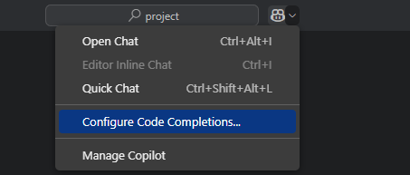
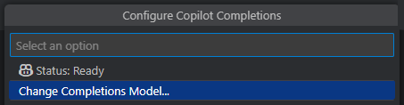
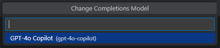

# GitHub Copilot Completions

---
level: 2
---

# GitHub Copilot Completions

Copilot automatically offers suggestions to complete your code, comments, tests, and more

 

<v-click>

## Code completions

While typing Copilot provides code suggestions that match your coding style and take your existing code into account

</v-click>

 

<v-click>

## Next Edit Suggestions

Predict your next code edit with **Copilot Next Edit Suggestions**

 

Settings in `settings.json`

`"github.copilot.nextEditSuggestions.enabled": true`

</v-click>

<!--
Copilot provides two kinds of suggestions

[click]
Code completions

[click]
Next Edit Suggestions

💡 Paste links in chat:

- [Code completions with GitHub Copilot in VS Code](https://code.visualstudio.com/docs/copilot/ai-powered-suggestions)

ℹ️ _NES_ are kind of refactoring feature based on LLM  
⚠️ _NES_ may interfere with the completions
-->

---
layout: image-right
background: /code-right.png
backgroundPosition: right
title: GitHub Copilot Completions Demo
level: 2
---

  <h1>GitHub Copilot Completions Demo</h1>

<!-- The empty clicks are only for the presenter mode to switch between the demos -->
<v-click>
  
</v-click>

<v-click>
  
</v-click>

<v-click>
  
</v-click>

<v-click>
  
</v-click>

<v-click>
  
</v-click>

<v-click>
  
</v-click>

<v-click>
  
</v-click>

<v-click>
  
</v-click>

<!--
Use the [Copilot bootcamp repo ](https://github.com/xebia/Copilot-Bootcamp-ForEndUsers) for these demos

⚠️ Disable **Next Edit Suggestions** as they may interfere with the completions

💡 Use the `PlanesController.cs` class for the demo

[click]
**Context suggestions**

- Place the cursor at the bottom after the `SetupPlanesData()` function, press `Enter`
- GitHub Copilot will automatically suggest the `[HttpPut(“{id}")]` method
- Accept the suggestion by pressing `Tab` to accept this attribute
- Press `Enter`, Copilot will now automically suggest the code for this method, press `Tab` to accept

[click]
**Inline suggestions**

- Start typing _private void CreateOr_  
- The method signature should be suggested

[click]
**Generate suggestions from code comments**

- Use the comment  
  _// create a private function to create or update a plane_
- Press `Enter`  
- ⚠️ Wait for the response

💡Show the differences using the following comment

- Use the comment  
  _// create a private function to create or update a plane by using all properties_
- Press `Enter`  
- ⚠️ Wait for the response

ℹ️ Sometimes the prompt must be adjusted to get the expected result

[click]
**Suggestions**

- Go to the `Planes` list definition  
- After the last item add `,` and press `Enter`  
- ⚠️ Wait for the response

[click]
**Suggestions Tab**  
⚠️ **IMPORTANT:**  
Check if the key binding (`github.copilot.generate`) for the `Ctrl + Enter` shortcut is set.

- Go to the `Planes` list definition  
- After the last item add `,` and press `Ctrl + Enter`

[click]
**Inline Chat**

- Go to the `Planes` list definition  
- After the last item add `,` and press `Ctrl + I`  
- Add comment into the Inline Chat  
  _add additional planes using historical data of the wright brothers_

[click]
**Chat Window**

- Go to the `Planes` list definition  
- After the last item add `,` and press `Ctrl + Alt + I`  
- Add comment into the Inline Chat  
  _add additional planes using historical data of the wright brothers_

[click]
**Next Edit Suggestions**

💡 Check if the setting is enabled

- Go to the `public class PlanesController` definition  
- Add `Abc` after the class name  
- ⚠️ Wait for the response

ℹ️ _NES_ for the constructor and the `_logger` should be provided
-->

---
layout: image-left
background: /pilot-1-left.png
level: 2
---

# Tip: Change Copilot Completions Model

 

 

<!--
Default model for Copilot Completions is **GPT-4o**. Nevertheless the model can be changed.
-->

