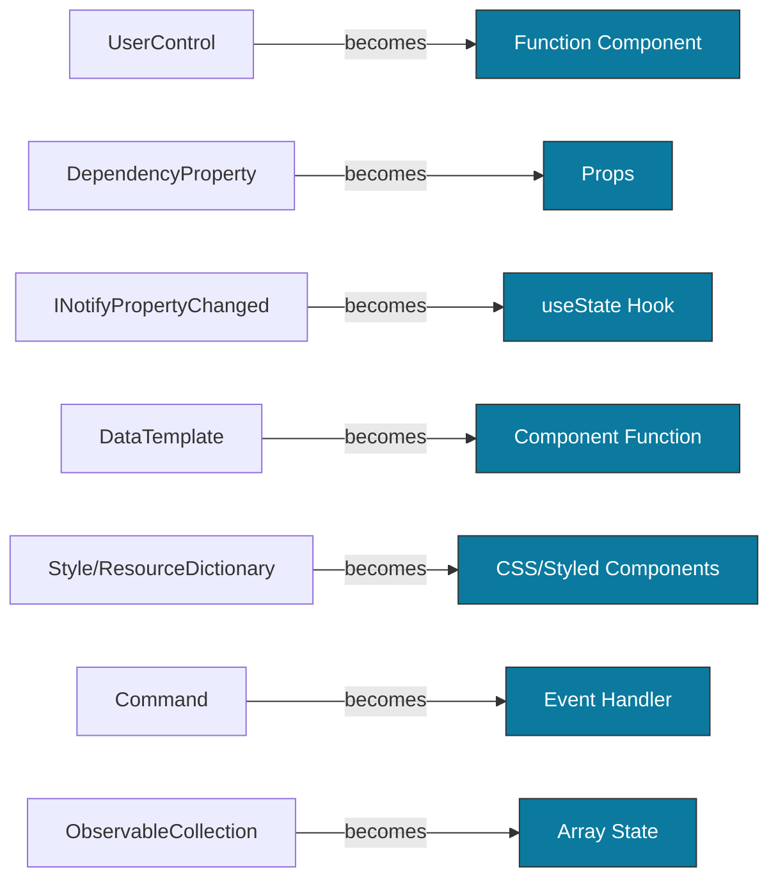

# Microsoft's Web UI Technology
## Is It React?


<!-- 
Regardless of whether it's SharePoint, Power Platform, or a new Office 365 application (Teams, Outlook, etc.), Microsoft uses React for new web or hybrid applications.

So, why not bet on the same horse?

When modernizing a legacy Windows desktop application, developers are confronted with a multitude of web technologies and different programming paradigms for the front-end. By selecting the appropriate web technologies and frameworks, Windows developers can avoid the necessity of mastering demanding technologies like CSS.

This presentation offers a brief overview and practical guidance on the knowledge that Windows developers can easily transfer, as well as the main differences when developing a front-end for the web. Using React and the Material-UI framework, participants will be shown the essential differences and how they can largely avoid tedious topics like CSS.

By the end of this session, former Windows developers will have knowledge of a fundamental set of technologies at hand to start building a web front-end.
-->

---
title: Speaker
layout: intro
src: special-slides/speaker.md
---

---
src: /special-slides/msWebUiReact/timeline.md
---

---
layout: default
title: Agenda
hideInToc: true
---

<h1 class="h-auto!"> Agenda </h1>

<div class="ml-16">

<Toc minDepth="1" maxDepth="1"/>

</div>

<!-- 
Standard agenda slide showing the main chapter-darks of the presentation
-->

---
layout: image-right
background: /msWebUiReact-crossroads.jpg
backgroundSize: contain
hideInToc: true
---

# The Crossroads

<v-clicks>

- SharePoint → **React**
- Power Platform → **React**  
- Teams → **React**
- Outlook (new) → **React**
- Office Add-ins → **React**

</v-clicks>

<v-click>

## The Question

If Microsoft bets on React...

**Should you?**

</v-click>

<!-- 
This slide introduces the central paradox: Microsoft, known for its own frameworks, has standardized on React for its modern web applications. This sets up the core question of the presentation.

AI Image Prompt: A crossroads with multiple technology paths converging into one modern web path, featuring subtle React and Microsoft logos. Style: clean, professional, blue/purple gradient, similar to pilot-large.jpg
-->

---
layout: image-right
background: /msWebUiReact-timeline.jpg
backgroundSize: contain
---

# The Evolution Timeline

## Desktop Era (1990s-2000s)
<v-clicks>

- **1992**: MFC (C++ wrapper)
- **1993**: Win32 API
- **2002**: Windows Forms
- **2006**: WPF (XAML revolution)
- **2007**: Silverlight (web dreams)

</v-clicks>

## Modern Era (2010s-2020s)
<v-clicks>

- **2014**: Xamarin.Forms
- **2015**: UWP (Universal Windows)
- **2018**: WinUI 2, Blazor
- **2021**: WinUI 3
- **2022**: .NET MAUI

</v-clicks>

<!-- 
This timeline shows Microsoft's 30+ year journey in UI technologies, from desktop-first to modern cross-platform approaches. Notice the acceleration of new frameworks in recent years.

AI Image Prompt: A timeline visualization showing evolution from desktop windows to web browsers and mobile devices, with technology icons along a flowing path. Style: infographic, professional, blue gradient.
-->

---
layout: image-right
background: /msWebUiReact-desktop-kings.jpg
backgroundSize: contain
hideInToc: true
---

# The Desktop Kings

## Windows Forms (2002)
<v-clicks>

- Drag & drop designer
- Event-driven model
- **RAD** development
- Legacy but still used
- .NET Framework/Core

</v-clicks>

## WPF (2006)
<v-clicks>

- **XAML**-based UI
- Data binding magic
- MVVM pattern
- DirectX acceleration
- Still actively maintained

</v-clicks>

<!--
Abscract: 
Windows Forms and WPF dominated desktop development for nearly two decades. WPF introduced concepts (XAML, data binding, MVVM) that influenced all subsequent Microsoft UI frameworks.

AI Image Prompt: Split image showing classic Windows desktop applications on left transitioning to modern UI on right. Style: professional, clean, corporate blue tones.
-->

---
layout: image-right
background: /msWebUiReact-mobile-push.jpg
hideInToc: true
---

# The Web Attempts

## Silverlight (2007-2021)
<v-clicks>

- Browser plugin
- WPF for the web
- Used by Netflix
- **Discontinued** ⚰️
- HTML5 won

</v-clicks>

## ASP.NET Web Forms
<v-clicks>

- Desktop-like web dev
- ViewState complexity
- Server-centric
- Legacy now
- Replaced by MVC/Razor

</v-clicks>

<!-- 
Microsoft's early web attempts tried to bring desktop paradigms to the web. Both ultimately failed because they fought against web standards rather than embracing them. This taught Microsoft important lessons.
-->

---
layout: image-right
background: /msWebUiReact-mobile-push.jpg
hideInToc: true
---

# The Mobile Push

## UWP (2015)
<v-clicks>

- Universal Windows Platform
- Write once, run on Win10/11, Xbox, HoloLens
- Windows Store apps
- XAML-based
- Transitioning to WinUI 3

</v-clicks>

## Xamarin.Forms (2014-2024)
<v-clicks>

- True cross-platform mobile
- iOS, Android, Windows
- C# + XAML
- **Sunset May 2024** 
- Evolved into .NET MAUI

</v-clicks>

<!-- 
UWP aimed for Windows ecosystem universality, while Xamarin.Forms tackled true cross-platform mobile. Both laid groundwork for modern solutions but had limitations.

AI Image Prompt: Devices (desktop, tablet, phone, Xbox) connected in a network showing unified application. Style: modern, tech, blue/purple gradient.
-->

---
layout: image-right
background: /msWebUiReact-winui3.jpg
backgroundSize: contain
---

# WinUI 3: Windows Native

<v-clicks>

- **Launched**: 2021
- **Platform**: Windows 10/11
- **Language**: C#, C++
- **Architecture**: MVVM
- **Rendering**: DirectX 12
- **Design**: Fluent Design

</v-clicks>

<v-clicks>

## Use Cases
- Modern Windows apps
- High-performance desktop
- Native Windows 11 experiences
- Gaming launchers
- Enterprise tools

</v-clicks>

<!-- 
WinUI 3 is Microsoft's recommended framework for modern Windows desktop applications. It's the evolution of UWP with better flexibility and performance.

AI Image Prompt: Modern Windows 11 application window with Fluent Design elements, translucent effects, and smooth animations. Style: clean, professional, Windows 11 aesthetic.
-->

---
layout: image-right
background: /msWebUiReact-winui3.jpg
backgroundSize: contain
hideInToc: true
---

# WinUI 3: Developer Perspective

## Strengths
<v-clicks>

- **Native performance**
- Hardware acceleration
- Fluent Design built-in
- Familiar to WPF devs
- Strong VS tooling

</v-clicks>

## Challenges
<v-clicks>

- **Windows-only**
- Steeper learning curve
- XAML complexity
- Smaller community
- Desktop paradigm only

</v-clicks>

<!-- 
For Windows developers, WinUI 3 feels familiar but is limited to Windows. This single-platform limitation is critical when considering web alternatives.
-->

---
layout: image-right
background: /msWebUiReact-maui.jpg
backgroundSize: contain
---

# .NET MAUI: True Cross-Platform

<v-clicks>

- **Launched**: 2022
- **Platform**: Windows, macOS, iOS, Android, Tizen
- **Language**: C# + XAML
- **Architecture**: MVVM, Handlers
- **One codebase**: 90%+ sharing

</v-clicks>

<v-clicks>

## Use Cases
- Mobile-first apps
- Desktop + mobile
- Enterprise internal tools
- Cross-platform utilities
- Hybrid with Blazor

</v-clicks>

<!-- 
.NET MAUI is the evolution of Xamarin.Forms, offering true write-once, run-anywhere capability across desktop and mobile platforms.

AI Image Prompt: Single codebase branching to multiple devices (Windows laptop, Mac, iPhone, Android phone) with connecting lines. Style: modern, technical diagram, blue/purple gradient.
-->

---
layout: image-right
background: /msWebUiReact-maui.jpg
backgroundSize: contain
hideInToc: true
---

# .NET MAUI: Developer Perspective

## Strengths
<v-clicks>

- **Truly cross-platform**
- Native controls
- Blazor Hybrid support
- Familiar XAML
- Single project structure

</v-clicks>

## Challenges
<v-clicks>

- Mobile paradigms required
- Need macOS for iOS builds
- Young ecosystem
- Performance tuning needed
- **Not for web browsers**

</v-clicks>

<!-- 
MAUI solves cross-platform desktop and mobile, but doesn't address web deployment - a critical gap for many modernization scenarios.
-->

---
layout: image-right
background: /msWebUiReact-blazor.jpg
backgroundSize: contain
---

# Blazor: C# for the Web

<v-clicks>

- **Launched**: 2018-2020
- **Platform**: Web browsers
- **Language**: C# + Razor
- **Models**: Server, WebAssembly, Hybrid
- **Paradigm**: Component-based

</v-clicks>

<v-clicks>

## Use Cases
- Full-stack web apps
- SPAs
- Progressive Web Apps
- Admin dashboards
- Hybrid desktop/mobile (via MAUI)

</v-clicks>

<!-- 
Blazor is Microsoft's answer to React/Angular/Vue, allowing C# developers to build web applications without JavaScript.

AI Image Prompt: Browser window showing modern web application with C# code transforming into web UI. Style: modern, tech-focused, blue/purple gradient with code snippets.
-->

---
layout: image-right
background: /msWebUiReact-blazor.jpg
backgroundSize: contain
hideInToc: true
---

# Blazor: Developer Perspective

## Strengths
<v-clicks>

- **C# in the browser**
- No JavaScript required
- Full .NET ecosystem
- Strong typing
- Familiar to C# devs
- Multiple hosting models

</v-clicks>

## Challenges
<v-clicks>

- Larger initial payload (WASM)
- Web concepts still needed
- Smaller community vs React
- CSS still required
- Limited component libraries

</v-clicks>

<!-- 
Blazor lets Windows developers use C#, but it still requires understanding web paradigms and doesn't eliminate CSS complexity.
-->

---
layout: chapter-dark
---

# Modern Microsoft UI & React
## Strategic Technologies Comparison

<!-- 
chapter-dark divider covering Microsoft's current UI frameworks (WinUI 3, .NET MAUI, Blazor) and the strategic comparison with React
-->

---
layout: default
title: Technology Comparison Matrix
---

<h1 class="h-auto!"> Technology Comparison Matrix </h1>

| Aspect | WinUI 3 | .NET MAUI | Blazor | React |
|--------|---------|-----------|--------|-------|
| **Platform** | Windows only | Desktop + Mobile | Web + Hybrid | Web (+ Native) |
| **Language** | C#/XAML | C#/XAML | C#/Razor | JavaScript/TypeScript |
| **Paradigm** | MVVM | MVVM | Component | Component |
| **Community** | Small | Growing | Growing | **Massive** |
| **Jobs** | Limited | Limited | Growing | **Abundant** |
| **Libraries** | Moderate | Moderate | Limited | **Vast** |
| **Browser Support** | ❌ | ❌ | ✅ | ✅ |

<!-- 
This comparison shows the strategic advantages of React: massive community, abundant jobs, vast ecosystem, and universal browser support.
-->

---
layout: image-right
background: /msWebUiReact-microsoft-react.jpg
---

# Why Microsoft Uses React

## The Evidence
<v-clicks>

- **SharePoint Framework**: React + TypeScript
- **Teams**: React frontend
- **Outlook**: React rewrite
- **Power Platform**: React controls
- **Fluent UI**: React components

</v-clicks>

## The Reasons
<v-clicks>

- **Ecosystem size**
- Developer availability
- Community support
- Proven at scale
- Cross-team collaboration
- Industry standard

</v-clicks>

<!-- 
Microsoft's own products prove React's superiority for web applications. When even Microsoft chooses React over its own frameworks, that's a powerful signal.

AI Image Prompt: Microsoft product logos (SharePoint, Teams, Outlook, Power Platform) connected to React logo in center. Style: professional, corporate, blue theme with connecting lines.
-->

---
title: React Component Basics
layout: image-right
background: /msWebUiReact-demo1.jpg
---

<h1 class="h-auto!"> React Component Basics </h1>


```tsx
import React from 'react';

interface ShipProps {
  name: string;
  containers: number;
}

const Ship: React.FC<ShipProps> = 
  ({ name, containers }) => {
    return (
        <div className="ship-card">
        <h2>{name}</h2>
        <p>Containers: {containers}</p>
        </div>
    );
};
```

<v-click>

**Key Concepts**: TypeScript props, functional components, JSX syntax

</v-click>

<!-- 
Demo Instructions:
1. Show simple functional component with TypeScript
2. Explain props vs WPF dependency properties
3. Compare to XAML UserControl
4. Highlight similarities: typed props, composition
5. Show in browser DevTools

AI Image Prompt: Code editor showing React component with browser preview side by side. Style: modern, clean, developer-focused with code syntax highlighting.
-->

---
title: Fluent UI Integration
layout: image-right
background: /msWebUiReact-fluent-ui.jpg
hideInToc: true
---

<h1 class="h-auto!"> Fluent UI Integration </h1>

<v-click>

````md magic-move
```tsx
import { Button, Card } from '@fluentui/react-components';
```

```tsx
import { Button, Card } from '@fluentui/react-components';

const ShipCard = ({ ship }) => {
  return ( );
};
```

```tsx
import { Button, Card } from '@fluentui/react-components';

const ShipCard = ({ ship }) => {
  return (
    <Card>
      <h3>{ship.name}</h3>
      <p>Capacity: {ship.capacity} TEU</p>
      <Button appearance="primary" onClick={() => alert('Loaded!')}>
        Load Ship
      </Button>
    </Card>
  );
};
```
```` 

</v-click>

<v-click>

**No CSS required!** Fluent UI provides styled components.

</v-click>

<!-- 
Demo Instructions:
1. Show Fluent UI component library (Storybook)
2. Demonstrate component usage without CSS
3. Compare to XAML controls
4. Show theming capabilities
5. Explore Fluent UI documentation

AI Image Prompt: Fluent UI component library showcase with various buttons, cards, and controls in Microsoft's design language. Style: clean, modern, Windows 11 aesthetic.
-->

---
title: React State Management
layout: image-right
background: /msWebUiReact-state-management.jpg
hideInToc: true
---

<h1 class="h-auto!"> React State Management </h1>

````md magic-move
```tsx

import { useState } from 'react';

const ShipCounter = () => {
  let count = 0;
  
  return (
    <div>
      <h2>Ships Loaded: {count}</h2>
      <button onClick={() => count += 1}>
        Load Another Ship
      </button>
    </div>
  );
};
```

```tsx

import { useState } from 'react';

const ShipCounter = () => {
  const [count, setCount] = useState(0);
  
  return (
    <div>
      <h2>Ships Loaded: {count}</h2>
      <button onClick={() => setCount(count + 1)}>
        Load Another Ship
      </button>
    </div>
  );
};
```
```` 

<v-click>

**Similar to**: `INotifyPropertyChanged` but simpler!

</v-click>

<!-- 
Demo Instructions:
1. Show useState hook in action
2. Compare to WPF INotifyPropertyChanged
3. Demonstrate component re-rendering
4. Show React DevTools
5. Explain one-way data flow vs two-way binding

AI Image Prompt: Split screen showing React useState code on left and WPF XAML/C# code on right with arrows showing data flow. Style: educational, technical diagram.
-->

---
layout: image-right
background: /msWebUiReact-transfers.jpg
---

# What Transfers Directly

## Programming Concepts
<v-clicks>

- **Object-oriented thinking**
- Component composition
- Event handling
- Async/await patterns
- Dependency injection
- Testing practices

</v-clicks>

## With TypeScript
<v-clicks>

- **Strong typing**
- Interfaces
- Classes
- Generics
- Null safety
- IDE IntelliSense

</v-clicks>

<!-- 
Windows developers have many transferable skills. TypeScript especially makes React feel familiar to C# developers.

AI Image Prompt: Bridge connecting desktop window to web browser with labeled concepts crossing over. Style: infographic, professional, blue/purple gradient.
-->

---
layout: two-column
---

# The Paradigm Shifts

::left::

## Desktop (XAML) Mindset
<v-clicks>

- Two-way data binding
- Complex state trees
- Imperative commands
- Control templates
- Design-time tools
- Click-drag designers

</v-clicks>

::right::

## React Mindset
<v-clicks>

- **One-way data flow**
- Component state
- Declarative UI
- Composition > inheritance
- Code-first design
- Props down, events up

</v-clicks>

<!-- 
The biggest mental shift is from imperative, stateful UI to declarative, functional components. This requires unlearning some desktop habits.
-->

---
layout: default
title: Concept Mapping XAML → React
---

<h1 class="h-auto!"> Concept Mapping: XAML → React </h1>

<div class="flex justify-center text-2xl">



</div>

<!-- 
Visual mapping of familiar XAML concepts to their React equivalents. This helps Windows developers find their bearings in React.
-->

---
layout: image-right
background: /msWebUiReact-css-challenge.jpg
---

# The CSS Challenge

## The Problem
<v-clicks>

- Different mental model
- Browser quirks
- Layout complexity
- Responsive design
- Specificity rules

</v-clicks>

## The Solutions
<v-clicks>

- **Fluent UI** components
- **Material-UI** (MUI)
- CSS-in-JS libraries
- Tailwind CSS
- Component libraries
- Let designers handle it!

</v-clicks>

<!-- 
CSS is often cited as the biggest hurdle for Windows developers. Component libraries like Fluent UI and Material-UI solve this by providing pre-styled, accessible components.

AI Image Prompt: Tangled CSS code on left transforming into clean component library UI on right. Style: before/after, humorous but professional.
-->

---
layout: two-column
---

# Component Libraries Comparison

::left::

## Fluent UI (Microsoft)
<v-clicks>

- Microsoft's design language
- Office 365 look & feel
- React, Web Components
- TypeScript-first
- Active development
- Enterprise-ready

</v-clicks>

::right::

## Material-UI (MUI)
<v-clicks>

- Google's Material Design
- Larger community
- More components
- Extensive docs
- Free + Pro versions
- Industry standard

</v-clicks>

<!-- 
Both libraries eliminate most CSS work. Fluent UI aligns with Microsoft products, while Material-UI offers broader community and components.
-->


---
layout: image-right
background: /msWebUiReact-tooling.jpg
backgroundSize: contain
---

# Tooling & Ecosystem

## Development Tools
<v-clicks>

- **VS Code** (not Visual Studio!)
- React DevTools
- npm/yarn package managers
- Vite/Create React App
- ESLint/Prettier
- Git workflows

</v-clicks>

## Key Libraries
<v-clicks>

- **React Router** (navigation)
- Axios/Fetch (HTTP)
- React Query (data fetching)
- Formik/React Hook Form
- Jest/React Testing Library
- Storybook (component dev)

</v-clicks>

<!-- 
The JavaScript ecosystem is vast. Start with the essentials: VS Code, React DevTools, and a few key libraries. Add others as needed.

AI Image Prompt: Toolbox with modern developer tools icons (VS Code, React, npm, Git) arranged professionally. Style: flat design, colorful but professional.
-->

---
layout: two-column
hideInToc: true
---

# Project Structure Comparison

::left::

## WPF/WinUI Project
```
📁 MyApp/
  ├── 📁 Views/
  │   ├── 📄 MainWindow.xaml
  │   └── 📁 UserControls/
  ├── 📁 ViewModels/
  ├── 📁 Models/
  ├── 📁 Services/
  └── 📄 App.xaml
   
```

::right::

## React Project
```
📁 my-app/
  ├── 📁 src/
  │   ├── 📁 components/
  │   │   ├── 📄 Ship.tsx
  │   │   └── 📄 ShipList.tsx
  │   ├── 📁 hooks/
  │   ├── 📁 services/
  │   └── 📄 App.tsx
  └── 📄 package.json
```

<!-- 
Project structure is similar conceptually: separate UI from logic, organize by feature or type. React projects are typically flatter and less ceremony.
-->

---
layout: two-column
background: /error-failed.png
backgroundSize: contain
---

# Common Pitfalls & Solutions

::left::

## Common Mistakes
<v-clicks>

- Trying to use two-way binding
- Over-engineering state
- Fighting CSS instead of using libraries
- Not using TypeScript
- Ignoring functional patterns
- Over-componentizing

</v-clicks>

::right::

## Best Practices
<v-clicks>

- **Embrace one-way data flow**
- Keep state minimal
- Use component libraries
- TypeScript from day 1
- Think in components
- Composition over complexity

</v-clicks>

<!-- 
Avoid trying to recreate XAML patterns in React. Embrace React's functional, declarative approach for better results.
-->

---
layout: chapter-dark
---

# Practical Guidance & Modernization
## From Windows Developer to React Developer

<!-- 
chapter-dark divider covering the transition from Windows development to React and practical modernization strategies
-->

---
layout: default
---

# Migration Strategies

## Big Bang Rewrite
<v-clicks>

- ❌ High risk
- ❌ Long timeline
- ❌ No incremental value
- ✅ Clean architecture
- **Rarely recommended**

</v-clicks>

## Incremental Approach
<v-clicks>

- ✅ Lower risk
- ✅ Continuous delivery
- ✅ Learn as you go
- ✅ Parallel systems
- **Recommended path**

</v-clicks>

<!-- 
Avoid big-bang rewrites. Incremental migration allows learning, reduces risk, and delivers value continuously.
-->


---
layout: two-column
hideInToc: true
---

# Hybrid Approaches

::left::

## WebView in Desktop
<v-clicks>

- Embed React in WPF/WinForms
- WebView2 control
- Gradual transition
- Share authentication
- **Good for prototyping**
</v-clicks>

::right::

## Blazor Hybrid
<v-clicks>

- Keep C# skills
- Gradual web learning
- MAUI + Blazor
- Desktop + Web
- **Bridge solution**

</v-clicks>

<!-- 
Hybrid approaches allow gradual transition. WebView2 lets you embed React in existing apps. Blazor Hybrid keeps C# while learning web concepts.
-->

---
layout: image-right
background: /msWebUiReact-decision-tree.jpg
backgroundSize: contain
---

# Technology Selection Decision Tree

## Choose WinUI 3 if:
<v-clicks>

- Windows-only forever
- Need native performance
- Desktop paradigm fits
- Existing WPF investment

</v-clicks>

## Choose .NET MAUI if:
<v-clicks>

- Need mobile + desktop
- Prefer C#/XAML
- Internal enterprise apps
- Can avoid web browsers

</v-clicks>

## Choose Blazor if:
<v-clicks>

- Want to stay in C#
- Learning web gradually
- Small team, one language
- Accept smaller ecosystem

</v-clicks>

## Choose React if:
<v-clicks>

- **Web-first application**
- **Need largest ecosystem**
- **Want abundant hiring pool**
- **Following Microsoft's lead**

</v-clicks>

<!-- 
Decision framework: For web applications, React is the strategic choice. For desktop-only or mobile, Microsoft frameworks may fit. For most modernization scenarios, React wins.

AI Image Prompt: Decision tree diagram with technology choices branching based on requirements. Style: clean flowchart, professional, blue/purple theme.
-->

---
layout: two-column
---

# Success Metrics

::left::

## Technical Metrics
<v-clicks>

- Developer velocity
- Bug rates
- Performance benchmarks
- Bundle size
- Load times
- Code maintainability

</v-clicks>

::right::

## Business Metrics
<v-clicks>

- Time to market
- Hiring success
- Team satisfaction
- Cost per feature
- Browser compatibility
- User adoption

</v-clicks>

<!-- 
Track both technical and business metrics. React's ecosystem advantages often show up in hiring speed and developer velocity.
-->

---
layout: chapter-dark
---

# Summary & Takeaways

<!-- 
chapter-dark divider for summary and key takeaways from the presentation
-->

---
layout: image-right
background: /msWebUiReact-summary.jpg
---

# Key Takeaways

## Microsoft's Journey
<v-clicks>

- 30+ years of UI evolution
- From desktop-only to web-first
- **Microsoft itself uses React**
- Blazor is great, but niche
- Ecosystem matters

</v-clicks>

## For Windows Developers
<v-clicks>

- Many skills transfer
- TypeScript feels like C#
- Component libraries save you
- CSS avoidable with Fluent/MUI
- **React is strategic choice**

</v-clicks>

<!-- 
The evidence is clear: Microsoft's own products prove React's superiority for web applications. Windows developers can successfully transition with the right approach.

AI Image Prompt: Summary visualization with key points radiating from center, professional infographic style. Include React, Microsoft, and developer icons. Style: clean, professional, blue/purple gradient.
-->


---
layout: image-right
background: /msWebUiReact-strategic-answer.jpg
hideInToc: true
---

# The Strategic Answer

## "Is It React?"

<v-clicks>

### For Microsoft: **Yes**
- SharePoint
- Teams  
- Outlook
- Power Platform
- Office 365

</v-clicks>

## For You?

<v-clicks>

### **Probably Yes**
- If building for web
- If modernizing legacy
- If hiring matters
- If ecosystem matters
- **If following best practices**

</v-clicks>

<!-- 
The title question answered: Microsoft uses React for web, and you probably should too. The evidence, ecosystem, and strategic advantages are compelling.

AI Image Prompt: Large stylized question mark transforming into checkmark, with React logo integrated. Style: bold, professional, gradient blue/purple.
-->

---
layout: quote
---

# "The best UI framework is the one that helps you ship products users love."

<div class="text-right mt-8">
  <em>— But React makes that easier</em>
</div>

<!-- 
Pragmatic conclusion: While all frameworks can build good products, React's ecosystem advantages make success more likely.
-->

---
src: /special-slides/questions.md
---

---
src: special-slides/thank-you.md
---

---
layout: end
hideInToc: true
---

  Nov 2025

<br/>

# End of presentation
