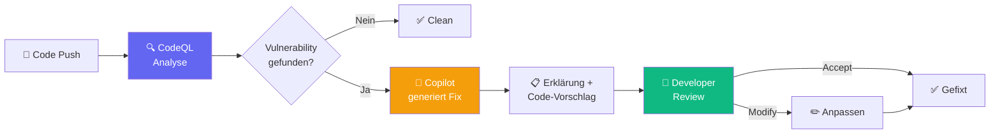

# Governance: Der Mensch im Loop

::intro::

Vertrauen durch Kontrolle

<!--
KI ohne Governance ist gefährlich. In diesem Abschnitt zeigen wir, wie ihr KI-gestützte Maintenance sicher und kontrolliert einführt — mit dem Menschen als letzte Entscheidungsinstanz.

🎨 Image prompt: A locked aircraft in a secure hangar with digital security shields, representing governance and controlled AI adoption. Digital art, dark atmosphere with security-blue accents similar to /plane-lock-left.jpg.
-->

---
layout: image-right
background: /security-shields-right.png
hideInToc: true
---

# Security by Design

<v-clicks>

- **Copilot Coding Agent**:
  - Kann nur auf **eigene Branches** pushen
  - PR-Ersteller kann **nicht selbst approven**
  - GitHub Actions erst nach **menschlicher Freigabe**
- **Code Scanning Autofix**:
  - CodeQL + Copilot = automatische Fixes
  - **2/3** aller Vulnerabilities auto-gefixt
  - **90%+** Alert-Typ-Abdeckung (JS, TS, Java, Python)
  - **7x schneller** als traditionelle Security-Tools

</v-clicks>

<!--
Security by Design ist kein Nachgedanke — es ist in die Tools eingebaut.

Der Copilot Coding Agent hat strikte Sicherheitsgrenzen: Er kann nur auf Branches pushen, die er selbst erstellt hat. Der PR-Ersteller kann den PR nicht selbst approven. Und GitHub Actions laufen erst nach menschlicher Freigabe.

Code Scanning Autofix kombiniert CodeQL-Analyse mit Copilot-Fixes: Mehr als 2/3 aller gefundenen Vulnerabilities werden automatisch gefixt, mit einer Abdeckung von 90%+ der Alert-Typen.

Quelle: https://github.blog/news-insights/product-news/found-means-fixed-introducing-code-scanning-autofix-powered-by-github-copilot-and-codeql/

🎨 Image prompt: A formation of futuristic spaceships with visible security shields, representing organized and secure AI deployment. Digital art similar to /spaceships-right.jpg.
-->

---
hideInToc: true
---

# "Found Means Fixed": Code Scanning Autofix

<v-clicks>

- Änderungen über **mehrere Dateien** und Dependencies
- Natürlichsprachige **Erklärung** des Problems
- **GHAS-Teams**: 7x schneller Remediation

</v-clicks>

<!--
Der Code Scanning Autofix Flow: Code wird gepusht, CodeQL analysiert, bei Fund generiert Copilot einen Fix mit Erklärung, der Developer reviewt und akzeptiert oder passt an.

Wichtig: Der Fix kann sich über mehrere Dateien erstrecken und Dependencies einbeziehen. Die natürlichsprachige Erklärung hilft dem Developer zu verstehen WARUM der Fix nötig ist.

GHAS (GitHub Advanced Security) Teams, die Autofix nutzen, remediieren 7x schneller als mit traditionellen Tools.

🎨 Image prompt: Not needed — this slide uses a mermaid diagram.
-->

---
layout: three-column
hideInToc: true
---

# DORA: KI-Adoption richtig machen

::one::

## Klare Policy 📜

<v-clicks>

- Acceptable-Use-Policy definieren
- **451%** mehr KI-Adoption
- Datenschutz-Guidelines
- Security-Risiken benennen

</v-clicks>

::two::

## Transparenz 💬

<v-clicks>

- Job-Displacement offen ansprechen
- **125%** mehr Team-Adoption
- KI-Strategie kommunizieren
- Ängste ernst nehmen

</v-clicks>

::three::

## Lernzeit 📚

<v-clicks>

- Dedizierte Lernzeit **während der Arbeit**
- **131%** mehr Adoption
- Nicht auf Freizeit erwarten
- Experimentieren ermöglichen

</v-clicks>

<!--
DORA identifiziert drei Schlüsselfaktoren für erfolgreiche KI-Adoption in Organisationen:

1. Klare Policy: Organisationen mit einer definierten KI-Acceptable-Use-Policy zeigen 451% mehr Adoption. Die Policy gibt Entwicklern einen sicheren Rahmen.

2. Transparenz: Offene Kommunikation über Job-Displacement-Ängste führt zu 125% mehr Team-Adoption. Ignorieren der Ängste ist kontraproduktiv.

3. Lernzeit: Dedizierte Arbeitszeit zum Lernen der KI-Tools führt zu 131% mehr Adoption. Erwarten, dass Entwickler das in ihrer Freizeit lernen, führt zu Frustration und Burnout.

Quelle: https://dora.dev/ai/gen-ai-report/

🎨 Image prompt: Three pillars (policy, transparency, learning) holding up a modern building, representing the foundations of successful AI governance. Digital art, architectural style.
-->

---
layout: image-right
background: /world-left.jpg
hideInToc: true
---

# Real-World: Home Assistant

<v-clicks>

- **75k+ Stars**, 2.900+ Issues, 695+ PRs
- Dedizierte `.github/copilot-instructions.md`
- **Copilot committet direkt** als Co-Author
- Präzise Review-Regeln:
  - _"Do not suggest extra defensive checks for inputs already validated by HA schemas"_
- Zusätzlich: Claude Code mit eigener `SKILL.md`

</v-clicks>

<v-click>

### Lesson: KI mit klaren Leitplanken = skalierbare Maintenance

</v-click>

<!--
Home Assistant ist das größte Open-Source Smart-Home-Projekt und nutzt KI aktiv:

Das Repo hat eine dedizierte copilot-instructions.md mit Copilot-spezifischen Review-Regeln. Copilot committet direkt — der letzte Commit kam als Co-Author mit dem Gründer.

Die Instructions definieren präzise, wann Copilot defensive Checks vorschlagen soll und wann nicht. Das ist Governance in Reinform.

Das Projekt nutzt auch Claude Code mit einer eigenen SKILL.md für Integration-spezifisches Wissen.

Quelle: https://github.com/home-assistant/core/blob/dev/.github/copilot-instructions.md

🎨 Image prompt: A world globe with smart home devices connected by AI networks, representing global open-source collaboration with AI governance. Digital art similar to /world-left.jpg.
-->
