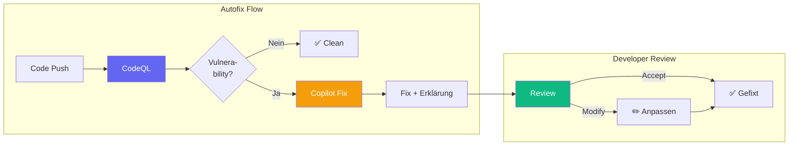

# Governance: Der Mensch im Loop

::intro::

Vertrauen durch Kontrolle

<!--
⚠️ Speakerwechsel ⚠️
KI ohne Governance ist gefährlich. In diesem Abschnitt zeigen wir, wie ihr KI-gestützte Maintenance sicher und kontrolliert einführt - mit dem Menschen als letzte Entscheidungsinstanz.
-->

---
layout: image-right
background: /security-shields-right.png
hideInToc: true

---

# Security by Design

 
<v-clicks>

- **Copilot Cloud Agent**
  - Arbeitet nur auf eigenen Branches
  - erstellt PRs (⚠️ achtung kann auch direkt committen)
  - CI/CD läuft über Branch-Protection-Regeln
- **Code Scanning Autofix**
  - CodeQL findet Issues, Copilot schlägt Fixes vor
  - Über zwei Drittel der Meldungen lassen sich direkt beheben
  - Deckt die meisten Alert-Typen in JS, TS, Java, Python ab

</v-clicks>

<!--
Security ist hier nicht „Add-on“, sondern Teil des Designs:

- Copilot Coding / Cloud Agent:
  - legt eigene Branches an und arbeitet dort,
  - kann keine Pull Requests selbst mergen,
  - läuft unter den ganz normalen Schutzregeln für eure Branches und Pipelines.
  - PRs und Deployments brauchen weiterhin menschliche Freigaben.

- Code Scanning Autofix:
  - CodeQL analysiert den Code, bei Alerts generiert Copilot konkrete Fix-Vorschläge,
  - mehr als zwei Drittel der unterstützten Alerts lassen sich mit wenig oder gar keinem manuellen Editieren schließen,
  - die Abdeckung umfasst einen Großteil der gängigen Alert-Typen in JS, TS, Java, Python,
  - Teams mit Autofix sind bei der Behebung von Sicherheitsproblemen um ein Mehrfaches schneller unterwegs.

Quelle (Autofix): GitHub-Blog „Found means fixed: Introducing code scanning autofix, powered by GitHub Copilot and CodeQL“
- https://github.blog/news-insights/product-news/found-means-fixed-introducing-code-scanning-autofix-powered-by-github-copilot-and-codeql/
Quelle (Copilot Agent Sicherheitsmodell): GitHub Docs zu Copilot Cloud / Cloud Agent
- https://docs.github.com/en/enterprise-cloud@latest/copilot/concepts/agents/cloud-agent/about-cloud-agent
- https://docs.github.com/en/copilot/responsible-use/agents
-->

---
hideInToc: true

---

# "Found Means Fixed": Code Scanning Autofix

 

<v-clicks>

- Änderungen über **mehrere Dateien** und Dependencies
- Natürlichsprachige **Erklärung** des Problems
- **GHAS-Teams**: 7x schneller Behebung

</v-clicks>

<!--
Der Code Scanning Autofix Flow: Code wird gepusht, CodeQL analysiert, bei Fund generiert Copilot einen Fix mit Erklärung, der Developer reviewt und akzeptiert oder passt an.

Wichtig: Der Fix kann sich über mehrere Dateien erstrecken und Dependencies einbeziehen. Die natürlichsprachige Erklärung hilft dem Developer zu verstehen WARUM der Fix nötig ist.

GHAS (GitHub Advanced Security) Teams, die Autofix nutzen, beheben Probleme 7x schneller als mit traditionellen Tools.
-->

---
layout: three-column
hideInToc: true
hide: true

---

# DORA: KI-Adoption richtig machen

> Governance entscheidet, ob KI angenommen wird.

::one::

## Klare Policy

<v-clicks>

- Acceptable-Use-Policy definieren
- **4,5x** mehr KI-Adoption
- Datenschutz-Guidelines
- Security-Risiken benennen

</v-clicks>

::two::

## Transparenz

<v-clicks>

- Job-Displacement offen ansprechen
- **125%** mehr Team-Adoption
- KI-Strategie kommunizieren
- Ängste ernst nehmen

</v-clicks>

::three::

## Lernzeit

<v-clicks>

- Dedizierte Lernzeit **während der Arbeit**
- **131%** mehr Adoption
- Nicht auf Freizeit erwarten
- Experimentieren ermöglichen

</v-clicks>

<!--
DORA identifiziert drei Schlüsselfaktoren für erfolgreiche KI-Adoption in Organisationen:

1. Klare Policy: Organisationen mit einer definierten KI-Acceptable-Use-Policy zeigen 4,5 mal mehr Adoption. Die Policy gibt Entwicklern einen sicheren Rahmen.

2. Transparenz: Offene Kommunikation über Job-Displacement-Ängste führt zu 125% mehr Team-Adoption. Ignorieren der Ängste ist kontraproduktiv.

3. Lernzeit: Dedizierte Arbeitszeit zum Lernen der KI-Tools führt zu 131% mehr Adoption. Erwarten, dass Entwickler das in ihrer Freizeit lernen, führt zu Frustration und Burnout.

Quelle: https://dora.dev/ai/gen-ai-report/
-->

---
layout: image-right
background: /world-left.jpg
hideInToc: true

---

## Real-World: Home Assistant

- Großes Open-Source-Projekt mit sehr aktiver Community
  
 <v-click> 

- Dedizierte `.github/copilot-instructions.md` im Repo
- Konkrete Regeln, wann Copilot Vorschläge machen soll
- Präzise Review-Regeln:
  - _"Do not suggest extra defensive checks for inputs already validated by HA schemas"_

</v-click>
<v-clicks>

- **Agentic Issue-Triage** via GitHub Actions + `actions/ai-inference`
  - Copilot erkennt Duplikate bei Integration-Issues → Ersteller automatisch benachrichtigt
  - Copilot erkennt nicht-englische Issues → werden automatisch geschlossen
  - Custom-Integration-Issues: strukturiertes Issue-Formular → Label `problem in custom integration` → Ersteller wird zum Plugin-Maintainer-Repo weitergeleitet

</v-clicks>

<v-click>

### Lesson: Gute Governance heißt, der KI klar sagen, wie "bei uns" entwickelt wird

</v-click>

<!--
Home Assistant ist das größte Open-Source Smart-Home-Projekt und nutzt KI aktiv:

Das Projekt nutzt auch Claude Code mit einer eigenen SKILL.md für Integration-spezifisches Wissen.

Es ist ein gutes Beispiel dafür, wie Governance im Alltag aussieht:

- Das Repo hat eine dedizierte copilot-instructions.md mit Copilot-spezifischen Review-Regeln. Copilot committet direkt - der letzte Commit kam als Co-Author mit dem Gründer.
- Darin steht:
  - welche Arten von Änderungen Copilot vorschlagen soll,
  - wie mit bestehenden Patterns und Schemas umzugehen ist,
  - und welche Dinge explizit unerwünscht sind (z.B. redundante Validierungen, die das Schema schon abdeckt).
- Damit wird Copilot nicht "irgendwie" genutzt, sondern wie ein neues Teammitglied mit Onboarding:
  - Das Projekt erklärt der KI: So ticken wir hier, so sieht guter Code bei uns aus.
- Commits mit Copilot-Anteil werden trotzdem wie jeder andere PR behandelt:
  - Review durch Maintainer,
  - gegebenenfalls Anpassungen,
  - Merge erst, wenn ein Mensch zustimmt.

Agentic Issue-Triage:
- Das Projekt nutzt GitHub Actions mit `actions/ai-inference` (GitHub Models API) für vollautomatische Issue-Triage:
  - `detect-duplicate-issues.yml`: Sobald ein `integration:`-Label auf einem Issue gesetzt wird, analysiert GPT-4o ähnliche Issues aus den letzten 6 Monaten. Bei Duplikat-Fund wird automatisch ein Kommentar gepostet, der den Ersteller benachrichtigt und auf die bestehenden Issues verweist. Das Issue erhält das Label `potential-duplicate`.
  - `detect-non-english-issues.yml`: GPT-4o-mini analysiert jedes neue Issue. Nicht-englische Issues werden automatisch mit Label `non-english` versehen, ein Kommentar erklärt die Anforderung, und das Issue wird geschlossen.
- Custom Integration Issues (3rd-party Plugins/HACS): Das Issue-Formular fragt nach "Link to integration documentation on our website". Ist die Integration nicht im offiziellen HA-Katalog, kennzeichnen Maintainer das Issue mit `problem in custom integration`, schließen es und verweisen den Ersteller auf das Repository der Custom Integration.

Quelle: https://github.com/home-assistant/core/blob/dev/.github/copilot-instructions.md
Quelle Workflows: https://github.com/home-assistant/core/tree/dev/.github/workflows
-->
