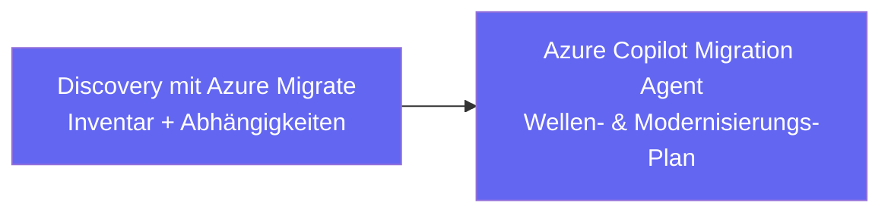
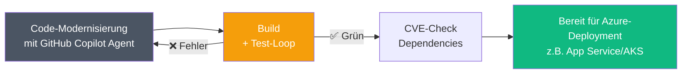

# Legacy-Modernisierung mit KI-Agenten

::intro::

Vom Monolithen zu Azure – Discovery → Modernisierung → Migration

<!--
Jetzt kommen wir zum Thema, das in fast jedem Unternehmen brennt: Legacy-Systeme modernisieren.
Nicht als schönes PowerPoint-Versprechen, sondern wirklich: alte Java/.NET-Buden in Richtung Azure ziehen – ohne alles wegzuwerfen.

Wir schauen uns an, wie Azure Migrate + Azure Copilot Migration Agent die Bestandslandschaft verstehen,
und wie GitHub Copilot beim eigentlichen Code-Upgrade hilft (z.B. Java/.NET, Build, Config).
-->

---
layout: two-column
hideInToc: true
---

# Modernisierungs-Strategien  
_Manuell vs. Azure Copilot + Migration Agent_

::left::

## Traditionell

<v-clicks>

- **Manuelles** Code- und Architektur-Audit
- Dependency-Updates **von Hand**
- Häufig „Big Bang“-Rewrites aus Zeitdruck
- Wochen bis **Monate** pro System
- Risiko steigt mit Umfang und Komplexität

</v-clicks>

::right::

<v-click>

## Mit KI-Agent

</v-click>

<v-clicks>

- **Automatischer** Code- und Dependency-Scan über viele Systeme
- Azure Migrate + Migration Agent unterstützen bei **Migrations- / Upgrade-Plan**
- GitHub Copilot modernisiert Code (APIs, Build, Config) per Pull Request
- Erleichtert **inkrementelle** Schritte, wenn das Team sich dafür entscheidet
- **Test-Loop**: Fix → Build → Test → Iterate
- Optional: CVE- und Compliance-Scans einfach in den Workflow integrierbar

</v-clicks>

<!--
Der Vergleich ist eigentlich das ganze Argument auf einer Folie:
Links: viel Bauchgefühl, Excel-Listen, manuelle Reviews, jede Änderung ein kleines Abenteuer.
Rechts: Azure Migrate + Copilot Migration Agent inventarisieren, clustern und planen Wellen.
GitHub Copilot unterstützt beim eigentlichen Refactoring und API-Upgrade in kleinen Häppchen.

Wichtig ist die Test-Loop: Der Agent macht eine Änderung, baut das Projekt, führt Tests aus, fixt Fehler und iteriert –
genau wie ein erfahrener Dev, nur hört er nicht um 18 Uhr auf.
-->

---
hideInToc: true
---

# Case Study: Java 17 → 21

### Spring WebFlow Legacy-Modernisierung im Azure-Kontext

<br>

<span>1. Azure: Discovery & Plan</span>



<span>2. GitHub Copilot: Modernisierung & Tests</span>



<v-click>

```java
// Vorher (deprecated in Java 21)
View view = this.resolver.resolveViewName("intro", new Locale("EN"));

// Nachher (Java 21 konform, von Copilot-Agent modernisiert)
View view = this.resolver.resolveViewName("intro", Locale.of("EN"));
```

</v-click>

<!--
Wichtig: Der eigentliche Java-17-→21-Case kommt direkt aus GitHub Copilot Agent Mode / App Modernization,
also ohne „magischen“ Azure Copilot im Code-Editor.

Die Verbindung zu Azure sieht in der Praxis so aus:
- Azure Migrate + Azure Copilot Migration Agent helfen dir vorher, deine Workloads zu inventarisieren,
  Risiken zu sehen und zu entscheiden, welche Apps du „nur“ rehostest und welche du wirklich modernisierst.
- Für genau diese Modernisierungs-Kandidaten startest du dann GitHub Copilot App Modernization:
  der Agent erstellt einen Upgrade-Plan, führt Code-Transformationen (OpenRewrite, Framework-Updates, Config-Fixes) aus, baut das Projekt, fixt Build- und Testfehler und macht CVE-Checks.
- Am Ende hast du eine Java-21-fitte Codebase mit allen Tests grün – und eine App, die sich deutlich entspannter nach Azure heben lässt (Container, App Service, AKS etc.).

Quelle: https://github.blog/ai-and-ml/github-copilot/a-step-by-step-guide-to-modernizing-java-projects-with-github-copilot-agent-mode/

Kurz: Azure Copilot sagt dir *wo* und *wie* du modernisieren solltest,
GitHub Copilot Agent macht dann die Drecksarbeit *im Code*.
Quelle für den Java-Case: GitHub-Blog „Step-by-step guide to modernizing Java projects with GitHub Copilot agent mode“.
-->

---
layout: image-right
background: /secret-agent-large.png
hideInToc: true
---

# Copilot Coding Agent

<v-clicks>

- GitHub Issues **direkt an Copilot** zuweisen
- Agent bestätigt mit 👀 und hängt sich an das Issue
- Klont das Repo in einer **sicheren Cloud-Umgebung** (GitHub Actions)
- Erstellt einen **Draft-PR** mit:
  - Commits + Session-Logs (nachvollziehbares „Warum“)
  - Umsetzung des Implementierungsplans
- Reagiert auf **Review-Kommentare** und iteriert weiter

</v-clicks>

<v-click>

> _"The GitHub Copilot coding agent integrates into our current workflow and turns specs into production code in minutes."_  
> – **Alex Devkar**, SVP Engineering, Carvana

</v-click>

<!--
Seit 2025 können GitHub Issues direkt an den Copilot Coding Agent (heute: Copilot Cloud Agent) zugewiesen werden – genau wie an ein Teammitglied.

Ablauf:
- Du weist ein Issue an Copilot zu, der Agent reagiert mit dem 👀-Emoji und startet eine Session.
- Der Agent klont das Repo in einer isolierten Cloud-Umgebung, analysiert den Code und plant die Umsetzung.
- Er erstellt eine eigene Branch, macht Commits, und öffnet einen Draft Pull Request – inklusive Session-Logs, die seine „Gedankengänge“ und Tools zeigen.
- Du kannst im PR-Review Feedback geben, und der Agent arbeitet die Kommentare wieder ein.

Security / Governance:
- Commits werden als „Copilot“ authored, mit dir als Co-Author – Nachvollziehbarkeit inklusive.
- Der Agent pusht nur auf Branches, die er selbst angelegt hat, und kann keine PRs selbst approven oder Actions einfach so durchwinken.
- Copilot Cloud Agent muss tenant-weit von Admins aktiviert werden und kann pro Repository wieder abgeschaltet werden.

Offizielle Doku:
- GitHub Docs: [About GitHub Copilot cloud agent](https://docs.github.com/en/copilot/concepts/agents/cloud-agent/about-cloud-agent)
- GitHub Blog: [GitHub Copilot: Meet the new coding agent](https://github.blog/news-insights/product-news/github-copilot-meet-the-new-coding-agent/)
-->

---
layout: cover
background: /evolution-left.jpg
hideInToc: true
---

<div class="flex flex-col h-full text-center justify-center">
  <h1>Demo: Legacy-Modernisierung<br/>mit Agent Mode</h1>
</div>

<v-click>
  <span/>
</v-click>

<!--
**DEMO 3: Legacy-Modernisierung mit Agent Mode (ca. 8 Minuten)**

1. Öffne VS Code mit dem ContainerShips API Projekt (oder ein vorbereitetes Legacy-Projekt)
2. Starte Copilot Agent Mode (Ctrl+Shift+I oder Chat → Agent)
3. Prompt: "Analysiere dieses Projekt auf veraltete Dependencies und deprecated APIs. Erstelle einen Upgrade-Plan."
4. Zeige wie der Agent:
   - Die Codebase scannt
   - Einen strukturierten Plan erstellt
   - Code-Transformationen vorschlägt
5. Prompt: "Führe die Migration durch und stelle sicher, dass alle Tests bestehen."
6. Zeige die iterative Fix-and-Test-Loop
7. Abschluss: Prompt "Erstelle eine PR-Summary für die Änderungen."

**Key Message:** Von der Analyse über die Migration bis zur Dokumentation - alles in einem Flow.

**Fallback:** Zeige den dokumentierten Java-17-zu-21-Flow als Walkthrough mit Screenshots.

🎨 Image prompt: An evolutionary transformation scene - old machinery morphing into sleek modern technology with AI energy flowing through the transformation. Digital art similar to /evolution-left.jpg.
-->
