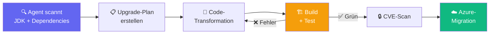

# Legacy-Modernisierung mit KI

::intro::

Vom Altsystem zum modernen Stack

<!--
Jetzt kommen wir zum Thema, das in fast jedem Unternehmen brennt: Legacy-Systeme modernisieren. Die KI kann hier dramatisch helfen — aber es braucht den richtigen Ansatz.

🎨 Image prompt: An evolution sequence showing old server racks transforming into modern cloud infrastructure with AI neural networks connecting them. Digital art, dark background with blue and orange transition colors similar to /evolution-left.jpg.
-->

---
layout: two-column
hideInToc: true
---

# Modernisierungs-Strategien

::left::

## Traditionell ⏳

<v-clicks>

- **Manuelles** Code-Audit
- Dependency-Updates **von Hand**
- "Big Bang" Rewrites
- Wochen bis **Monate** pro Projekt
- Hohes **Risiko** bei jedem Schritt

</v-clicks>

::right::

<v-click>

## Mit KI-Agent 🤖

</v-click>

<v-clicks>

- **Automatischer** Code-Scan
- Agent plant **Upgrade-Strategie**
- **Inkrementelle** Transformationen
- **Test-Loop**: Fix → Build → Test → Iterate
- CVE-Scan **inklusive**

</v-clicks>

<!--
Der Vergleich zeigt: Traditionelle Modernisierung ist manuell, riskant und dauert Monate. Mit KI-Agents wird der Prozess automatisiert, inkrementell und testgetrieben.

Der Schlüssel ist die Test-Loop: Der Agent macht eine Änderung, baut das Projekt, führt Tests aus, fixt Fehler und iteriert — genau wie ein erfahrener Entwickler, aber 10x schneller.

🎨 Image prompt: Two paths diverging — left: a winding, difficult mountain path (manual); right: a smooth, illuminated highway (AI-assisted). Digital art, dramatic landscape.
-->

---
hideInToc: true
---

# Case Study: Java 17 → 21

### Spring WebFlow Legacy-Modernisierung



<v-click>

```java
// Vorher (deprecated in Java 21)
View view = this.resolver.resolveViewName("intro", new Locale("EN"));

// Nachher (Java 21 konform)
View view = this.resolver.resolveViewName("intro", Locale.of("EN"));
```

</v-click>

<v-click>

### Ergebnis: **Alle 1.177 Tests bestanden** ✅

</v-click>

<!--
Konkretes, dokumentiertes Beispiel von GitHub: Spring WebFlow Projekt von Java 17 auf 21.

Der Agent: 1) Scannt JDK-Version, Build-Config, Dependencies, deprecated APIs. 2) Erstellt einen editierbaren Upgrade-Plan. 3) Führt Code-Transformationen mit OpenRewrite durch. 4) Fixt Build-Fehler iterativ. 5) Alle 1.177 Tests bestanden. 6) CVE-Scan aller Dependencies. 7) Migration zu Azure (Entra ID).

Das Code-Beispiel zeigt eine typische Transformation: deprecated `new Locale()` wird zu `Locale.of()`.

Quelle: https://github.blog/ai-and-ml/github-copilot/a-step-by-step-guide-to-modernizing-java-projects-with-github-copilot-agent-mode/

🎨 Image prompt: Not needed — this slide uses code and mermaid diagram.
-->

---
layout: image-right
background: /secret-agent-large.png
hideInToc: true
---

# Copilot Coding Agent

<v-clicks>

- Issues **direkt an Copilot** zuweisen
- Agent reagiert mit 👀 Emoji
- Startet **sichere VM** via GitHub Actions
- Erstellt **Draft-PR** mit:
  - Commits + Session-Logs
  - Reasoning-Steps
- Reagiert auf **Review-Kommentare**

</v-clicks>

<v-click>

> _"The coding agent converts specifications to production code in minutes."_
> — **Alex Devkar**, SVP Engineering, Carvana

</v-click>

<!--
Seit Mai 2025 können GitHub Issues direkt an Copilot zugewiesen werden — genau wie an ein Teammitglied.

Der Agent: klont das Repo in einer sicheren VM, analysiert die Codebase per RAG, erstellt einen Draft-PR mit Commits und detaillierten Session-Logs. Er reagiert auch auf Review-Kommentare und arbeitet Feedback ein.

Security: Der Agent kann nur auf Branches pushen, die er selbst erstellt. PRs können nicht selbst approved werden. GitHub Actions erst nach menschlicher Freigabe.

Quelle: https://github.blog/news-insights/product-news/github-copilot-meet-the-new-coding-agent/

🎨 Image prompt: A secret agent (AI) working autonomously at a futuristic workstation, multiple holographic code screens around it. Digital art, dark mysterious atmosphere similar to /secret-agent-large.png.
-->

---
layout: cover
coverImage: /evolution-left.jpg
hideInToc: true
---

<div class="flex flex-col h-full text-center justify-center">
  <h1>Demo: Legacy-Modernisierung<br/>mit Agent Mode</h1>
</div>

<v-click>
  <span/>
</v-click>

<!--
**DEMO 3: Legacy-Modernisierung mit Agent Mode (ca. 8 Minuten)**

1. Öffne VS Code mit dem ContainerShips API Projekt (oder ein vorbereitetes Legacy-Projekt)
2. Starte Copilot Agent Mode (Ctrl+Shift+I oder Chat → Agent)
3. Prompt: "Analysiere dieses Projekt auf veraltete Dependencies und deprecated APIs. Erstelle einen Upgrade-Plan."
4. Zeige wie der Agent:
   - Die Codebase scannt
   - Einen strukturierten Plan erstellt
   - Code-Transformationen vorschlägt
5. Prompt: "Führe die Migration durch und stelle sicher, dass alle Tests bestehen."
6. Zeige die iterative Fix-and-Test-Loop
7. Abschluss: Prompt "Erstelle eine PR-Summary für die Änderungen."

**Key Message:** Von der Analyse über die Migration bis zur Dokumentation — alles in einem Flow.

**Fallback:** Zeige den dokumentierten Java-17-zu-21-Flow als Walkthrough mit Screenshots.

🎨 Image prompt: An evolutionary transformation scene — old machinery morphing into sleek modern technology with AI energy flowing through the transformation. Digital art similar to /evolution-left.jpg.
-->
