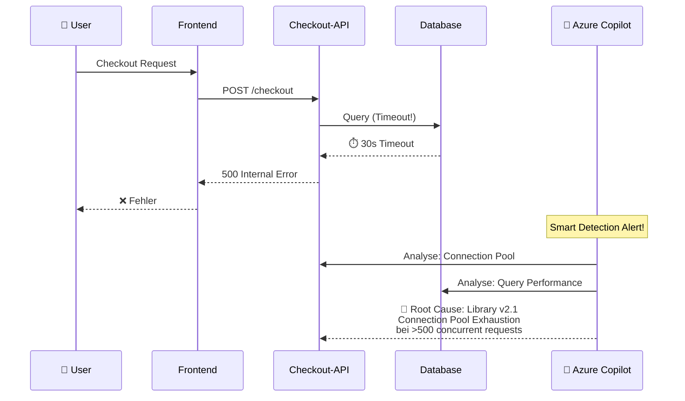
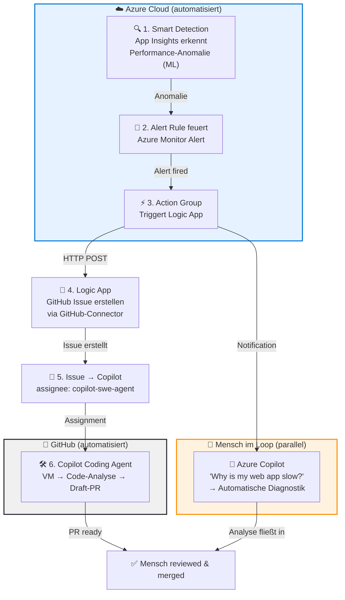

# Root Cause Analysis mit KI

::intro::

Von "Ich vermute" zu "Ich sehe"

<!--
Jetzt geht's ans Eingemachte. Hier hört "netter Assistent, der ein bisschen Code schreibt" auf — und hier fängt echte KI-gestützte Diagnostik an. Das ist der Paradigmenwechsel.

🎨 Image prompt: A pilot in a futuristic cockpit with holographic diagnostic displays overlaying the windshield, representing AI-assisted system diagnostics. Digital art, warm cockpit lighting with blue holographic overlays similar to /pilot-large.jpg.
-->

---
layout: image-right
background: /code-right.png
hideInToc: true
---

# Der Paradigmenwechsel

<v-clicks>

- **Code-Copilot** arbeitet auf _statischem Code_ zur **Entwicklungszeit**
- **Azure Copilot** arbeitet auf _Live-Telemetrie_ zur **Laufzeit**
- Völlig andere **Datenebene**:
  - Logs, Metriken, Traces
  - Distributed Dependencies
  - Real-time Anomalien

</v-clicks>

<v-click>

> "Warum ist meine Web-App langsam?"
> → Azure Copilot wählt automatisch das richtige Diagnose-Tool

</v-click>

<!--
Kernaussage: Code-Copilot = statischer Quellcode. Azure Copilot = Live-Telemetrie, Metriken, Logs und Alerts. Das ist eine komplett andere Dimension.

Du fragst im Azure Portal: "Warum ist meine Web-App langsam?" und Azure Copilot wählt automatisch das richtige Diagnose-Tool, führt Checks durch, identifiziert Ursachen und schlägt Lösungen vor.

🎨 Image prompt: Two contrasting panels — left: static code in an IDE; right: live production monitoring with flowing data streams and AI analysis. Digital art, dark theme with code-green accents.
-->

---
layout: image-left
background: /aiops-monitoring-large.png
hideInToc: true
---

# Application Insights & Smart Detection

<v-clicks>

- **Transaction Diagnostics**
  - End-to-End Gantt-Chart
  - Browser → Frontend → Backend → DB
  - Über Service-Grenzen hinweg
- **Smart Detection** (ML-basiert)
  - Failure Anomalies
  - Performance Degradation
  - Memory Leaks
  - **Bevor** ein Mensch es merkt

</v-clicks>

<!--
Application Insights Transaction Diagnostics zeigt einen Request als Gantt-Chart über alle Services hinweg — vom Browser über Frontend und Backend bis zur Datenbank. Jeder Hop ist sichtbar mit Timings.

Smart Detection nutzt Machine Learning um Anomalien automatisch zu erkennen: Failure Spikes, Performance-Verschlechterung, Memory Leaks — und das bevor ein Mensch überhaupt einen Alert bemerkt.

Quellen:
- https://learn.microsoft.com/en-us/azure/azure-monitor/app/transaction-search-and-diagnostics
- https://learn.microsoft.com/en-us/azure/azure-monitor/alerts/proactive-diagnostics

🎨 Image prompt: A satellite view of interconnected data streams with a magnifying glass focusing on an anomaly point. Dark background with glowing blue data nodes.
-->

---
hideInToc: true
---

# RCA in Aktion: Connection Pool Exhaustion

<!--
Konkretes Beispiel: Ein User löst einen Checkout aus. Die API fragt die DB ab, aber es gibt einen 30-Sekunden-Timeout. Der User bekommt einen 500er Fehler.

Smart Detection erkennt den Anomalie-Spike. Azure Copilot analysiert automatisch den Connection Pool und die Query Performance. Ergebnis: Die Library v2.1 hat einen Bug, der bei mehr als 500 gleichzeitigen Requests den Connection Pool erschöpft.

Von "wir vermuten es liegt an der DB" zu "es ist Library v2.1, Zeile 847, Connection Pool max_size=10 statt 100" — in 30 Sekunden statt 2 Stunden.

🎨 Image prompt: Not needed — this slide uses a mermaid diagram.
-->

---
hideInToc: true
---

# End-to-End: Vom Alert zum automatischen Fix

<!--
Der vollautomatisierte End-to-End-Flow von der Erkennung bis zum Fix:

1. Smart Detection in App Insights erkennt eine Performance-Anomalie (ML-basiert, keine Konfiguration nötig)
2. Die migrierte Alert Rule feuert als Azure Monitor Alert
3. Eine Action Group triggert eine Logic App UND benachrichtigt das Team
4. Die Logic App erstellt ein GitHub Issue mit Diagnose-Daten (Severity, Resource, Description)
5. Die Logic App weist das Issue an copilot-swe-agent zu
6. Der Copilot Coding Agent startet eine VM, analysiert den Code und erstellt einen Draft-PR

Parallel: Der Ops-Engineer nutzt Azure Copilot im Portal für die tiefe Diagnostik — dieses Wissen fließt in die PR-Review ein.

Kein Azure DevOps nötig. Der einzige "Mensch im Loop" ist das finale PR-Review.
-->

---
hideInToc: true
---

# Der automatisierte Pfad im Detail

<v-clicks>

- **Smart Detection → Alert**: ML erkennt Failure Anomalies, Performance Degradation, Memory Leaks — **automatisch**
- **Action Group → Logic App**: Common Alert Schema → GitHub-Connector (No-Code, in Minuten aufgesetzt)
- **Logic App → GitHub Issue**: Titel, Severity, Resource, Diagnose-Link — alles strukturiert
- **Issue → Copilot Coding Agent**: Agent reagiert mit 👀, klont Repo, analysiert per RAG, erstellt Draft-PR
- **Azure Copilot (parallel)**: Ops-Engineer fragt _"Why is my web app slow?"_ → automatische Diagnostik + Transaction Diagnostics

</v-clicks>

<v-click>

> **Security**: Agent kann nur auf eigene Branches pushen. PR-Ersteller kann nicht self-approven. Actions erst nach menschlicher Freigabe.

</v-click>

<!--
Die Details des automatisierten Flows:

Smart Detection ist per Default aktiv und erkennt: Failure Anomalies, Performance Degradation, Memory Leaks, Trace Severity Degradation, Exception Volume Anomalien.

Seit der Migration von Smart Detection zu Alerts werden diese als vollwertige Azure Monitor Alert Rules behandelt und können mit Action Groups verknüpft werden.

Die Logic App empfängt den Alert über einen HTTP-Trigger und nutzt den nativen GitHub-Connector, um ein Issue zu erstellen und an copilot-swe-agent zuzuweisen.

Azure Copilot im Portal ist rein interaktiv — keine API zum programmatischen Triggern. Deswegen läuft er als paralleler manueller Analyse-Kanal.

Quellen:
- https://learn.microsoft.com/en-us/azure/azure-monitor/alerts/alerts-smart-detections-migration
- https://learn.microsoft.com/en-us/azure/azure-monitor/alerts/alerts-logic-apps
- https://github.blog/news-insights/product-news/github-copilot-meet-the-new-coding-agent/
-->

---
layout: cover
coverImage: /rca-diagnostics-large.png
hideInToc: true
---

  <h1>Demo: Azure Copilot Root Cause Analysis</h1>

<v-click>
  
</v-click>

<!--
**DEMO 1: Azure Copilot RCA (ca. 8 Minuten)**

1. Öffne Azure Portal → App Service (ContainerShips API oder eigene Demo-App)
2. Frage Azure Copilot: "Warum ist meine Web-App langsam?"
3. Zeige wie Copilot automatisch Diagnose-Tools auswählt
4. Navigiere zu Application Insights → Transaction Diagnostics
5. Zeige die End-to-End Gantt-Chart eines langsamen Requests
6. Zeige Smart Detection Alerts und deren ML-basierte Erkennung
7. Demonstriere die Korrelation: Alert → Root Cause → Fix-Vorschlag

**Key Message:** Von der Frage zur Ursache in unter 60 Sekunden statt Stunden manueller Suche.

**Fallback:** Falls Demo nicht live möglich, Screenshots der Azure Portal UI zeigen und den Flow erklären.

🎨 Image prompt: A dramatic cockpit view with holographic AI diagnostic overlays on a dark sky background, representing the developer being guided by AI through system diagnostics.
-->
