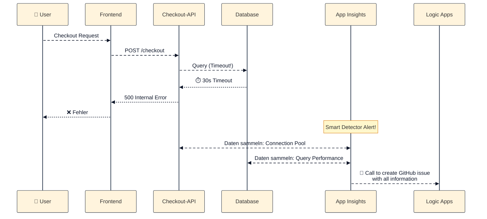

# Root Cause Analysis mit KI

::intro::

Von "Ich vermute" zu "Ich sehe"

<!--
⚠️Speakerwechsel⚠️

&rarr; Ursachenanalyse
Jetzt geht's ans Eingemachte. Hier hört "netter Assistent, der ein bisschen Code schreibt" auf - und hier fängt echte KI-gestützte Diagnostik an. Das ist der Paradigmenwechsel.
-->

---
layout: image-left
background: /aiops-monitoring-large.png
hideInToc: true

---

# Application Insights & Smart Detection

 
<v-clicks>

- **Application Insights**
  - Monitoring/Observability für laufende Anwendungen
  - Basis-Telemetrie: Requests, Dependencies, Exceptions, Traces
  - Dazu Metriken, Availability sowie Browser- und Nutzungssignale
  
 

- **Smart Detector Alerts**
  - Failure Anomalies
  - Performance Anomalies
  - Trace Degradation / Memory Leaks

</v-clicks>

<!--
Application Insights [**Azure**] ist hier vor allem die Datengrundlage:
Es liefert die Telemetrie aus der laufenden Anwendung – also z. B. Requests, Dependencies, Exceptions und Traces, aber auch Metriken, Availability- sowie Browser- und Nutzungssignale.

Das ist für die meisten hier vermutlich nichts Neues.

Nächste Folie beschriebt (also hier noch nicht erwähnen):
Smart Detection nutzt Machine Learning, um Anomalien automatisch zu erkennen: Failure Spikes, Performance-Verschlechterung, Memory Leaks - und das bevor ein Mensch überhaupt einen Alert bemerkt.

Quellen:
- https://learn.microsoft.com/en-us/azure/azure-monitor/app/transaction-search-and-diagnostics
- https://learn.microsoft.com/en-us/azure/azure-monitor/alerts/proactive-diagnostics
-->

---
layout: two-cols-header
hideInToc: true

---

# Smart Detector Alerts

<v-clicks depth="2">

* ML-gestützte Anomalie-Erkennung
  * Fast Echtzeit
    * 20min &rarr; vorherige 40min &rarr; 7 Tage
  * X-Fache der Standardabweichung
    * Minium Level basierend auf Anzahl Requests
  * Findet komplexe Anomalien automatisch
* Aktionen:
  * E-Mail-Benachrichtigung als Standard
  * Optional: Webhooks, Logic Apps, Azure Functions

</v-clicks>

<!--
[click]

[click] Rollendes Zeitfenster: Prüft laufende 20 Minuten gegen vorherige 40 Minuten und letzte 7 Tage

[click] Anomalien basieren auf X-facher Standardabweichung, angepasst an die Anzahl der Requests. Kleine App mit 100 Requests/Tag hat niedrigere Schwelle als große App mit 1 Mio Requests/Tag.

[click] Seiten, die auf bestimmten Browser-Konstellationen langsam laden, ein Server, der langsamer lädt als die anderen etc.. und auch Kombinationen daraus
-->

---
hideInToc: true

---

# RCA in Aktion: Connection Pool Exhaustion

 

<!--
Konkretes Beispiel: Ein User löst einen Checkout aus. Die API fragt die Datenbank ab, läuft in einen 30-Sekunden-Timeout und gibt danach einen 500er Fehler ans Frontend zurück.

Parallel dazu schlägt Smart Detection an. Application Insights sammelt die relevanten Signale aus API und Datenbank, hier vor allem Connection Pool und Query Performance.

Diese Informationen werden automatisiert an eine Logic App weitergegeben, die daraus direkt ein GitHub-Issue mit allen Diagnose-Daten erzeugt.

Die Aussage der Folie ist also: Nicht erst manuell Logs zusammensuchen, sondern den Fehlerfluss, die Telemetrie und die Übergabe in einen umsetzbaren Work Item Flow sofort verbunden sehen.

🎨 Image prompt: Not needed - this slide uses a mermaid diagram.
-->

---
layout: image-right
background: /aiops-paradigmenwechsel.png
hideInToc: true
hide: true

---

# Der Paradigmenwechsel

 

<v-clicks>

- **GitHub Copilot** arbeitet auf _statischem Code_ zur **Entwicklungszeit**
- **Azure Copilot** arbeitet auf _Live-Telemetrie_ zur **Laufzeit**
- Völlig andere **Datenebene**:
  - Logs, Metriken, Traces
  - Distributed Dependencies
  - Real-time Anomalien

</v-clicks>

<v-click>

> "Warum ist meine Web-App langsam?"
> 
> → Azure Copilot wählt automatisch das richtige Diagnose-Tool

</v-click>

<!--
Kernaussage: GitHub Copilot = statischer Quellcode. Azure Copilot = Live-Telemetrie, Metriken, Logs und Alerts. Das ist eine komplett andere Dimension.

DEMO:
Du fragst im Azure Portal: "Warum ist meine Web-App langsam?" und Azure Copilot wählt automatisch das richtige Diagnose-Tool, führt Checks durch, identifiziert Ursachen und schlägt Lösungen vor.

Falls die Demo nicht live möglich ist: <a href="/why-is-my-app-slow.png">[/why-is-my-app-slow.png]</a>

-->

---
layout: cover
coverImage: /rca-diagnostics-large.png
hideInToc: true
title: Demo - Azure Copilot

---

  <h1>Demo: Root Cause Analysis</h1>

<v-click>
  
</v-click>

<!--
**DEMO 1: Azure Copilot RCA (ca. 8 Minuten)**
0. Zeige die App → <a href="https://purple-rock-09516260f.7.azurestaticapps.net/">Product Catalog App</a>
1. K6 load test aus dem repo der Web-App starten  (triggert Fehler 429 gegenüber ComosDB [too many Requests])
2. Öffne Azure Portal → <a href="https://portal.azure.com/#@harrybin.de/resource/subscriptions/175a348e-b5e6-4bde-b695-534e7e719c32/resourceGroups/rg-productcatalog/providers/Microsoft.Insights/components/pc-appinsights/overview">Azure Portal - AppInsights</a>
3. Observability Agent triggern: <a href="/Obersevaility-Agent.png">Obersevaility-Agent</a>
4. Logic Apps, wurden Ausgelöst: <a href="https://portal.azure.com/#@harrybin.de/resource/subscriptions/175a348e-b5e6-4bde-b695-534e7e719c32/resourceGroups/rg-productcatalog/providers/Microsoft.Logic/workflows/productcatalog-alert-to-github-issue/logicApp">Logic Apps</a>
5. Zeige Issue auf GitHub: <a href="https://github.com/xebia/demo-root-cause-analysis/issues
 ">GitHub Issue</a>

**Key Message:** Von der Frage zur Ursache in unter 60 Sekunden statt Stunden manueller Suche.

**Fallback:** Falls Demo nicht live möglich, Screenshots der Azure Portal UI zeigen und den Flow erklären.
-->
