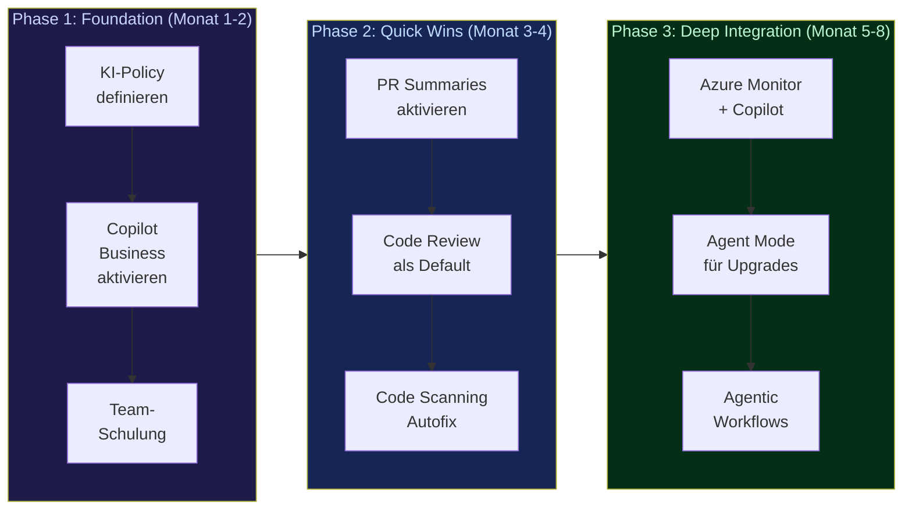

# Zusammenfassung & Ausblick

::intro::

Was wir heute gelernt haben

<!--
Zusammenfassung des Talks. Die wichtigsten Takeaways auf einen Blick.

🎨 Image prompt: A satellite looking down at Earth from space with data connections glowing across continents, representing the global impact of AIOps. Digital art, epic space view with blue-green Earth tones.
-->

---
layout: image-right
background: /idea-new.png
hideInToc: true
---

# Key Takeaways

<v-clicks>

1. **AIOps ≠ Code-Autocomplete** — es ist ein Paradigmenwechsel von Entwicklungszeit zu Laufzeit
2. **RCA in Sekunden** statt Stunden — Azure Copilot + App Insights + Smart Detection
3. **Technical Debt**: KI hilft, aber nur **mit Guardrails** (kleine Batches, automatisierte Reviews, SCA)
4. **Legacy-Modernisierung**: Agent Mode scannt, plant, migriert und testet automatisch
5. **Auto-Doku im Vorbeigehen**: Jeder PR hinterlässt eine Spur — nach 6 Monaten = gute Doku

</v-clicks>

<v-click>

### Der rote Faden:

> **KI ersetzt den Menschen nicht — sie gibt ihm bessere Werkzeuge und bessere Argumente.**

</v-click>

<!--
Die fünf Key Takeaways zusammengefasst:

1. AIOps ist mehr als Code-Autocomplete — es operiert auf Live-Telemetrie zur Laufzeit.
2. Root Cause Analysis in Sekunden statt Stunden — das ist der konkreteste Mehrwert.
3. Technical Debt: KI ist ein Hebel FÜR Qualität, aber nur mit den richtigen Guardrails.
4. Legacy-Modernisierung: Der Agent Mode automatisiert den gesamten Upgrade-Zyklus.
5. Auto-Dokumentation: Nicht "einmal drüberfliegen", sondern Doku als Teil des normalen Flows.

Der rote Faden: KI ersetzt den Menschen nicht. Sie gibt bessere Werkzeuge und bessere Argumente — gegenüber dem Management und gegenüber dem Code.

🎨 Image prompt: A bright lightbulb with five key points radiating outward as light rays, each labeled with a takeaway icon. Digital art, inspiring and forward-looking.
-->

---
hideInToc: true
---

# AIOps-Adoption Roadmap

<v-click>

### Starte heute mit Phase 1 — die meisten Tools sind in 30 Minuten eingerichtet.

</v-click>

<!--
Eine konkrete Roadmap für die AIOps-Adoption:

Phase 1 (Monat 1-2): Foundation legen. KI-Policy definieren (→ 451% mehr Adoption laut DORA), Copilot Business aktivieren, Team schulen (dedizierte Lernzeit!).

Phase 2 (Monat 3-4): Quick Wins realisieren. PR Summaries sind in 5 Minuten aktiviert. Code Review als Default auf allen Repos. Code Scanning Autofix einschalten.

Phase 3 (Monat 5-8): Deep Integration. Azure Monitor mit Copilot für RCA. Agent Mode für automatisierte Upgrades. Agentic Workflows für Dokumentation.

Die meisten Tools aus Phase 1 sind in 30 Minuten eingerichtet. Es gibt keine Ausrede, nicht heute anzufangen.

🎨 Image prompt: Not needed — this slide uses a mermaid diagram.
-->

---
hideInToc: true
---

# Zahlen zum Mitnehmen

<v-click>

  
97%

  
der Entwickler nutzen KI-Tools bei der Arbeit

</v-click>

<v-click>

  
60M+

  
Copilot Code Reviews durchgeführt

</v-click>

<v-click>

  
451%

  
mehr KI-Adoption mit klarer Policy

</v-click>

<v-click>

  
84%

  
mehr erfolgreiche Builds (Accenture)

</v-click>

<v-click>

  
7x

  
schnellere Vulnerability-Remediation

</v-click>

<v-click>

  
96%

  
Merge Rate autonomer Doku-Agenten

</v-click>

<!--
Die wichtigsten Zahlen zum Mitnehmen — perfekt für die Diskussion mit dem Management oder dem Team:

- 97% der Entwickler nutzen bereits KI-Tools (GitHub Survey)
- 60M+ Copilot Code Reviews (März 2026)
- 451% mehr KI-Adoption mit einer klaren Acceptable-Use-Policy (DORA)
- 84% mehr erfolgreiche Builds bei Accenture mit Copilot
- 7x schnellere Security-Vulnerability-Remediation mit Code Scanning Autofix
- 96% Merge Rate bei Peli's autonomen Dokumentations-Agenten

Zusätzliche DORA-Zahlen:
- 125% mehr Team-Adoption durch transparenten Umgang mit Job-Displacement-Ängsten
- 131% mehr Adoption durch dedizierte Lernzeit während der Arbeit

Quellen: GitHub Blog, DORA, Sonatype, Accenture

🎨 Image prompt: Not needed — this slide uses styled HTML cards with statistics.
-->

---
hideInToc: true
---

# Bonus: Weitere DORA-Zahlen

<v-click>

  
125%

  
mehr Team-Adoption durch <strong>transparenten Umgang</strong> mit Job-Displacement-Ängsten

</v-click>

<v-click>

  
131%

  
mehr Adoption durch <strong>dedizierte Lernzeit</strong> während der Arbeit

</v-click>

<v-click>

> _"AI-driven velocity will overwhelm any governance model built on 'we'll review it later.'"_ — **Brian Fox**, CTO Sonatype

</v-click>

<!--
Die wichtigsten Zahlen zum Mitnehmen — perfekt für die Diskussion mit dem Management oder dem Team:

- 97% der Entwickler nutzen bereits KI-Tools (GitHub Survey)
- 60M+ Copilot Code Reviews (März 2026)
- 451% mehr KI-Adoption mit einer klaren Acceptable-Use-Policy (DORA)
- 84% mehr erfolgreiche Builds bei Accenture mit Copilot
- 7x schnellere Security-Vulnerability-Remediation mit Code Scanning Autofix
- 96% Merge Rate bei Peli's autonomen Dokumentations-Agenten

Quellen: GitHub Blog, DORA, Sonatype, Accenture

🎨 Image prompt: Not needed — this slide uses styled HTML cards with statistics.
-->
