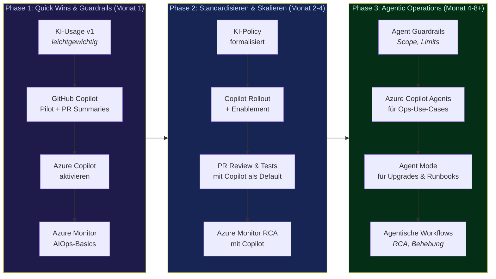

---
layout: chapter
chapterNumber: 7
background: /aiops-monitoring-large.png
showCopyright: false
---

# Zusammenfassung & Ausblick

::intro::

<!--
Zusammenfassung des Talks. Die wichtigsten Takeaways auf einen Blick.

🎨 Image prompt: A satellite looking down at Earth from space with data connections glowing across continents, representing the global impact of AIOps. Digital art, epic space view with blue-green Earth tones.
-->

---
layout: image-right
background: /idea-new.png
hideInToc: true
showCopyright: false
---

# Key Takeaways

 
<v-clicks>

1. **AIOps** unterstützt und beschleunigt Ops - saubere DevOps/<abbr title="Site Reliability Engineering">SRE</abbr>-Arbeit bleibt die Grundlage
2. **RCA in Sekunden** statt Stunden - Azure Copilot + App Insights + Smart Detection
3. **Technical Debt**: KI hilft, aber nur **mit Guardrails** (kleine Batches, automatisierte Reviews, SCA)
4. **Legacy-Modernisierung**: Agent Mode scannt, plant, übernimmt große Teile von Migration und Tests automatisch
5. **Auto-Doku** unterstützt dabei, Wissenslücken zu schließen
6. **KI-Governance**: klare Policy, Human-in-the-Loop, Security-Scans, Reviews

</v-clicks>

<v-click>

### Der rote Faden:

> **KI ersetzt den Menschen nicht - sie gibt ihm bessere Werkzeuge und bessere Argumente.**

</v-click>

<!--
1. AIOps ist keine völlig neue Welt, sondern ein Beschleuniger für Dinge, die wir in DevOps/SRE schon immer tun sollten: beobachten, analysieren, automatisiert reagieren.
2. Root Cause Analysis wird deutlich schneller: statt stundenlang Dashboards zu klicken, bekommt man in Minuten eine erste, datenbasierte Hypothese und einen konkreten Fix
3. Technical Debt: KI kann beim Aufräumen und Absichern helfen, solange wir sie bewusst in Batches, mit Reviews und Security-Scans einsetzen.
4. Legacy-Modernisierung: Agenten nehmen uns viel Fleißarbeit ab (Scans, Pläne, Code-Änderungen, Tests), aber Architektur-Entscheidungen und Freigaben treffen weiterhin Menschen.
5. Auto-Dokumentation: Wo sich Teams oft aus Zeit und Budget-Gründen schwer tun, kann KI helfen, Dokumentation aktuell zu halten und eine Grundlage zu schaffen, auf der das Team aufbauen kann.
6. KI-Governance: klare Policy, Human-in-the-Loop, Security-Scans, Reviews. KI ist kein Zauberstab, der automatisch alles richtig macht - wir müssen sie bewusst einsetzen und kontrollieren.

Der rote Faden: KI ist kein Zauberstab und keine Revolution, die plötzlich alle guten Praktiken einführt.
Sie beschleunigt Teams dabei, Dinge zu tun, die viele bisher aus Zeit- oder Wissensgründen vernachlässigt haben.
Und sie gibt uns bessere Argumente - gegenüber Management, Security und unserem zukünftigen Ich.
-->

---
hideInToc: true
showCopyright: false
---

# AIOps-Adoption Roadmap

<!--
Phase 1 (Monat 1): Quick Wins & Guardrails
- A1: KI-Usage v1 als eine Seite: erlaubte Use Cases, Datenklassen, „kein Shadow-AI“. Noch keine monatelange Konzern-Policy.
- A2: GitHub Copilot für ein Pilotsquad aktivieren, inkl. PR Summaries auf 1–2 wichtigen Repos. Ziel: erste „wow“-Momente im nächsten Sprint.
- A3: Azure Copilot im Ziel-Subscription einschalten, damit Ops-Fragen („zeig mir alle fehlerhaften VMs“, „erklär mir diesen Alert“) direkt im Portal beantwortet werden.
- A4: Azure Monitor AIOps-Basics: Logs/Metriken sauber einspeisen, Alerts kuratieren, damit Copilot und spätere Agents überhaupt gute Signale haben.
- Botschaft: Die meisten dieser Schritte sind Konfigurationsarbeit in Minuten, nicht Projekte in Monaten – fangt heute an und lernt am realen System.

Phase 2 (Monat 2–4): Standardisieren & Skalieren
- B1: Aus KI-Usage v1 wird eine formalisierte KI-Policy mit Legal/Security – jetzt mit echten Beispielen aus dem Pilot statt reiner Theorie.
- B2: Copilot Rollout über weitere Teams mit Champions, Trainings und klaren Erfolgskriterien (Time-to-PR, Test-Coverage, Dev-Zufriedenheit).
- B3: „PR Review & Tests mit Copilot“ im Engineering-Playbook verankern: PR-Summaries, Vorschläge für Änderungen, Test- und Doku-Generierung als Default.
- B4: Azure Monitor RCA mit Copilot etablieren: Alerts erklären lassen, KQL-Queries generieren, Incidents zusammenfassen und Lessons Learned dokumentieren.
- Botschaft: Aus „wir probieren Copilot“ wird „so arbeiten wir standardmäßig“ – mit Messung von Adoption und Wirkung.

Phase 3 (Monat 4–8+): Agentic Operations
- C1: Agent Guardrails definieren: Welche Agenten dürfen was? Nur lesen vs. Konfiguration ändern, Kosten-/Ressourcen-Limits, immer mit Human-in-the-Loop.
- C2: Azure Copilot Agents für konkrete Ops-Use-Cases: z.B. Patch- und Upgrade-Orchestrierung, wiederkehrende Health-Checks, Compliance-Validierung.
- C3: Agent Mode für Upgrades & Runbooks: Agent übernimmt Teile der Ausführung (Deploy, Validate, Rollback-Pfade), Mensch überwacht und genehmigt.
- C4: Agentische Workflows für RCA & Remediation: mehrere Agents arbeiten zusammen – einer analysiert, einer dokumentiert, einer schlägt Remediations vor.
- Botschaft: Wir gehen von „Copilot als Assistent“ zu „Agenten übernehmen repetitive Ops-Arbeit unter klaren Leitplanken“ – mehr Autonomie, ohne Kontrolle zu verlieren.

Call to action:
- Wenn Phase 1 noch nicht gestartet ist: Heute Tools einschalten, kleines Pilot-Team benennen und KI-Usage v1 schreiben.
- Wenn Phase 1 schon läuft: Nächster Schritt ist, Phase-2-Standards explizit zu machen (Playbooks, Metriken, Trainingsplan) und die ersten Agent-Use-Cases zu identifizieren.
-->

---
hideInToc: true
showCopyright: false
---

# Zahlen zum Mitnehmen

<v-click>

  
97%

  
der Entwickler nutzen KI-Tools bei der Arbeit

</v-click>

<v-click>

  
60M+

  
Copilot Code Reviews durchgeführt

</v-click>

<v-click>

  
4,5x

  
mehr KI-Adoption mit klarer Policy

</v-click>

<v-click>

  
84%

  
mehr erfolgreiche Builds (Accenture)

</v-click>

<v-click>

  
7x

  
schnellere Vulnerability-Behebung

</v-click>

<v-click>

  
???

  
Wie sind Eure Zahlen?

</v-click>

<!--
Die wichtigsten Zahlen zum Mitnehmen - perfekt für die Diskussion mit dem Management oder dem Team:

- 97% der Entwickler nutzen bereits KI-Tools (GitHub Survey)
- 60M+ Copilot Code Reviews (März 2026)
- 451% mehr KI-Adoption mit einer klaren Acceptable-Use-Policy (DORA)
- 84% mehr erfolgreiche Builds bei Accenture mit Copilot
- 7x schnellere Security-Vulnerability-Remediation mit Code Scanning Autofix

Quellen: GitHub Blog, DORA, Sonatype, Accenture
-->
