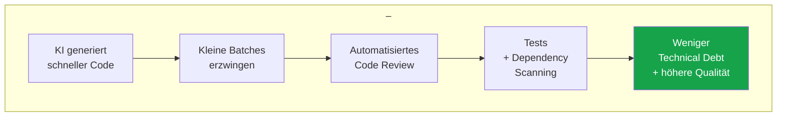

---
layout: chapter
chapterNumber: 3
background: /technical-debt-large.png
showCopyright: false
---

# Technical Debt mit KI vermeiden

::intro::

---
layout: image-right
background: /datenlage-pro-right.png
hideInToc: true
showCopyright: false
---

# Die Datenlage: Pro

 
<v-clicks>

- **GitHub <abbr title="Randomized Controlled Trial">RCT</abbr>** (202 devs):
  - **53%** wahrscheinlicher alle Unit Tests bestanden
  - +2,5% Maintainability
  - +3,6% Readability
- **Accenture Enterprise**:
  - **84%** mehr erfolgreiche Builds
- **Copilot Code Review** (60M+ Reviews):
  - **12.000+** Organisationen
  - **20%** aller Reviews auf GitHub

</v-clicks>

<!--
Die Pro-Seite hat starke, belastbare Studien. Die GitHub RCT-Studie (randomisiert-kontrolliert, 202 Teilnehmer) zeigt signifikante Verbesserungen bei Funktionalität, Maintainability und Readability.

Accenture bestätigt im Enterprise-Kontext: 84% mehr erfolgreiche Builds während der Einführung von Copilot - also weniger kaputte Deployments.

Diese Daten trotzdem vorsichtig interpretieren, da sie von GitHub selbst stammen.

Was man ableiten kann: KI hilft in klar definierten Aufgaben gut. Es fehlt noch belastbare Erkenntis bei großen Architekturentscheidungen

Quellen:
- https://github.blog/news-insights/research/does-github-copilot-improve-code-quality-heres-what-the-data-says/
- https://github.blog/news-insights/research/research-quantifying-github-copilots-impact-in-the-enterprise-with-accenture/
- https://github.blog/ai-and-ml/github-copilot/60-million-copilot-code-reviews-and-counting/

-->

---
layout: image-right
background: /governance-large.png
hideInToc: true
showCopyright: false
---

# Die Datenlage: Contra

<v-clicks>

- **DORA Gen AI Report** 2024:
  - 25% mehr KI-Verwendung →
  - **7,2% weniger Delivery Stability**
  - Ursache: **"Batch Size Trap"**
- **Sonatype State of the Software Supply Chain** 2026:
  - LLMs halluzinieren **Dependency-Versionen**
  - und das mit "hoher Selbstsicherheit"
- **Studienlage**:
  - Voreingenommenheit und Abhängigkeit <small class="text-xs italic">- The Psychology of Learning From Machines, Stanford</small>
  - Reduzierung eigenständiger Problemlösungsfähigkeiten <small class="text-xs italic">- Computing Education in the Era of Generative AI, Paul Denny et al.</small>
  - Architekturelles Urteilsvermögen kann leiden <small class="text-xs italic">- Coding With AI, Chang et al.</small>

</v-clicks>

<!--
Jetzt die Contra-Seite

[click] DORA (= DevOps Research and Assessment) Studio von 2024 zeigt: Teams mit hoher KI-Adoption haben ~7% weniger Delivery Stability. 

Delivery Stability = wie zuverlässig Änderungen in die Production gelangen, ohne etwas kaputt zu machen 

Warum? Die "Batch Size Trap" - KI erzeugt schneller mehr Code, der in größeren Batches reviewed werden muss. mehr Code pro PR, langsamere Reviews, mehr versteckte Fehler...

[click] Sonatype warnt: LLMs halluzinieren bei Dependency-Empfehlungen. Fast immer kein Zugriff auf Datenbanken / Security Advisories, werden gerne falsche / schädliche Versionen vorschlagen. (z.B. auch wegen Data-Cutoff)
(wobei man auch sagen kann, Menschen machen gerne ähnliche Fehler z.B. OSS neuer = besser)

[click]
[1] KI fördert Automatisierungsbias und Abhängigkeit. Insbesondere Anfänger neigen dazu, KI-generierte Lösungen ungeprüft zu übernehmen und deren Qualität oder Korrektheit nicht ausreichend zu hinterfragen.

[2] Wenn Lösungen direkt generiert werden, entfällt ein Teil des kognitiven Prozesses, der normalerweise für Analyse, Zerlegung und Lösung komplexer Probleme notwendig ist.

[3] Entwickler werden möglicherweise effizienter beim Formulieren von Prompts, entwickeln jedoch weniger Erfahrung in Architekturentscheidungen, Code-Reviews, Wartbarkeit und der Bewertung von Zielkonflikten.

Quellen:
- https://dora.dev/ai/gen-ai-report/
- https://www.sonatype.com/state-of-the-software-supply-chain/introduction

- [Computing Education in the Era of Generative AI](https://arxiv.org/abs/2306.02608)
- [The Psychology of Learning From Machines, Stanford](https://scale.stanford.edu/ai/repository/psychology-learning-machines-anthropomorphic-ai-and-paradox-automation-education)
- [Coding With AI: From a Reflection on Industrial Practices to Future Computer Science and Software Engineering Education](https://arxiv.org/abs/2512.23982)
-->

---
hideInToc: true
showCopyright: false
---

# Geschwindigkeit vs. Qualität

 

<ReviewFunnel />

<!--
Das ist die Kernbotschaft dieses Kapitels: KI macht Teams nicht automatisch besser, sondern erstmal nur schneller.

Guardrails: 
* Schutzmechanismen
* klare Prozesse
* Disziplin

Ohne Guardrails kippt dieser Geschwindigkeitsgewinn schnell ins Negative.
Die KI produziert mehr Code in kürzerer Zeit, dadurch wachsen die Changesets, Reviews werden langsamer und oberflächlicher, und am Ende leidet die Stabilität.
Genau so entsteht neue Technical Debt.

Mit Guardrails kann derselbe Produktivitätsschub aber in die andere Richtung wirken.
Wir halten die Batches klein, lassen automatisierte Reviews darüberlaufen und prüfen mit Tests sowie SCA oder SBOM nach.
Dann bedeutet mehr Geschwindigkeit nicht mehr Chaos, sondern mehr Durchsatz bei saubererem Code.

Die eigentliche Aussage der Folie ist also nicht: KI löst Technical Debt.
Die Aussage ist: KI verstärkt das bestehende Engineering-System.
Mit schwachen Prozessen erzeugen wir schneller neue Schulden.
Mit guten Guardrails liefern wir schneller und sauberer.
-->

---
layout: cover
coverImage: /technical-debt-large.png
hideInToc: true
title: Demo - Copilot Code Review
showCopyright: false
---

  <h1>Demo: Copilot Code Review in Aktion</h1>

<v-click>
  
</v-click>

<!--
⚠️ Speakerwechsel ⚠️

**DEMO 2: Copilot Code Review (ca. 7 Minuten)**

1. Öffne ein GitHub Repository: <a href="https://github.com/xebia/demo-root-cause-analysis/edit/main/src/ProductCatalog.Api/Services/CosmosProductService.cs">Product API Service</a>
2. Ändere:
   1.  Zeile 94: Füge einen Kommentar hinzu: "// I don't like to pay anaything"
   2.  Zeile 95 (Price -Bedingung) "kleiner" in "größer gleich" (führt zu falschem Verhalten)
   3.  Zeile 100: Guid.NewGuid().ToString() nach: Guid.Empty.ToString()
3. Branch erstellen und Copilot als Reviewer hinzufügen
4. Bearbeitung beobachten, und erklären

**Key Message:** "Copilot Code Review handles PR reviews, allowing teams to focus on complex tasks." - Suvarna Rane, Software Dev Manager, General Motors

**Fallback:** Screenshots der GitHub UI mit echten Copilot Code Review Comments zeigen.
-->
