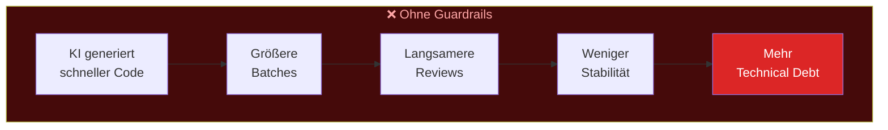

# Technical Debt mit KI bekämpfen

::intro::

 
Was sagen die Daten wirklich?

<!--
Technical Debt ist oft politisch induziert: "seid schneller, billiger". Hilft KI wirklich dagegen? Die Antwort ist differenziert - und genau das macht sie glaubwürdig.
-->

---
layout: image-right
background: /datenlage-pro-right.png
hideInToc: true
---

# Die Datenlage: Pro

 
<v-clicks>

- **GitHub <abbr title="Randomized Controlled Trial">RCT</abbr>** (202 devs):
  - **53%** wahrscheinlicher alle Unit Tests bestanden
  - +2,5% Maintainability
  - +3,6% Readability
- **Accenture Enterprise**:
  - **84%** mehr erfolgreiche Builds
- **Copilot Code Review** (60M+ Reviews):
  - **12.000+** Organisationen
  - **20%** aller Reviews auf GitHub

</v-clicks>

<!--
Die Pro-Seite hat starke, belastbare Studien. Die GitHub RCT-Studie (randomisiert-kontrolliert, 202 Teilnehmer) zeigt signifikante Verbesserungen bei Funktionalität, Maintainability und Readability.

Accenture bestätigt im Enterprise-Kontext: 84% mehr erfolgreiche Builds - also weniger kaputte Deployments.

Quellen:
- https://github.blog/news-insights/research/does-github-copilot-improve-code-quality-heres-what-the-data-says/
- https://github.blog/news-insights/research/research-quantifying-github-copilots-impact-in-the-enterprise-with-accenture/
- https://github.blog/ai-and-ml/github-copilot/60-million-copilot-code-reviews-and-counting/

-->

---
layout: image-right
background: /governance-large.png
hideInToc: true
---

# Die Datenlage: Contra

<v-clicks>

- **DORA Gen AI Report**:
  - 25% mehr KI-Adoption →
  - **7,2% weniger Delivery Stability**
  - Ursache: **"Batch Size Trap"**
- **Sonatype 2026**:
  - LLMs halluzinieren **Dependency-Versionen**
  - _"AI should not guess."_ - Brian Fox, CTO
- **Studienlage**:
  - Voreingenommenheit und Abhängigkeit <small class="text-xs italic">- The Psychology of Learning From Machines, Stanford</small>
  - Reduzierung eigenständiger Problemlösungsfähigkeiten <small class="text-xs italic">- Computing Education in the Era of Generative AI, Paul Denny et al.</small>
  - Architekturelles Urteilsvermögen kann leiden <small class="text-xs italic">- Coding With AI, Chang et al.</small>

</v-clicks>

<!--
Jetzt die Contra-Seite - und die ist wichtig für die Glaubwürdigkeit.

[click] DORA (= DevOps Research and Assessment.) zeigt: 25% mehr KI-Adoption korreliert mit 7,2% weniger Delivery Stability. Warum? Die "Batch Size Trap" - KI erzeugt schneller mehr Code, der in größeren Batches reviewed werden muss. Schnellere Erzeugung ohne disziplinierte kleine Batches untergräbt die Qualität.

[click] Sonatype warnt: LLMs halluzinieren bei Dependency-Empfehlungen - sie schlagen Versionen vor, die nicht existieren.

[click]
[1] KI fördert Automatisierungsbias und Abhängigkeit. Insbesondere Anfänger neigen dazu, KI-generierte Lösungen ungeprüft zu übernehmen und deren Qualität oder Korrektheit nicht ausreichend zu hinterfragen.

[2] Wenn Lösungen direkt generiert werden, entfällt ein Teil des kognitiven Prozesses, der normalerweise für Analyse, Zerlegung und Lösung komplexer Probleme notwendig ist.

[3] Entwickler werden möglicherweise effizienter beim Formulieren von Prompts, entwickeln jedoch weniger Erfahrung in Architekturentscheidungen, Code-Reviews, Wartbarkeit und der Bewertung von Zielkonflikten.

Quellen:
- https://dora.dev/ai/gen-ai-report/
- https://www.sonatype.com/state-of-the-software-supply-chain/introduction

- [Computing Education in the Era of Generative AI](https://arxiv.org/abs/2306.02608)
- [The Psychology of Learning From Machines, Stanford](https://scale.stanford.edu/ai/repository/psychology-learning-machines-anthropomorphic-ai-and-paradox-automation-education)
- [Coding With AI: From a Reflection on Industrial Practices to Future Computer Science and Software Engineering Education](https://arxiv.org/abs/2512.23982)
-->

---
hideInToc: true
---

# Die Qualitäts-Geschwindigkeits-Balance

<!--
Dieses Diagramm zeigt den entscheidenden Unterschied:

OHNE Guardrails: KI generiert schneller → größere Batches → langsamere Reviews → weniger Stabilität → mehr Technical Debt. Das ist die DORA-Warnung.

MIT Guardrails: KI generiert schneller → kleine Batches erzwingen → automatisiertes Code Review → Tests + SCA/SBOM → schneller UND sauberer.

Die Botschaft: KI löst das Technical-Debt-Problem nicht automatisch. Aber mit den richtigen Guardrails wird sie zum Hebel FÜR Qualität statt dagegen.
-->

---
layout: cover
coverImage: /technical-debt-large.png
hideInToc: true
title: Demo - Copilot Code Review
---

  <h1>Demo: Copilot Code Review in Aktion</h1>

<v-click>
  
</v-click>

<!--
**DEMO 2: Copilot Code Review (ca. 7 Minuten)**

1. Öffne ein GitHub Repository mit Copilot Code Review aktiviert
2. Erstelle einen PR mit absichtlich problematischem Code:
   - Fehlende Dependency im React useCallback Hook
   - Potentielle Endlosschleife in Retry-Logik
   - Unvalidierter User-Input
3. Zeige wie Copilot Code Review automatisch triggered wird
4. Zeige die Multi-Line Comments mit Code-Fix-Vorschlägen
5. Demonstriere Batch-Autofix: mehrere Issues auf einmal fixen
6. Zeige die Stille bei gutem Code (29% der Reviews: kein Kommentar = kein Problem)

**Key Message:** "Copilot Code Review handles PR reviews, allowing teams to focus on complex tasks." - Suvarna Rane, Software Dev Manager, General Motors

**Fallback:** Screenshots der GitHub UI mit echten Copilot Code Review Comments zeigen.

🎨 Image prompt: Two developers collaborating with AI code review suggestions floating between them as holographic cards. Digital art, collaborative warm lighting.
-->
