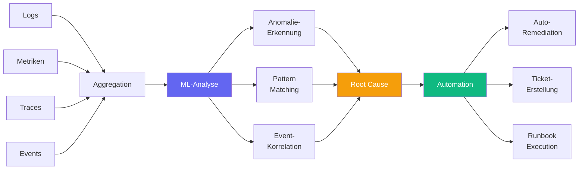

# Was ist AIOps?

::intro::

Künstliche Intelligenz trifft IT-Operations

<!--
Einführung in AIOps. Gartner hat den Begriff 2017 geprägt. Heute ist es ein Schlüsselkonzept für die Wartung moderner Softwaresysteme.
-->

---
layout: image-right
background: /idea-new.png
hideInToc: true
---

# AIOps: Definition & Scope

<v-clicks>

- **AIOps** = Artificial Intelligence for IT Operations
- Geprägt von **Gartner (2017)**
- Kombination: **Big Data** + **Machine Learning**
- Angewendet auf:
  - Monitoring & Observability
  - Incident Management
  - Root Cause Analysis
  - Capacity Planning
  - Auto-Remediation

</v-clicks>

<!--
AIOps wurde 2016 von Gartner definiert als die Anwendung von ML und Big Data auf IT-Operations. Es geht über einfache Alerting-Regeln hinaus — die KI erkennt Muster, korreliert Events und schlägt Lösungen vor.

Wichtig: AIOps ist nicht ein einzelnes Tool, sondern ein Paradigma. Es umfasst den gesamten Lifecycle von der Erkennung bis zur automatischen Behebung.
-->

---
hideInToc: true
layout: center
---

# “there is no future of IT Operations that does not include AIOps.”
 

_Gartner, 2022_ 

<!-- Starke Worte. Und das konnte man bereits im Gartner Report 2022 nachlesen. -->

---
hideInToc: true
---

# AIOps-Pipeline

<!--
Die AIOps-Pipeline visualisiert: Daten aus verschiedenen Quellen (Logs, Metriken, Traces, Events) werden aggregiert (Big Data), durch ML analysiert, Root Causes identifiziert und automatische Maßnahmen eingeleitet.

Drei Kernfähigkeiten der ML-Analyse: Anomalie-Erkennung (ist das normal?), Pattern Matching (haben wir das schon mal gesehen?) und Event-Korrelation (hängen diese Alerts zusammen?).
-->

---
layout: two-column
hideInToc: true
---

# AIOps vs. Traditional Ops

::left::

## Traditional Ops

<v-clicks>

- **Regelbasierte** Alerts
- **Manuelle** Korrelation
- **Reaktiv**: Erst nach dem Ausfall
- Alert Fatigue: **Tausende** Alerts/Tag
- MTTR: **Stunden bis Tage**

</v-clicks>

::right::

<v-click>

## AIOps

</v-click>

<v-clicks>

- **ML-basierte** Anomalie-Erkennung
- **Automatische** Event-Korrelation
- **Proaktiv**: Vor dem Ausfall
- Intelligentes Alerting: **Priorisiert**
- MTTR: **Minuten**

</v-clicks>

<!--
Der zentrale Unterschied: Traditional Ops ist regelbasiert und reaktiv — der Mensch stellt Schwellwerte ein und reagiert auf Alerts. AIOps nutzt ML um proaktiv Muster zu erkennen und Probleme zu lösen, bevor sie eskalieren.

Alert Fatigue ist ein reales Problem: Teams ignorieren 30-50% ihrer Alerts weil sie Rauschen sind. AIOps priorisiert und korreliert, sodass nur actionable Alerts durchkommen.
-->
