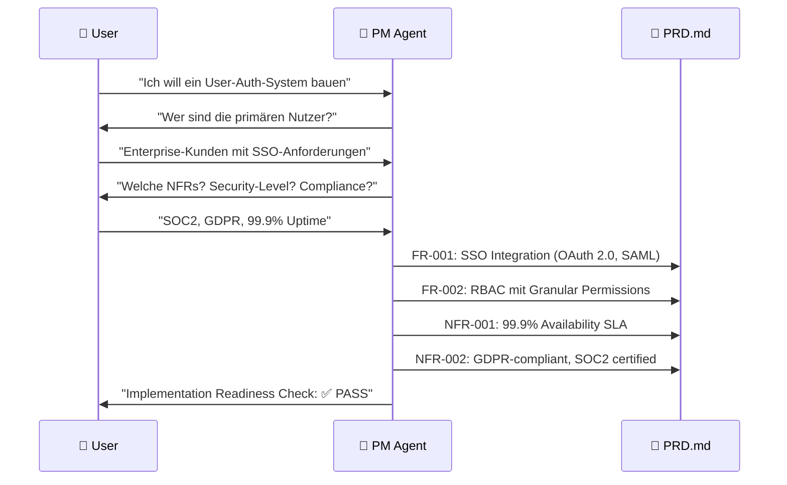
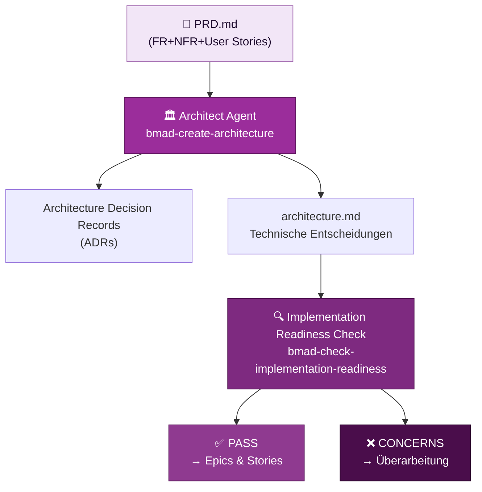

# Anforderungen präzisieren mit BMad

::intro::

<br/>
<br/>

Von der vagen Idee zum strukturierten PRD — mit KI-Agenten als Sparring-Partner

<!--
- Kapitel 3: Kernteil des Vortrags
- Leitfrage: Wie präzisiert BMad Anforderungen?

-->

---
layout: image-right
background: /bmad-ai-lightbulb.png
hideInToc: true

---

# Phase 1: Analyse — Den Problemraum erkunden

<br/>
<br/>

<v-clicks>

- 🧠 **Brainstorming** (`bmad-brainstorming`) — KI als Coach für Ideenfindung
- 🔬 **Research** (`bmad-domain-research`) — Markt-, Domain- und Tech-Validierung
- 📄 **Product Brief** (`bmad-product-brief`) — strategische Vision dokumentieren
- ⚡ **PRFAQ** (`bmad-prfaq`) — Working Backwards, Stresstest für die Idee

</v-clicks>

<v-click>

> 💡 Phase 1 ist **optional** — aber je mehr Analyse, desto schärfer das PRD

</v-click>

<!--
- Phase 1: optional, hoher Nutzen
- PRFAQ-Check: Pressemitteilung vor erster Codezeile
- Reifegrad-Indikator: unklare PMF -> Idee noch unreif
- Brainstorming: KI fragt nach, extrahiert Wissen
- Abgrenzung: nicht "einfach ChatGPT fragen"

-->

---
layout: image-right
background: /bmad-governance-control-center.png
hideInToc: true

---

# Phase 2: Das PRD — Das Herzstück

<br/>

<v-clicks>

- 📝 **PRD** = Product Requirements Document
- Erstellt durch **PM Agent** mit `bmad-create-prd`
- Enthält:
  - **Functional Requirements (FRs)** — was soll das System tun?
  - **Non-Functional Requirements (NFRs)** — Qualität, Performance, Security
  - **Scope** — was ist IN und was ist OUT
  
- Wird **Basis für alle weiteren Phasen**
  - z.B. Grundlage für Fragen zum Erstellenvon **User Stories** mit Akzeptanzkriterien
  
</v-clicks>

<!--
- PRD: Dreh- und Angelpunkt im Workflow
- Living Document statt statischer Spezifikation
- PM Agent: gezielte Nutzer- und Qualitätsfragen
- Ergebnis: strukturierte Dokumentation in PRD.md

-->

---
hideInToc: true

---

## PRD-Workflow: Von der Idee zum Dokument



<!--
- PM Agent: strukturiertes Interview
- Fragen auf Basis von Best Practices
- Konsistenz- und Vollständigkeitscheck
- Beispiel-Rückfrage: SSO auch mit Single Sign-Out?

-->

---
layout: image-right
background: /bmad-secret-agent-analysis.png
hideInToc: true

isDark: true
---

# 🎬 Demo 1: PRD-Erstellung mit BMad PM Agent

<br/>
<br/>

<v-click>

```bash
# BMad installieren
npx bmad-method install

# PM Agent laden
bmad-agent-pm

# PRD-Workflow starten
bmad-create-prd
```

</v-click>

<!--
- Demo 1: PRD-Erstellung live
- Setup: Claude/Cursor/VS Code + Copilot
- Aktivierung: bmad-agent-pm
- Workflowstart: bmad-create-prd
- Beispiel: Auth-System für Enterprise-Kunden
- Live-Teil: gezielte Fragen beantworten
- Output zeigen: PRD.md strukturiert und vollständig
- Highlight: Logiklücken erkennen (z. B. SSO ohne IdP)
- Highlight: NFR-Anreicherung automatisch
- Highlight: PRD als Basis für Folgeschritte
- Fallback: Screenshot/Recording

-->

---
layout: image-right
background: /bmad-governance-control-center.png
hideInToc: true

---

## Vom PRD zur Architektur: Phase 3



<!--
- PRD als Input für Architect Agent
- Technische Entscheidungen via ADRs explizit
- Readiness Check als Gate vor Coding
- Ergebnisarten: PASS, CONCERNS, FAIL
- Immer mit konkreten Verbesserungsvorschlägen

-->
