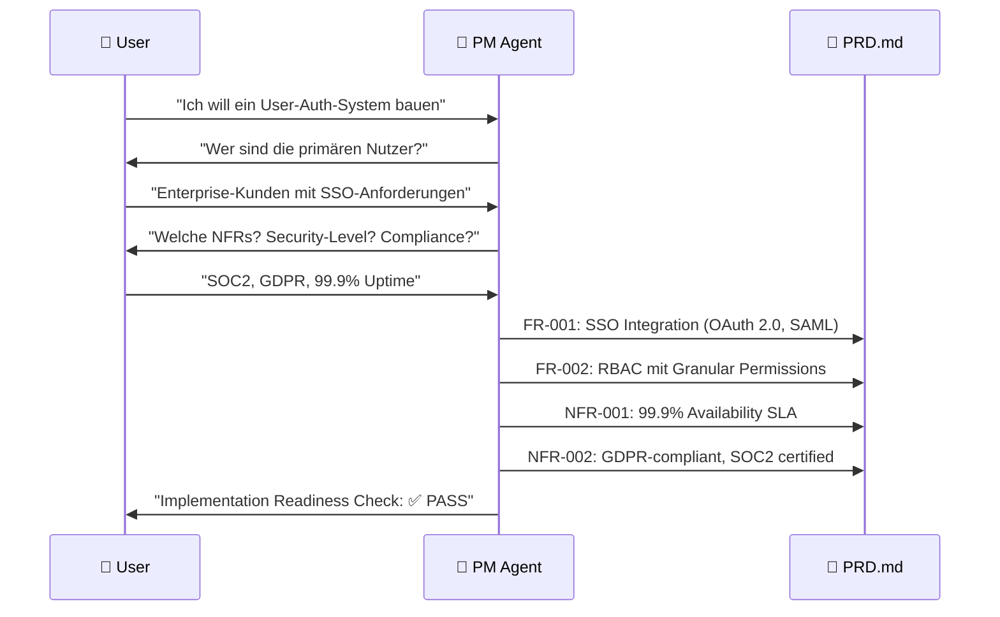
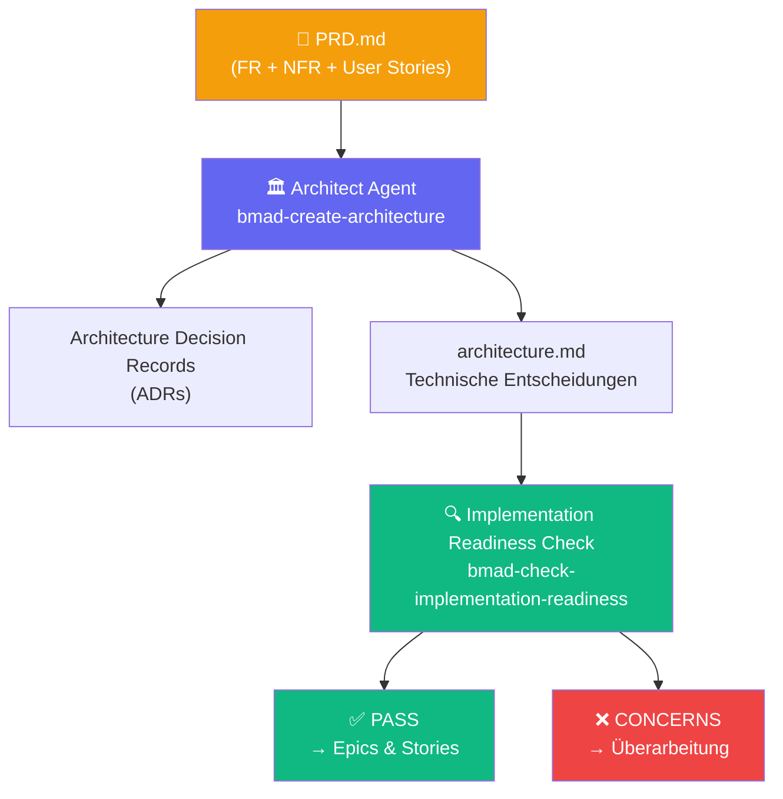

# Anforderungen präzisieren mit BMad

::intro::

<br/>
<br/>

Von der vagen Idee zum strukturierten PRD — mit KI-Agenten als Sparring-Partner

<!--
Kapitel 3: Der Kern des Vortrags. Wie hilft BMad dabei, Anforderungen zu präzisieren?

🎨 Image prompt: Two professionals collaborating intensely over a document, with AI visualization overlay showing structured analysis. Creative digital art blending real people silhouettes with AI network patterns.
-->

---
layout: image-right
background: /bmad-ai-lightbulb.png
hideInToc: true
showCopyright: false
---

# Phase 1: Analyse — Den Problemraum erkunden

<br/>
<br/>

<v-clicks>

- 🧠 **Brainstorming** (`bmad-brainstorming`) — KI als Coach für Ideenfindung
- 🔬 **Research** (`bmad-domain-research`) — Markt-, Domain- und Tech-Validierung
- 📄 **Product Brief** (`bmad-product-brief`) — strategische Vision dokumentieren
- ⚡ **PRFAQ** (`bmad-prfaq`) — Working Backwards, Stresstest für die Idee

</v-clicks>

<v-click>

> 💡 Phase 1 ist **optional** — aber je mehr Analyse, desto schärfer das PRD

</v-click>

<!--
Phase 1 ist optional aber wertvoll. Besonders PRFAQ ist sehr kraftvoll:
"Schreib die Pressemitteilung für dein fertiges Produkt — bevor du eine Zeile Code schreibst."
Wenn man das nicht überzeugend machen kann, ist die Idee noch nicht reif.

Brainstorming: KI stellt Fragen, zieht Ideen heraus — generiert sie NICHT selbst.
Das ist der Unterschied zu "einfach ChatGPT fragen".

🎨 Image prompt: A glowing lightbulb over an open book, representing ideation and structured thinking. Warm orange and blue tones, digital art style similar to /bmad-ai-lightbulb.png.
-->

---
layout: two-column
hideInToc: true
showCopyright: false
---

# PRFAQ: Working Backwards mit KI

::left::

## Ohne PRFAQ ❌

```
"Wir brauchen ein User-Auth-System 
mit SSO und RBAC."

→ Teams diskutieren wochen-
  lang über Details
→ Budget explodiert  
→ Launch-Termin verfehlt
```

::right::

## Mit PRFAQ + BMad ✅

```
"Seattle, 1. März 2026 —
XYZ Corp gibt Matterflow bekannt,
die erste Auth-Plattform, die..."

→ Klare Value Proposition
→ Echte Customer FAQs
→ Scope ist definiert
```

<!--
PRFAQ (Press Release FAQ) ist Amazons Working Backwards Methode.
BMad adaptiert diese als interaktiven KI-Challenge-Prozess.

Der Analyst-Agent stellt provozierende Fragen: "Was tun Nutzer, wenn sie ihr Passwort vergessen?"
"Was passiert bei einem Sicherheitsvorfall?" — Schwachstellen werden früh aufgedeckt.

🎨 Image prompt: Not needed — text-heavy comparison slide.
-->

---
layout: image-right
background: /bmad-governance-control-center.png
hideInToc: true
showCopyright: false
---

# Phase 2: Das PRD — Das Herzstück

<br/>

<v-clicks>

- 📝 **PRD** = Product Requirements Document
- Erstellt durch **PM Agent** mit `bmad-create-prd`
- Enthält:
  - **Functional Requirements (FRs)** — was soll das System tun?
  - **Non-Functional Requirements (NFRs)** — Qualität, Performance, Security
  - **User Stories** mit Akzeptanzkriterien
  - **Scope** — was ist IN und was ist OUT
- Wird **Basis für alle weiteren Phasen**

</v-clicks>

<!--
Das PRD ist der Dreh- und Angelpunkt im BMad-Workflow.
Es ist nicht ein starres Dokument, sondern lebt mit dem Projekt.

Der PM Agent stellt gezielte Fragen: "Wer sind die Nutzer?" "Was sind die Qualitätsziele?"
Die Antworten werden strukturiert im PRD.md dokumentiert.

🎨 Image prompt: A professional document on a desk with structured sections highlighted, representing well-organized requirements. Clean, corporate digital art style with warm lighting.
-->

---
hideInToc: true
showCopyright: false
---

# PRD-Workflow: Von der Idee zum Dokument



<!--
Der PM-Agent führt ein strukturiertes Interview durch.
Keine offenen Fragen ins Blaue — gezielte Fragen basierend auf Best Practices.

Wichtig: Der Agent prüft auch Konsistenz und Vollständigkeit.
"Sie haben SSO erwähnt — haben Sie auch Anforderungen für Single Sign-Out?"

🎨 Image prompt: Not needed — sequence diagram slide.
-->

---
layout: image-right
background: /bmad-secret-agent-analysis.png
hideInToc: true
showCopyright: false
isDark: true
---

# 🎬 Demo 1: PRD-Erstellung mit BMad PM Agent

<br/>
<br/>

<v-click>

```bash
# BMad installieren
npx bmad-method install

# PM Agent laden
bmad-agent-pm

# PRD-Workflow starten
bmad-create-prd
```

</v-click>

<!--
DEMO 1: PRD-Erstellung live demonstrieren.

Schritte:
1. Claude Code öffnen (oder Cursor/VS Code mit Copilot)
2. "bmad-agent-pm" eingeben um den PM Agent zu aktivieren
3. "bmad-create-prd" starten
4. Beispiel-Anforderung eingeben: "Ich will ein Authentifizierungssystem für Enterprise-Kunden"
5. Agent stellt gezielte Fragen — live beantworten
6. PRD.md wird generiert — zeigen wie strukturiert und vollständig es ist

Zeige besonders:
- Wie der Agent Logikfehler aufdeckt ("Sie wollen SSO aber erwähnen keinen IdP-Provider?")
- Wie NFRs automatisch angereichert werden
- Wie das PRD.md die Basis für alle weiteren Schritte wird

Backup: Screenshot/Recording falls Live-Demo Probleme macht.

🎨 Image prompt: A secret agent in a trenchcoat looking at classified documents with glowing AI overlays, representing the PM Agent analyzing requirements. Digital art, dramatic lighting, dark background similar to /bmad-secret-agent-analysis.png.
-->

---
layout: image-right
background: /bmad-governance-control-center.png
hideInToc: true
showCopyright: false
---

## Vom PRD zur Architektur: Phase 3



<!--
Das PRD wird zur Eingabe für den Architect Agent.
Der Architect macht technische Entscheidungen explizit in Architecture Decision Records.

Implementation Readiness Check: Gate-Kontrolle bevor Code geschrieben wird.
Ergebnis: PASS, CONCERNS oder FAIL — mit konkreten Verbesserungsvorschlägen.

🎨 Image prompt: Not needed — mermaid diagram slide.
-->
