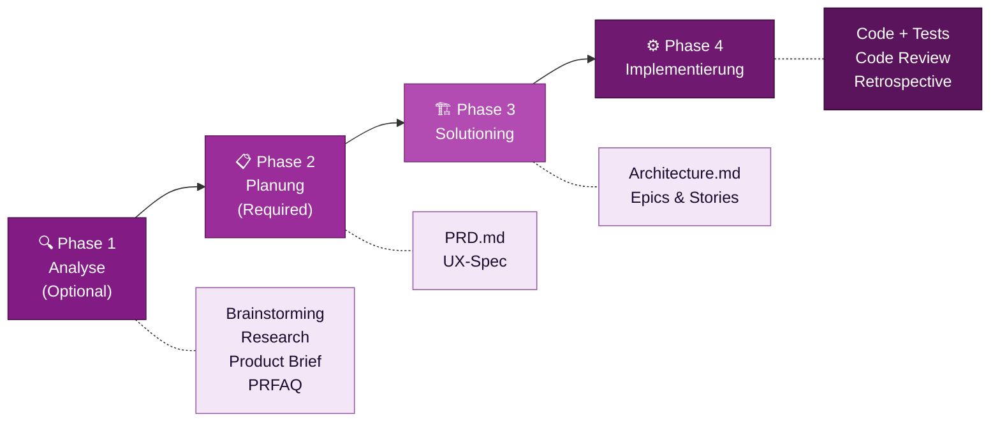

# Die BMad-Methode

::intro::

KI-gesteuertes agiles Entwickeln vom ersten Gedanken bis zum Deployment

<!--
Einführung in BMad. Frage ans Publikum: "Wer kennt BMad bereits?"

🎨 Image prompt: A fleet of spaceships representing multiple AI agents working together, flying in formation through space. Futuristic digital art, dark background with vibrant neon lights, similar style to /bmad-agent-fleet.png.
-->

---
layout: image-right
background: /bmad-ai-lightbulb.png
hideInToc: true
showCopyright: false
---

# Was ist BMad?

<v-clicks>

- **B**uild **M**ore **A**rchitect **D**reams
- 100% **Open Source** (MIT Lizenz)
- KI-gesteuertes Framework für **gesamten SW-Entwicklungs-Lifecycle**
- Spezialisierte **KI-Agenten** als Experten-Kollaborateure
- Grounded in **agilen Methoden**
- Unterstützt: Claude Code, Cursor, GitHub Copilot, Codex CLI

</v-clicks>

<!--
BMad ist kein einzelnes Tool — es ist ein Framework, das KI-Agenten strukturiert einsetzt.
Wichtig: BMad ersetzt keine agilen Methoden, sondern setzt sie mit KI-Unterstützung um.

Website: https://docs.bmad-method.org
GitHub: https://github.com/bmad-code-org/BMAD-METHOD

🎨 Image prompt: A glowing lightbulb made of neural network nodes, representing AI-powered ideas. Warm blue light, dark background, futuristic digital art similar to /bmad-ai-lightbulb.png.
-->

---
layout: image-right
background: /bmad-agent-fleet.png
hideInToc: true
showCopyright: false
---

# Erste Schritte mit BMad

<br/>

<v-clicks>

1. **Installieren**: `npx bmad-method install`
2. **Tutorial starten**: `bmad-help` für intelligente Führung
3. **Klein anfangen**: Quick Flow für das nächste kleine Feature
4. **TEA hinzufügen**: `npx bmad-method install` → TEA Modul
5. **Community**: Discord, GitHub, YouTube

</v-clicks>

<v-click>

```
🌐 docs.bmad-method.org
📦 npmjs.com/package/bmad-method  
```

</v-click>

<!--
Call-to-Action: Was können die Zuhörer heute noch tun?

BMad ist komplett kostenlos und Open Source.
Die Community ist aktiv und hilfreich.
Der Start mit npx bmad-method install dauert 5 Minuten.

🎨 Image prompt: A fleet of spaceships launching toward a bright horizon, representing teams starting their BMad journey. Inspiring digital art, warm sunrise colors, futuristic style similar to /bmad-agent-fleet.png.
-->

---
hideInToc: true
showCopyright: false
---

## BMad: 4 Phasen, 1 Framework

### Klissischer Prozess, kein (A)TDD

<br/>



<!--
Das zentrale Framework: 4 Phasen, die aufeinander aufbauen.
Jede Phase produziert Dokumente, die der nächsten Phase als Kontext dienen.
Dies ist der Kern des Context Engineerings in BMad.

Phase 1 ist optional, Phase 2 ist obligatorisch.
Für kleine Projekte gibt es den "Quick Flow" der die Phasen 1-3 überspringt.

🎨 Image prompt: Not needed — mermaid diagram slide.
-->

---
layout: image-right
background: /bmad-agents-specialized-experts.png
hideInToc: true
showCopyright: false
---

# BMad Agenten: Spezialisierte KI-Experten

<br/>
<br/>
<br/>


<v-clicks>

- 🎯 **PM Agent** — Product Requirements, PRD-Erstellung
- 🏛️ **Architect Agent** — technische Entscheidungen, ADRs
- 👩‍💻 **Developer Agent** — Story-Implementierung, Code Review
- 🎨 **UX Agent** — User Experience Design
- 🔬 **Analyst Agent** — Research, Brainstorming
- 🧪 **TEA Agent** — Test Strategy & Automation *(Modul)*
- 🆘 **BMad-Help** — intelligenter Guide für "was als nächstes?"

</v-clicks>

<!--
BMad kommt mit über 12 spezialisierten Agenten. Jeder Agent hat sein eigenes Expertenwissen.
Das Besondere: Die Agenten kommunizieren über strukturierte Dokumente miteinander.

Party Mode: Mehrere Agenten können zusammen in einer Session arbeiten und diskutieren.

🎨 Image prompt: A team of diverse AI robot heads representing different agent specializations — each with unique features like blueprints, code symbols, test tubes. Digital art, friendly futuristic style.
-->

---
layout: image-left
background: /bmad-human-ai-copilot.png
hideInToc: true
showCopyright: false
---

# BMad vs. "einfach KI fragen"

| Aspekt | KI direkt fragen | BMad-Methode |
|--------|-----------------|--------------|
| **Kontext** | verloren nach Session | persistent in Docs |
| **Qualität** | inkonsistent | strukturiert |
| **Trace** | keine Nachvollziehbarkeit | vollständig auditierbar |
| **Team** | einzelne Nutzung | kollaborativ |
| **Skalierung** | kleines Scope | enterprise-fähig |

<!--
Der entscheidende Unterschied: BMad schafft persistenten, strukturierten Kontext.
KI direkt fragen ist wie mit einem goldfish mit Gedächtnis zu arbeiten — jede Session startet von Null.
BMad baut Kontext auf, der von Agent zu Agent weitergegeben wird.

🎨 Image prompt: A pilot in a cockpit with AI co-pilot displays, symbolizing human-AI collaboration with structure and clarity. Professional digital art, warm cockpit lighting, similar to /bmad-human-ai-copilot.png.
-->

---
layout: image-right
background: /bmad-governance-control-center.png
hideInToc: true
showCopyright: false
---

# BMad-Module: Das Ökosystem

<br/>

<v-clicks>

- 🧱 **BMad Method (BMM)** — Core Framework, 34+ Workflows
- 🔧 **BMad Builder (BMB)** — eigene Agenten & Workflows erstellen
- 🧪 **Test Architect (TEA)** — Risk-based Testing & Automation *(heute unser Fokus!)*
- 🎮 **Game Dev Studio** — Unity, Unreal, Godot Workflows
- 💡 **Creative Intelligence Suite** — Innovation & Design Thinking

</v-clicks>

<!--
BMad ist modular aufgebaut. Man installiert nur was man braucht.
Für uns heute besonders relevant: TEA — der Test Architect.

Installation: npx bmad-method install → Modul auswählen

🎨 Image prompt: An ecosystem visualization showing multiple modules connecting to a central hub, like nodes in a network. Futuristic digital art with glowing connections, dark background.
-->
