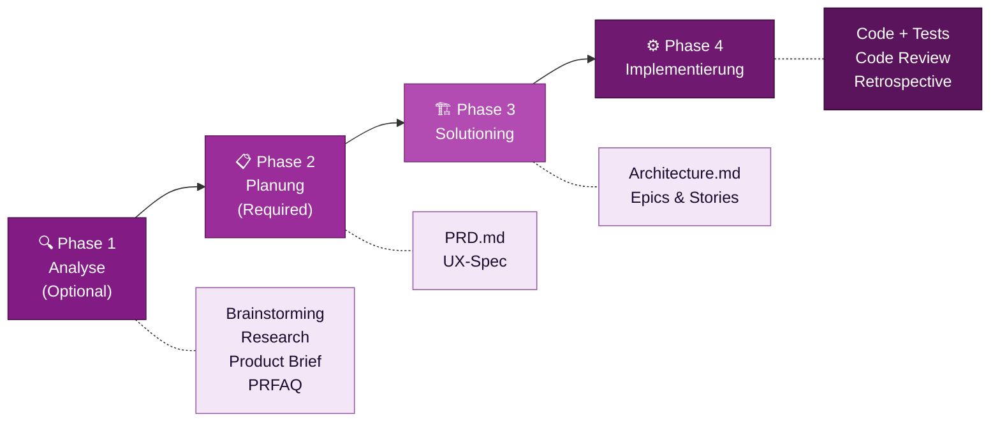

# Die BMad-Methode

::intro::

KI-gesteuertes agiles Entwickeln vom ersten Gedanken bis zum Deployment

<!--
- Intro: BMad kurz einordnen
- Publikumsfrage: Wer kennt BMad bereits?

-->

---
layout: image-right
background: /bmad-ai-lightbulb.png
hideInToc: true
showCopyright: false
---

# Was ist BMad?

<v-clicks>

- **B**uild **M**ore **A**rchitect **D**reams
- 100% **Open Source** (MIT Lizenz)
- KI-gesteuertes Framework für **gesamten SW-Entwicklungs-Lifecycle**
- Spezialisierte **KI-Agenten** als Experten-Kollaborateure
- Grounded in **agilen Methoden**
- Unterstützt: Claude Code, Cursor, GitHub Copilot, Codex CLI

</v-clicks>

<!--
- Kein Einzeltool, sondern Framework
- Strukturierter Einsatz spezialisierter KI-Agenten
- Ergänzung agiler Methoden, kein Ersatz
- Website: https://docs.bmad-method.org
- GitHub: https://github.com/bmad-code-org/BMAD-METHOD

-->

---
layout: image-right
background: /bmad-agent-fleet.png
hideInToc: true
showCopyright: false
---

# Erste Schritte mit BMad

<br/>

<v-clicks>

1. **Installieren**: `npx bmad-method install`
2. **Tutorial starten**: `bmad-help` für intelligente Führung
3. **Klein anfangen**: Quick Flow für das nächste kleine Feature
4. **TEA hinzufügen**: `npx bmad-method install` → TEA Modul
5. **Community**: Discord, GitHub, YouTube

</v-clicks>

<v-click>

```
🌐 docs.bmad-method.org
📦 npmjs.com/package/bmad-method  
```

</v-click>

<!--
- Call-to-Action: Start noch heute
- Kostenlos, Open Source
- Aktive Community
- Einstieg in ca. 5 Minuten: npx bmad-method install

-->

---
hideInToc: true
showCopyright: false
---

## BMad: 4 Phasen, 1 Framework

### Klissischer Prozess, kein (A)TDD

<br/>



<!--
- Kernmodell: 4 aufbauende Phasen
- Output je Phase als Input für nächste Phase
- Context Engineering als roter Faden
- Phase 1 optional, Phase 2 verpflichtend
- Quick Flow für kleine Vorhaben (Phase 1-3 überspringen)

-->

---
layout: image-right
background: /bmad-agents-specialized-experts.png
hideInToc: true
showCopyright: false
---

# BMad Agenten: Spezialisierte KI-Experten

<br/>
<br/>
<br/>


<v-clicks>

- 🎯 **PM Agent** — Product Requirements, PRD-Erstellung
- 🏛️ **Architect Agent** — technische Entscheidungen, ADRs
- 👩‍💻 **Developer Agent** — Story-Implementierung, Code Review
- 🎨 **UX Agent** — User Experience Design
- 🔬 **Analyst Agent** — Research, Brainstorming
- 🧪 **TEA Agent** — Test Strategy & Automation *(Modul)*
- 🆘 **BMad-Help** — intelligenter Guide für "was als nächstes?"

</v-clicks>

<!--
- Über 12 spezialisierte Agenten
- Klar abgegrenzte Rollen und Expertise
- Zusammenarbeit über strukturierte Dokumente
- Party Mode: mehrere Agenten in einer Session

-->

---
layout: image-left
background: /bmad-human-ai-copilot.png
hideInToc: true
showCopyright: false
---

# BMad vs. "einfach KI fragen"

| Aspekt | KI direkt fragen | BMad-Methode |
|--------|-----------------|--------------|
| **Kontext** | verloren nach Session | persistent in Docs |
| **Qualität** | inkonsistent | strukturiert |
| **Trace** | keine Nachvollziehbarkeit | vollständig auditierbar |
| **Team** | einzelne Nutzung | kollaborativ |
| **Skalierung** | kleines Scope | enterprise-fähig |

<!--
- Hauptunterschied: persistenter, strukturierter Kontext
- Direkte KI-Nutzung: Session-gebunden, Kontextverlust
- BMad: Kontextübergabe von Agent zu Agent

-->

---
layout: image-right
background: /bmad-governance-control-center.png
hideInToc: true
showCopyright: false
---

# BMad-Module: Das Ökosystem

<br/>

<v-clicks>

- 🧱 **BMad Method (BMM)** — Core Framework, 34+ Workflows
- 🔧 **BMad Builder (BMB)** — eigene Agenten & Workflows erstellen
- 🧪 **Test Architect (TEA)** — Risk-based Testing & Automation *(heute unser Fokus!)*
- 🎮 **Game Dev Studio** — Unity, Unreal, Godot Workflows
- 💡 **Creative Intelligence Suite** — Innovation & Design Thinking

</v-clicks>

<!--
- Modulares Ökosystem
- Nur benötigte Module installieren
- Heutiger Fokus: TEA (Test Architect)
- Installation: npx bmad-method install -> Modul wählen

-->
