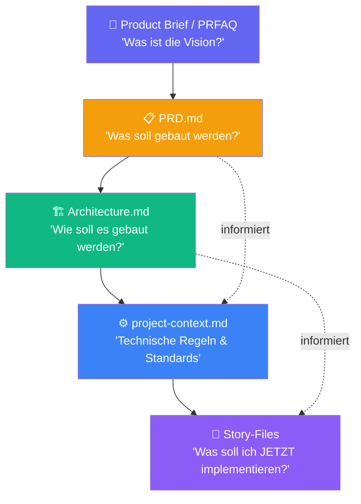

# Context Engineering

::intro::

Wie die effiziente Organisation von Projektwissen KI-Ergebnisse dramatisch verbessert

<!--
Context Engineering ist eines der wichtigsten Konzepte in der modernen KI-gestützten Entwicklung.
"Garbage in, garbage out" — aber für KI: "Context in, quality out".

🎨 Image prompt: A satellite in orbit with glowing data streams connecting to Earth below, representing organized information flow and context management. Digital art, dark space background with blue energy connections, similar to /bmad-context-satellite.png.
-->

---
layout: image-right
background: /bmad-dev-ideas-to-tests.png
hideInToc: true
showCopyright: false
---

# Was ist Context Engineering?

<br/>

<v-clicks>

- KI-Agenten sind nur so gut wie ihr **Kontext**
- Context Engineering = systematischer Aufbau von **relevantem Wissen**
- Ziel: Jeder Agent hat genau die **Informationen**, die er braucht
- Keine Wiederholungen, keine Widersprüche, keine Lücken
- **Progressive Context** — jede Phase baut auf der vorherigen auf

</v-clicks>

<v-click>

> 💡 **"Context is the new prompt engineering"** — mit Struktur statt Trick

</v-click>

<!--
Früher: Prompt Engineering — wie stelle ich die Frage damit die KI antwortet?
Heute: Context Engineering — welches Wissen hat die KI zur Verfügung?

BMad löst dieses Problem durch strukturierte Dokumente, die von Phase zu Phase weitergegeben werden.

🎨 Image prompt: A developer surrounded by organized code modules and documentation blocks flowing into an AI brain, representing structured context engineering. Digital art with glowing connections.
-->

---
hideInToc: true
background: /bmad-context-hierarchy.png
showCopyright: false
---

## Context-Hierarchie in BMad



<!--
Die Context-Hierarchie: Jedes Dokument baut auf dem vorherigen auf.
Ein Dev-Agent, der eine Story implementiert, hat Zugriff auf:
- Die technischen Regeln aus project-context.md
- Die Architektur-Entscheidungen aus architecture.md
- Die Business-Anforderungen aus dem PRD (via Story-File)

Das verhindert inkonsistente Entscheidungen zwischen verschiedenen Agenten/Sessions.

🎨 Image prompt: Not needed — mermaid diagram slide.
-->

---
layout: image-right
background: /bmad-governance-control-center.png
hideInToc: true
showCopyright: false
---

# project-context.md: Das Gehirn des Projekts

<br/>
<br/>

<v-clicks>

- **Technologie-Stack** — welche Sprachen, Frameworks, Libraries?
- **Coding Standards** — Naming Conventions, Patterns, Code Style
- **Sicherheits-Regeln** — was ist erlaubt/verboten?
- **Architektur-Constraints** — welche Muster müssen eingehalten werden?
- **Test-Standards** — Welcher Test-Level, welche Coverage-Ziele?

</v-clicks>

<v-click>

```bash
# Automatisch generieren aus bestehender Codebase:
bmad-generate-project-context
```

</v-click>

<!--
project-context.md ist optional, aber sehr wertvoll.
Es kann manuell erstellt oder automatisch aus der Codebase generiert werden.

Typischer Inhalt: "Wir verwenden TypeScript strict mode, keine any-Types, 
Jest für Tests mit mindestens 80% Coverage, React Query für API-Calls."

Jeder Agent, der Code schreibt, hält sich automatisch an diese Regeln.

🎨 Image prompt: A control center with multiple screens showing governance rules, compliance checks, and policy enforcement for a software project. Digital art, professional corporate style.
-->

---
layout: cover-dark
background: /bmad-security-shields.png
hideInToc: true
showCopyright: false
---

# 🎬 Demo 2: Context Engineering in der Praxis

<v-click>

```bash
# Project Context generieren
bmad-generate-project-context

# Inhalt prüfen: _bmad-output/project-context.md
# Zeigt automatisch erkannte:
# → Technologie-Stack
# → Architektur-Pattern  
# → Existierende Test-Strategien
```

</v-click>

<!--
DEMO 2: Context Engineering live zeigen.

Schritte:
1. Existierendes Projekt öffnen (z.B. das Auth-System aus Demo 1)
2. "bmad-generate-project-context" ausführen
3. Die generierte project-context.md zeigen und erklären
4. Eine zweite Agent-Session öffnen — zeigen dass der Kontext übertragen wird
5. Der neue Agent "kennt" die Regeln aus project-context.md automatisch

Zeige besonders:
- Wie Regeln automatisch aus bestehendem Code extrahiert werden
- Wie das PRD + Architecture in den Kontext einfließt
- Wie dadurch konsistente Code-Generierung möglich wird

Backup: Vorbereitetes project-context.md-Beispiel zeigen.

🎨 Image prompt: Multiple security shields forming a protective layer around project documents, representing governance and consistency enforcement. Digital art, blue and silver tones.
-->

---
layout: image-left
background: /bmad-collaboration-requirements.png
hideInToc: true
showCopyright: false
---

# Epics & Stories: Kontextualisierte Arbeitspakete

<br/>

<v-clicks>

- **Epic** = größeres Feature (z.B. "User Authentication")
- **Story** = implementierbares Arbeitspaket mit:
  - 🎯 **Akzeptanzkriterien** aus dem PRD
  - 🏗️ **Technische Constraints** aus Architecture.md
  - ⚙️ **Coding Standards** aus project-context.md
  - 🧪 **Test-Anforderungen** aus TEA *(kommt gleich!)*

</v-clicks>

<v-click>

```bash
bmad-create-epics-and-stories  # PRD + Architecture → Epics
bmad-create-story               # Epic → konkretes Story-File
```

</v-click>

<!--
Der Vorteil von Story-Files: Jede Story enthält genug Kontext für einen Dev-Agenten.
Keine langen Gespräche um den Kontext zu etablieren — alles ist bereits dokumentiert.

Stories entstehen aus PRD + Architecture — also mit vollständigem Business- und Tech-Kontext.

🎨 Image prompt: A developer reading a structured story card with clear requirements and acceptance criteria glowing on a tablet screen. Digital art, warm lighting, professional software development environment.
-->
