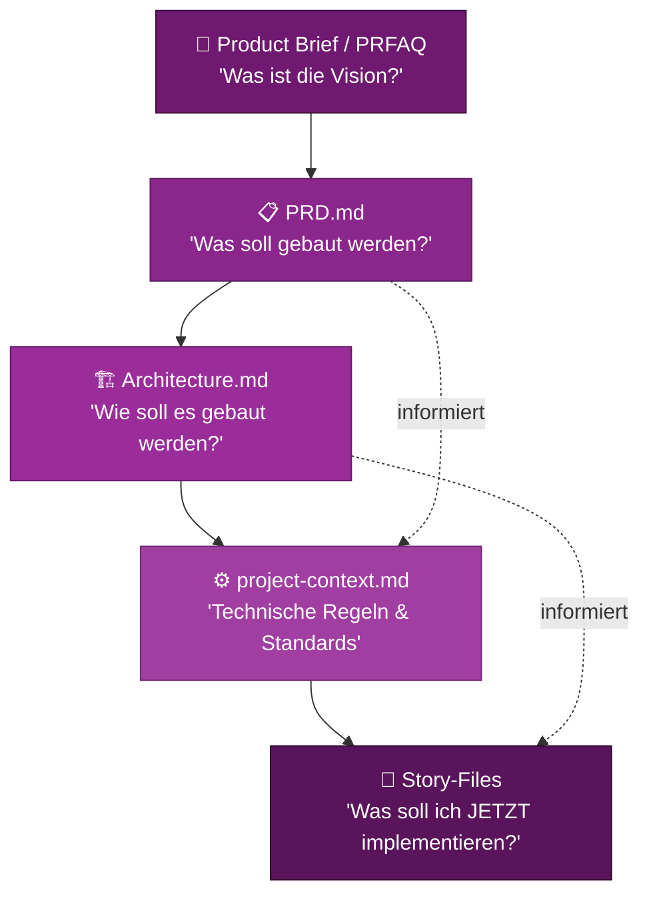

# Context Engineering

::intro::

Wie die effiziente Organisation von Projektwissen KI-Ergebnisse dramatisch verbessert

<!--
- Context Engineering als Schlüsselkonzept
- Leitgedanke: Context in, quality out

-->

---
layout: image-right
background: /bmad-dev-ideas-to-tests.png
hideInToc: true

---

# Was ist Context Engineering?

<br/>

<v-clicks>

- KI-Agenten sind nur so gut wie ihr **Kontext**
- Context Engineering = systematischer Aufbau von **relevantem Wissen**
- Ziel: Jeder Agent hat genau die **Informationen**, die er braucht
- Keine Wiederholungen, keine Widersprüche, keine Lücken
- **Progressive Context** — jede Phase baut auf der vorherigen auf

</v-clicks>

<v-click>

> 💡 **"Context is the new prompt engineering"** — mit Struktur statt Trick <br/>
(Harness Context)

</v-click>

<!--
- Früher: Prompt-Formulierung im Fokus
- Heute: Wissensbasis im Fokus
- BMad-Lösung: strukturierte Dokumente über Phasen hinweg

-->

---
hideInToc: true
layout: image-right
background: /bmad-context-hierarchy.png

---

## Context-Hierarchie in BMad



<!--
- Context-Hierarchie: Dokumente bauen aufeinander auf
- Dev-Agent-Kontext:
- Technische Regeln aus project-context.md
- Architekturentscheidungen aus architecture.md
- Business-Anforderungen aus PRD via Story-File
- Effekt: konsistente Entscheidungen über Agenten/Sessions

-->

---
layout: image-right
background: /bmad-project-context-agent-brain.png
hideInToc: true

---

# project-context.md: Das Gehirn des Projekts

<br/>
<br/>

<v-clicks>

- **Technologie-Stack** — welche Sprachen, Frameworks, Libraries?
- **Coding Standards** — Naming Conventions, Patterns, Code Style
- **Sicherheits-Regeln** — was ist erlaubt/verboten?
- **Architektur-Constraints** — welche Muster müssen eingehalten werden?
- **Test-Standards** — Welcher Test-Level, welche Coverage-Ziele?

</v-clicks>

<v-click>

```bash
# Automatisch generieren aus bestehender Codebase:
bmad-generate-project-context
```

</v-click>

<!--
- project-context.md: optional, hoher Hebel
- Erstellung: manuell oder automatisch aus Codebase
- Typische Inhalte: Stack, Regeln, Teststandards
- Beispiel: TS strict, keine any-Types, Jest >= 80%, React Query
- Effekt: einheitliche Regelbefolgung durch alle Agenten

-->

---
layout: image-right
background: /bmad-security-shields.png
hideInToc: true

isDark: true
---

# 🎬 Demo 2: Context Engineering in der Praxis

<br/>
<br/>

<v-click>

```bash
# Project Context generieren
bmad-generate-project-context

# Inhalt prüfen: _bmad-output/project-context.md
# Zeigt automatisch erkannte:
# → Technologie-Stack
# → Architektur-Pattern  
# → Existierende Test-Strategien
```

</v-click>

<!--
- Demo 2: Context Engineering live
- Projektbasis: bestehendes Auth-System
- Befehl: bmad-generate-project-context
- Output: project-context.md zeigen und einordnen
- Zweite Agent-Session: Kontextübernahme demonstrieren
- Highlight: Regel-Extraktion aus bestehendem Code
- Highlight: PRD + Architecture fließen in Kontext
- Highlight: konsistente Code-Generierung
- Fallback: vorbereitetes project-context.md

-->

---
layout: image-left
background: /bmad-collaboration-requirements.png
hideInToc: true

---

# Epics & Stories: Kontextualisierte Arbeitspakete

<br/>

<v-clicks>

- **Epic** = größeres Feature (z.B. "User Authentication")
- **Story** = implementierbares Arbeitspaket mit:
  - 🎯 **Akzeptanzkriterien** aus dem PRD
  - 🏗️ **Technische Constraints** aus Architecture.md
  - ⚙️ **Coding Standards** aus project-context.md
  - 🧪 **Test-Anforderungen** aus TEA *(kommt gleich!)*

</v-clicks>

<v-click>

```bash
bmad-create-epics-and-stories  # PRD + Architecture → Epics
bmad-create-story               # Epic → konkretes Story-File
```

</v-click>

<!--
- Story-Files: genug Kontext pro Arbeitspaket
- Weniger Abstimmungsaufwand vor Implementierung
- Kontext bereits dokumentiert
- Herkunft: PRD + Architecture
- Ergebnis: vollständiger Business- und Tech-Kontext

-->
