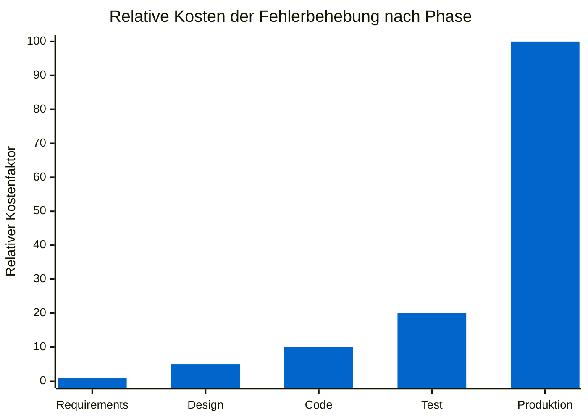

# Das Problem: Vage Anforderungen & lückenhafte Tests

::intro::

 
 

Warum scheitern Softwareprojekte – und was kostet uns das wirklich?

<!--
Einstieg in den ersten Hauptteil. Starte mit einer provokanten Frage ans Publikum:
"Wie viele von euch haben schon ein Projekt erlebt, das wegen unklarer Anforderungen in Schieflage geraten ist?"

🎨 Image prompt: A burning airplane symbolizing a failed software project, dramatic light, dark stormy sky. Cinematic digital art style similar to /bmad-project-failure-aircraft.png.
-->

---
layout: image-right
background: /bmad-technical-debt-mountain.png
hideInToc: true
showCopyright: false
---

# Die teuersten Anforderungsfehler

<v-clicks>

- 📋 **Vage Akzeptanzkriterien** — niemand weiß, wann "fertig" wirklich fertig ist
- 🔄 **Spät entdeckte Logikfehler** — Bugs, die erst in Produktion auftauchen
- 🗣️ **Missverstandene Business-Anforderungen** — Dev baut was anderes als Business will
- 🧩 **Fehlende Edge Cases** — Sonderfälle werden erst beim Kunden entdeckt
- 🧪 **Lückenhafte Tests** — keine Abdeckung der kritischen Pfade

</v-clicks>

<!--
Das Chaos Model von Standish Group: Nur 35% der Softwareprojekte werden erfolgreich abgeschlossen.
Hauptgrund Nummer 1: unklare Anforderungen.

IBM-Studie: Ein Bug, der in der Requirements-Phase entdeckt wird, kostet 1x.
Derselbe Bug in der Design-Phase: 5x. Produktion: 100x.

🎨 Image prompt: A giant technical debt mountain with developers struggling to climb. Metaphorical illustration showing a mountain of messy code and sticky notes, dark humorous style similar to /bmad-technical-debt-mountain.png.
-->

---
layout: two-column
hideInToc: true
showCopyright: false
---

::left::

## Kosten von Anforderungsfehlern

<v-click>

> 💡 **IBM-Studie**: Ein in der Anforderungsphase entdeckter Fehler kostet **100× weniger** als einer in Produktion.

</v-click>

::right::

 

    

<!--
Dieses Diagramm aus der IBM-Studie "Minimizing Code Defects to Improve Software Quality and Lower Development Costs" (2008) zeigt den exponentiellen Anstieg der Fehlerkosten je später sie entdeckt werden.

Punkt: Wir müssen Fehler früher finden — idealerweise bevor eine einzige Zeile Code geschrieben wird.

🎨 Image prompt: Not needed — mermaid diagram slide.
-->

---
layout: image-left
background: /bmad-requirement-test-gap.png
hideInToc: true
showCopyright: false
---

# Die Anforderungs-Test-Lücke

<v-clicks>

## Business schreibt:
> *"Das System soll Benutzer authentifizieren können."*

## Developer baut:
> Username + Password Login

## Tester testet:
> Happy Path funktioniert ✅

## Produktion zeigt:
> Kein MFA, kein Rate Limiting, kein Account Lockout 💥

</v-clicks>

<!--
Ein klassisches Beispiel für die Lücke zwischen Business-Intention und technischer Implementierung.
Das Problem: Jede Ebene interpretiert die Anforderung nach eigenem Verständnis.

Die Lösung: Strukturierte Anforderungsanalyse, die alle Stakeholder einbezieht und Edge Cases explizit macht.

🎨 Image prompt: A broken chain between business people on one side and developers on the other, with test failures visible in the gap. Digital art style, red and grey tones representing failure and disconnection.
-->

---
layout: two-column
hideInToc: true
showCopyright: false
---

# Was wäre, wenn KI helfen könnte?

::left::

## Heute ❌

<v-clicks>

- Manuelle Anforderungsanalyse
- Stunden in Meetings
- Inkonsistente Dokumentation
- Tests erst nach dem Code
- Logikfehler in Produktion

</v-clicks>

::right::

<v-click>

## Mit BMad ✅

</v-click>

<v-clicks>

- **KI-gestützte** Anforderungspräzisierung
- **Strukturierte** Agenten-Workflows
- **Living Documentation** durch PRD
- **Tests aus Specs** automatisch generiert
- **Frühzeitige** Fehlererkennung

</v-clicks>

<!--
Die Brücke zum Hauptthema: BMad bietet einen strukturierten Rahmen, um KI methodisch einzusetzen.
Nicht KI als Zauberstab, sondern KI als methodischer Kollaborateur.

🎨 Image prompt: Split image showing chaos vs. order — left side messy whiteboard with sticky notes and frustrated team, right side clean structured workflow diagram with AI assistant. Digital art style.
-->
