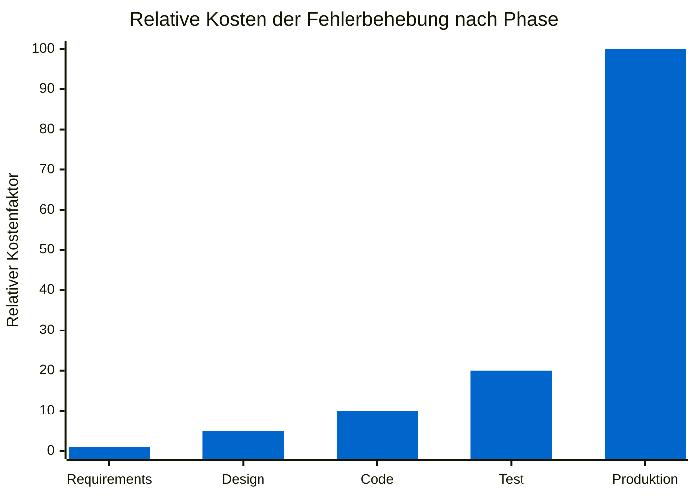

# Das Problem: Vage Anforderungen & lückenhafte Tests

::intro::

 
 

Warum scheitern Softwareprojekte – und was kostet uns das wirklich?

<!--
- Einstieg in Hauptteil 1
- Publikumsfrage: Projekt-Schieflage durch unklare Anforderungen?

-->

---
layout: image-right
background: /bmad-technical-debt-mountain.png
hideInToc: true
showCopyright: false
---

# Die teuersten Anforderungsfehler

<v-clicks>

- 📋 **Vage Akzeptanzkriterien** — niemand weiß, wann "fertig" wirklich fertig ist
- 🔄 **Spät entdeckte Logikfehler** — Bugs, die erst in Produktion auftauchen
- 🗣️ **Missverstandene Business-Anforderungen** — Dev baut was anderes als Business will
- 🧩 **Fehlende Edge Cases** — Sonderfälle werden erst beim Kunden entdeckt
- 🧪 **Lückenhafte Tests** — keine Abdeckung der kritischen Pfade

</v-clicks>

<!--
- Standish Chaos: nur 35% erfolgreich
- Hauptursache: unklare Anforderungen
- IBM-Kostenkurve: Requirements 1x, Design 5x, Produktion 100x

-->

---
layout: two-column
hideInToc: true
showCopyright: false
---

::left::

## Kosten von Anforderungsfehlern

<v-click>

> 💡 **IBM-Studie**: Ein in der Anforderungsphase entdeckter Fehler kostet **100× weniger** als einer in Produktion.

</v-click>

::right::

 

    

<!--
- Diagrammquelle: IBM-Studie 2008
- Kernaussage: exponentieller Kostenanstieg bei später Fehlerfindung
- Takeaway: Fehler vor dem Coding finden

-->

---
layout: image-left
background: /bmad-requirement-test-gap.png
hideInToc: true
showCopyright: false
---

# Die Anforderungs-Test-Lücke

<v-clicks>

## Business schreibt:
> *"Das System soll Benutzer authentifizieren können."*

## Developer baut:
> Username + Password Login

## Tester testet:
> Happy Path funktioniert ✅

## Produktion zeigt:
> Kein MFA, kein Rate Limiting, kein Account Lockout 💥

</v-clicks>

<!--
- Klassische Business-zu-Implementierung-Lücke
- Problem: unterschiedliche Interpretation je Rolle
- Lösung: strukturierte Analyse, Stakeholder einbeziehen, Edge Cases explizit

-->

---
layout: two-column
hideInToc: true
showCopyright: false
---

# Was wäre, wenn KI helfen könnte?

::left::

## Heute ❌

<v-clicks>

- Manuelle Anforderungsanalyse
- Stunden in Meetings
- Inkonsistente Dokumentation
- Tests erst nach dem Code
- Logikfehler in Produktion

</v-clicks>

::right::

<v-click>

## Mit KI ✅

</v-click>

<v-clicks>

- **KI-gestützte** Anforderungspräzisierung
- **Strukturierte** Agenten-Workflows
- **Living Documentation** durch PRD
- **Tests aus Specs** automatisch generiert
- **Frühzeitige** Fehlererkennung

</v-clicks>

<!--
- Brücke zum Hauptthema: methodischer KI-Einsatz mit BMad
- Positionierung: kein Zauberstab, sondern Kollaborateur

-->
