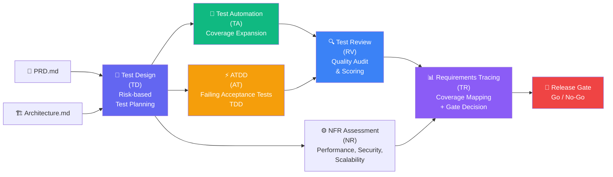
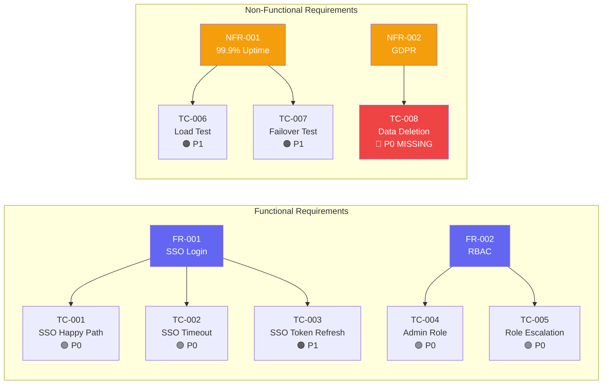

# Test Architect (TEA): Automatisierte Testfallentwicklung

::intro::

<br/>
<br/>

Vom PRD zur validierten Test-Suite — risikobasiert, automatisiert, auditierbar

<!--
Kapitel 5: Das Herzstück des Talks — der Test Architect (TEA).
"Was wäre, wenn eure Test-Suite direkt aus den Spezifikationen entstehen würde?"

🎨 Image prompt: A sophisticated diagnostic dashboard showing test coverage maps, risk matrices, and automated test pipelines. Digital art, dark background with green and blue metrics, similar to /bmad-tea-diagnostics.png.
-->

---
layout: image-right
background: /bmad-governance-control-center.png
hideInToc: true
showCopyright: false
---

# Was ist der Test Architect (TEA)?

<br/>

<v-clicks>

- **TEA** = Test Engineering Architect — BMad-Modul für Testing
- 9 spezialisierte **Workflows** für den kompletten Test-Lifecycle
- **Risk-based Testing** — P0-P3 Priorisierung (Wahrscheinlichkeit × Impact)
- **Release Gates** — evidenzbasierte Go/No-Go-Entscheidungen
- Integration mit dem **PRD** und **Architecture.md**
- Traceability: Jeder Test ist auf eine Anforderung zurückführbar

</v-clicks>

<!--
TEA ist ein eigenständiges BMad-Modul, das auf dem Core-Framework aufbaut.
Es nutzt den Context aus PRD und Architecture, um Tests abzuleiten.

Installation: npx bmad-method install → "Test Architect (TEA)" auswählen

🎨 Image prompt: A meticulous test architect reviewing blueprints of test suites, with risk matrices and coverage charts visible. Digital art, professional engineering environment style.
-->

---
hideInToc: true
showCopyright: false
---

# TEA Workflow-Übersicht

<br/>
<br/>



<!--
Der TEA-Workflow: Vom PRD über Test Design, ATDD und Automation bis zum Release Gate.
Jeder Schritt produziert auditierbare Artefakte.

Besonders wichtig: Requirements Tracing — jeder Test zeigt, welche Anforderung er abdeckt.
Das Release Gate ist evidenzbasiert: "Sind alle P0-Tests grün? Ist Coverage-Ziel erreicht?"

🎨 Image prompt: Not needed — mermaid diagram slide.
-->

---
layout: image-left
background: /bmad-risk-lock.png
hideInToc: true
showCopyright: false
---

# Risk-based Testing: P0-P3 Priorisierung

<br/>
<br/>

| Priorität | Kriterien | Beispiel |
|-----------|-----------|---------|
| **P0 🔴** | System-kritisch, Datenverlust | Auth, Payment |
| **P1 🟠** | Hoher Business-Impact | Checkout, Reports |
| **P2 🟡** | Medium Impact | E-Mail Notifications |
| **P3 🟢** | Niedrig, Nice-to-have | UI Farben, Tooltips |

<v-click>

> 💡 Formel: **Priorität = Wahrscheinlichkeit × Impact**

</v-click>

<!--
Risk-based Testing ist keine neue Idee — aber TEA macht sie systematisch und KI-gestützt.
Der TEA-Agent analysiert PRD und Architecture und weist automatisch Risikoprioritäten zu.

P0-Tests müssen immer 100% grün sein — das ist das Release Gate.
P1-Tests haben 95%+ Abdeckung als Ziel.
P2-P3 nach verfügbaren Ressourcen.

🎨 Image prompt: A security lock on a vault representing high-priority P0 tests that must always pass. Dark, serious digital art with red danger indicators, similar to /bmad-risk-lock.png.
-->

---
layout: image-right
background: /bmad-agent-fleet.png
hideInToc: true
showCopyright: false
---

# ATDD: Tests vor dem Code

<br/>

<v-clicks>

- **ATDD** = Acceptance Test-Driven Development
- TEA generiert **failing Acceptance Tests** aus PRD-Anforderungen
- Tests dokumentieren die **erwartete Verhaltensweise**
- Erst wenn Tests **grün** sind → Anforderung erfüllt
- Verhindert: "Works on my machine" Syndrome

</v-clicks>

<v-click>

```gherkin
Feature: User Authentication
  Scenario: Successful SSO Login
    Given a user with valid enterprise credentials
    When they click "Login with SSO"
    Then they are authenticated within 2 seconds
    And their role is set based on RBAC mapping
```

</v-click>

<!--
ATDD ist der Schlüssel zur Anforderungs-Test-Brücke.
TEA generiert Gherkin-Szenarien direkt aus den Akzeptanzkriterien im PRD.

Der Entwickler implementiert Code, bis diese Tests grün sind.
Die Tests sind die lebende Spezifikation — immer aktuell, immer ausführbar.

🎨 Image prompt: A robot reading a test specification document and translating it into automated test code, representing ATDD automation. Futuristic digital art, warm tones.
-->

---
layout: cover-dark
background: /bmad-human-ai-copilot.png
hideInToc: true
showCopyright: false
isDark: true
---

# 🎬 Demo 3: TEA Test Design Workflow

<v-click>

```bash
# TEA Agent laden
bmad-tea

# Test Design aus PRD starten  
test-design

# ATDD: Failing Acceptance Tests generieren
bmad-atdd

# Requirements Tracing: Abdeckung prüfen
bmad-trace
```

</v-click>

<!--
DEMO 3: TEA in Aktion zeigen.

Schritte:
1. Das PRD aus Demo 1 (Auth-System) als Basis nehmen
2. "bmad-tea" eingeben um den TEA Agent zu aktivieren
3. "test-design" starten — zeigen wie TEA die Anforderungen analysiert
4. Risk Matrix wird generiert: P0 = Auth-Flow, P1 = SSO, P2 = Audit Logs
5. "bmad-atdd" starten — failing Acceptance Tests werden generiert
6. Gherkin-Szenarien zeigen und erklären
7. "bmad-trace" für Requirements Tracing

Highlight: 
- Zeige wie jeder Test auf eine FR/NFR-Anforderung verweist
- Zeige die Coverage-Map: Welche Anforderungen sind noch nicht getestet?
- Zeige das Release Gate: "P0 nicht abgedeckt → kein Release"

Backup: Vorbereitete Test-Files als Fallback.

🎨 Image prompt: A pilot in the cockpit with AI co-pilot analyzing test results and flight data, representing TEA as the AI test co-pilot. Professional digital art, cockpit lighting, similar to /bmad-human-ai-copilot.png.
-->

---
hideInToc: true
showCopyright: false
---

# Requirements Tracing: Lückenlos



<v-click>

> ⚠️ **TC-008 fehlt** → Release Gate: NO-GO bis GDPR-Test implementiert

</v-click>

<!--
Dieses Diagramm zeigt Requirements Tracing in Aktion.
Jede Anforderung ist mit ihren Tests verknüpft.
Fehlende Tests sind sofort sichtbar — kein "wir haben schon genug Tests" ohne Evidenz.

Das Release Gate ist transparent: Alle P0-Tests müssen grün sein UND vollständig abgedeckt.

🎨 Image prompt: Not needed — mermaid diagram slide.
-->

---
layout: image-right
background: /bmad-governance-control-center.png
hideInToc: true
showCopyright: false
---

# NFR Assessment: Nicht-funktionale Anforderungen

<br/>
<br/>

<v-clicks>

- TEA testet auch **NFRs** systematisch
- **Performance**: Load Tests, Latenz-Messungen
- **Security**: OWASP-basierte Sicherheitstests
- **Scalability**: Lasttest-Szenarien
- **Reliability**: Chaos Engineering Tests
- **GDPR/Compliance**: Datenschutz-Validierung

</v-clicks>

<v-click>

```bash
# NFR Assessment starten:
bmad-nfr-assess
```

</v-click>

<!--
NFRs werden oft vergessen oder zu spät getestet.
TEA integriert NFR-Tests von Anfang an in die Test-Strategie.

Für das Auth-System aus unserem Beispiel:
- Performance: Login unter 500ms bei 10.000 gleichzeitigen Usern
- Security: SQL Injection, XSS, CSRF automatisch geprüft
- GDPR: Datenlöschung vollständig verifiziert

🎨 Image prompt: An evolution chart showing testing maturity from basic unit tests to comprehensive NFR testing. Digital art visualization of testing pyramid evolution.
-->
