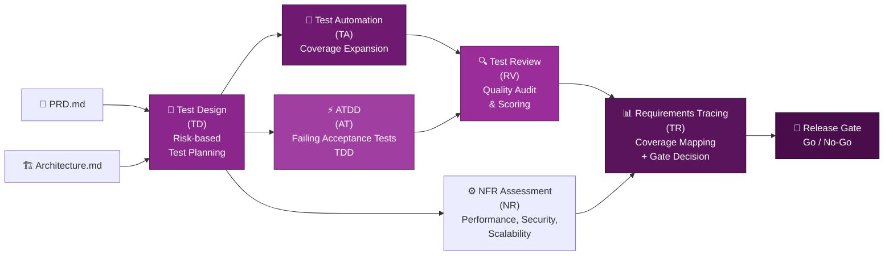
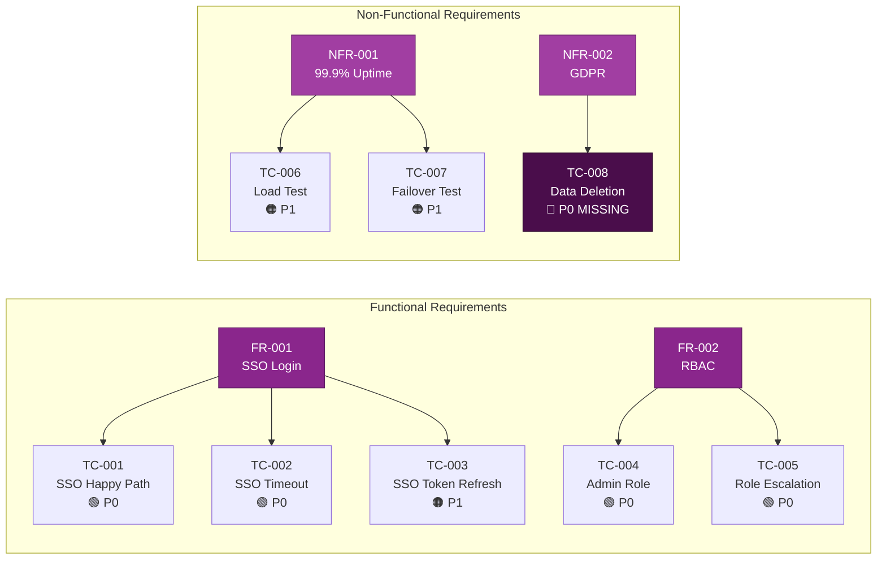

# Test Architect (TEA): Automatisierte Testfallentwicklung

::intro::

<br/>
<br/>

Vom PRD zur validierten Test-Suite — risikobasiert, automatisiert, auditierbar

<!--
- Kapitel 5: Herzstück des Talks (TEA)
- Leitfrage: Test-Suite direkt aus Spezifikationen?

-->

---
layout: image-right
background: /bmad-governance-control-center.png
hideInToc: true

---

# Was ist der Test Architect (TEA)?

<br/>

<v-clicks>

- **TEA** = Test Engineering Architect — BMad-Modul für Testing
- 9 spezialisierte **Workflows** für den kompletten Test-Lifecycle
- **Risk-based Testing** — P0-P3 Priorisierung (Wahrscheinlichkeit × Impact)
- **Release Gates** — evidenzbasierte Go/No-Go-Entscheidungen
- Integration mit dem **PRD** und **Architecture.md**
- Traceability: Jeder Test ist auf eine Anforderung zurückführbar

</v-clicks>

<!--
- TEA als eigenständiges BMad-Modul
- Basis: Core-Framework + Kontext aus PRD/Architecture
- Zweck: Testableitungen aus Spezifikation
- Installation: npx bmad-method install -> Test Architect (TEA)

-->

---
hideInToc: true

---

# TEA Workflow-Übersicht

<br/>
<br/>



<!--
- TEA-Flow: PRD -> Test Design -> ATDD -> Automation -> Gate
- Jeder Schritt mit auditierbaren Artefakten
- Requirements Tracing: Test zu Anforderung zuordenbar
- Release Gate: evidenzbasiert
- Gate-Fragen: P0 grün? Coverage-Ziel erreicht?

-->

---
layout: image-left
background: /bmad-risk-lock.png
hideInToc: true

---

# Risk-based Testing: P0-P3 Priorisierung

<br/>
<br/>

| Priorität | Kriterien | Beispiel |
|-----------|-----------|---------|
| **P0 🔴** | System-kritisch, Datenverlust | Auth, Payment |
| **P1 🟠** | Hoher Business-Impact | Checkout, Reports |
| **P2 🟡** | Medium Impact | E-Mail Notifications |
| **P3 🟢** | Niedrig, Nice-to-have | UI Farben, Tooltips |

<v-click>

> 💡 Formel: **Priorität = Wahrscheinlichkeit × Impact**

</v-click>

<!--
- Risk-based Testing: bekanntes Prinzip, systematisch mit TEA
- Analysebasis: PRD + Architecture
- Automatische Priorisierung durch TEA-Agent
- Gate-Regel: P0 immer 100% grün
- Zielwerte: P1 >= 95% Abdeckung
- P2/P3 abhängig von Ressourcen

-->

---
layout: image-right
background: /bmad-agent-fleet.png
hideInToc: true

---

# ATDD: Tests vor dem Code

<br/>

<v-clicks>

- **ATDD** = Acceptance Test-Driven Development
- TEA generiert **failing Acceptance Tests** aus PRD-Anforderungen
- Tests dokumentieren die **erwartete Verhaltensweise**
- Erst wenn Tests **grün** sind → Anforderung erfüllt
- Verhindert: "Works on my machine" Syndrome

</v-clicks>

<v-click>

```gherkin
Feature: User Authentication
  Scenario: Successful SSO Login
    Given a user with valid enterprise credentials
    When they click "Login with SSO"
    Then they are authenticated within 2 seconds
    And their role is set based on RBAC mapping
```

</v-click>

<!--
- ATDD als Brücke zwischen Anforderung und Test
- Gherkin-Szenarien aus PRD-Akzeptanzkriterien
- Umsetzung bis Tests grün
- Tests als lebende Spezifikation
- Immer aktuell, immer ausführbar

-->

---
layout: image-right
background: /bmad-human-ai-copilot.png
hideInToc: true

isDark: true
---

# 🎬 Demo 3: TEA Test Design Workflow

<br/>
<br/>

<v-click>

```bash
# TEA Agent laden
bmad-tea

# Test Design aus PRD starten  
test-design

# ATDD: Failing Acceptance Tests generieren
bmad-atdd

# Requirements Tracing: Abdeckung prüfen
bmad-testarch-trace
```

</v-click>

<!--
- Demo 3: TEA in Aktion
- Basis: PRD aus Demo 1 (Auth-System)
- Aktivierung: bmad-tea
- Schritt 1: test-design (Anforderungsanalyse)
- Schritt 2: Risk Matrix erzeugen (P0/P1/P2)
- Schritt 3: bmad-atdd (failing Acceptance Tests)
- Schritt 4: Gherkin-Szenarien zeigen
- Schritt 5: bmad-trace für Tracing
- Highlight: Test -> FR/NFR-Verknüpfung
- Highlight: Coverage-Map mit Lücken
- Highlight: Release Gate bei fehlender P0-Abdeckung
- Fallback: vorbereitete Test-Files

-->

---
layout: two-column
hideInToc: true

---


::left::



::right::

## Requirements Tracing: Lückenlos

<v-click>

> ⚠️ **TC-008 fehlt** → Release Gate: NO-GO bis GDPR-Test implementiert

</v-click>

<!--
- Requirements Tracing in Aktion
- Jede Anforderung mit Tests verknüpft
- Lücken sofort sichtbar
- Keine "genug Tests"-Diskussion ohne Evidenz
- Transparentes Gate: P0 grün und vollständig abgedeckt

-->

---
layout: image-right
background: /bmad-governance-control-center.png
hideInToc: true

---

# NFR Assessment: Nicht-funktionale Anforderungen

<br/>
<br/>

<v-clicks>

- TEA testet auch **NFRs** systematisch
- **Performance**: Load Tests, Latenz-Messungen
- **Security**: OWASP-basierte Sicherheitstests
- **Scalability**: Lasttest-Szenarien
- **Reliability**: Chaos Engineering Tests
- **GDPR/Compliance**: Datenschutz-Validierung

</v-clicks>

<v-click>

```bash
# NFR Assessment starten:
bmad-testarch-nfr
```

</v-click>

<!--
- NFRs häufig unterpriorisiert
- TEA integriert NFR-Tests von Beginn an
- Beispiel Auth-System:
- Performance: Login < 500ms bei 10.000 gleichzeitigen Usern
- Security: SQLi, XSS, CSRF automatisch prüfen
- GDPR: Datenlöschung vollständig verifiziert

-->
