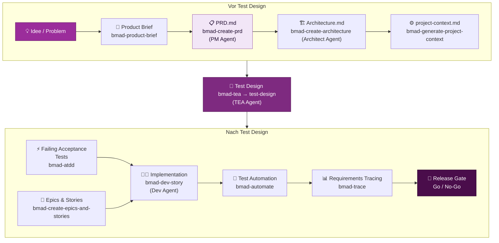

# Die Lücke schließen: Von Business-Logik zur validierten Testsuite

::intro::

 
 

BMad als Brücke zwischen Anforderung, Architektur und qualitätsgesichertem Code

<!--
- Abschlusskapitel: Zusammenspiel aller Bausteine

-->

---
hideInToc: true
showCopyright: false
---

## Der komplette BMad-Workflow

<!--
- Gesamtflow: Idee bis Release Gate
- Nachvollziehbare Schritte, auditierbare Artefakte
- Geeignet für Solo bis Enterprise

-->

---
layout: image-right
background: /bmad-human-ai-copilot.png
hideInToc: true
showCopyright: false
---

# Qualitätssteigerung in der Praxis

 

<v-clicks>

- 🔍 **Frühe Fehlererkennung** — Logikfehler in der Anforderungsphase
- 📋 **Vollständige Abdeckung** — kein Requirements ohne Test-Case
- 🚦 **Klare Release-Kriterien** — Go/No-Go auf Basis von Evidenz
- 📈 **Messbare Qualität** — Coverage, Risk-Level, Traceability
- 🔄 **Living Documentation** — Docs und Tests bleiben synchron

</v-clicks>

<v-click>

> 🎯 **Ziel**: Software, die tut was sie soll — nachweisbar und wiederholbar

</v-click>

<!--
- Qualitätsgewinne kompakt
- Community-Werte:
- 60-70% weniger spätere Requirement-Änderungen
- 50% schnellere PRD-Erstellung
- Nahezu 100% Requirement-zu-Test-Traceability

-->

---
layout: two-column
hideInToc: true
showCopyright: false
---

# Wann lohnt sich BMad?

::left::

## ✅ Ideal für

<v-clicks>

- Projekte mit **komplexen Business-Anforderungen**
- **Enterprise**-Umgebungen mit Compliance-Anforderungen
- Teams die **remote** oder **cross-functional** arbeiten
- Projekte wo **Auditierbarkeit** wichtig ist
- Wenn **KI-Coding-Tools** bereits im Einsatz sind

</v-clicks>

::right::

<v-click>

## ⚠️ Weniger geeignet

</v-click>

<v-clicks>

- Sehr kleine Projekte (< 1 Woche Scope)
- Schnelle Prototypen ohne langfristige Wartung
- Teams ohne KI-Tool-Integration
- Wenn kein Struktur-Investment möglich ist

</v-clicks>

<!--
- Ehrliche Einordnung: kein Silver Bullet
- Für kleine, kurzlebige Projekte oft zu viel Overhead
- Für produktive, wartbare Systeme klarer Mehrwert
- Einstieg: Quick Flow
- Skalierung: schrittweise zur vollen BMad Method

-->

---
layout: image-left
background: /bmad-ai-lightbulb.png
hideInToc: true
showCopyright: false
---

# Zusammenfassung

<v-clicks>

- 🎯 **Das Problem**: Vage Anforderungen kosten 100× mehr wenn spät entdeckt
- 🏗️ **BMad**: KI-gestütztes Framework mit spezialisierten Agenten
- 📋 **PRD**: Strukturierte Anforderungen durch PM-Agent-Dialog
- ⚙️ **Context Engineering**: Persistenter Kontext über alle Phasen
- 🧪 **TEA**: Tests direkt aus Spezifikationen, Risk-based, auditierbar
- 🚦 **Release Gate**: Evidenzbasierte Go/No-Go-Entscheidungen

</v-clicks>

<v-click>

> **"Die beste Zeit um Anforderungen zu präzisieren war gestern. Die zweitbeste Zeit ist jetzt."**

</v-click>

<!--
- Abschluss: alle Kernpunkte auf einem Slide
- Zitat als Merkanker (Baum-Pflanzen-Twist)
- Letzter Call-to-Action: bmad-method heute testen

-->
