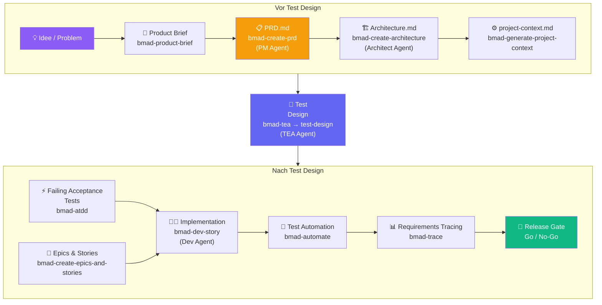

# Die Lücke schließen: Von Business-Logik zur validierten Testsuite

::intro::

<br/>
<br/>

BMad als Brücke zwischen Anforderung, Architektur und qualitätsgesichertem Code

<!--
Das Abschlusskapitel: Wie alle Teile zusammenpassen.

🎨 Image prompt: Two hands reaching toward each other across a gap, with documents on one side (business requirements) and test results on the other, bridged by AI energy. Digital art, inspiring composition.
-->

---
hideInToc: true
showCopyright: false
---

## Der komplette BMad-Workflow



<!--
Der vollständige Flow: Von der Idee zum Release Gate.
Jeder Schritt ist nachvollziehbar, jedes Artefakt ist auditierbar.

Dieser Flow funktioniert für Teams aller Größen — von Einzelentwicklern bis Enterprise-Teams.

🎨 Image prompt: Not needed — mermaid diagram slide.
-->

---
layout: image-right
background: /bmad-human-ai-copilot.png
hideInToc: true
showCopyright: false
---

# Qualitätssteigerung in der Praxis

<br/>

<v-clicks>

- 🔍 **Frühe Fehlererkennung** — Logikfehler in der Anforderungsphase
- 📋 **Vollständige Abdeckung** — kein Requirements ohne Test-Case
- 🚦 **Klare Release-Kriterien** — Go/No-Go auf Basis von Evidenz
- 📈 **Messbare Qualität** — Coverage, Risk-Level, Traceability
- 🔄 **Living Documentation** — Docs und Tests bleiben synchron

</v-clicks>

<v-click>

> 🎯 **Ziel**: Software, die tut was sie soll — nachweisbar und wiederholbar

</v-click>

<!--
Zusammenfassung der Qualitätsgewinne durch BMad.

Real-world Zahlen (aus BMad-Community):
- 60-70% weniger nachträgliche Requirement-Änderungen
- 50% schnellere PRD-Erstellung durch strukturierten PM-Agent-Workflow
- Nahezu 100% Requirement-zu-Test-Traceability

🎨 Image prompt: A confident pilot in cockpit with all systems showing green, representing software quality and readiness for flight (release). Professional digital art, cockpit environment.
-->

---
layout: two-column
hideInToc: true
showCopyright: false
---

# Wann lohnt sich BMad?

::left::

## ✅ Ideal für

<v-clicks>

- Projekte mit **komplexen Business-Anforderungen**
- **Enterprise**-Umgebungen mit Compliance-Anforderungen
- Teams die **remote** oder **cross-functional** arbeiten
- Projekte wo **Auditierbarkeit** wichtig ist
- Wenn **KI-Coding-Tools** bereits im Einsatz sind

</v-clicks>

::right::

<v-click>

## ⚠️ Weniger geeignet

</v-click>

<v-clicks>

- Sehr kleine Projekte (< 1 Woche Scope)
- Schnelle Prototypen ohne langfristige Wartung
- Teams ohne KI-Tool-Integration
- Wenn kein Struktur-Investment möglich ist

</v-clicks>

<!--
Ehrliche Einschätzung: BMad ist kein Silver Bullet.
Für kleine, kurzlebige Projekte ist der Overhead zu groß.
Für alles was in Produktion geht und gewartet wird: absolut empfehlenswert.

Einstieg: Beginne mit "Quick Flow" für kleine Features, skaliere dann zu BMad Method.

🎨 Image prompt: Not needed — text comparison slide.
-->

---
layout: image-right
background: /bmad-agent-fleet.png
hideInToc: true
showCopyright: false
---

# Erste Schritte mit BMad

<br/>

<v-clicks>

1. **Installieren**: `npx bmad-method install`
2. **Tutorial starten**: `bmad-help` für intelligente Führung
3. **Klein anfangen**: Quick Flow für das nächste kleine Feature
4. **TEA hinzufügen**: `npx bmad-method install` → TEA Modul
5. **Community**: Discord, GitHub, YouTube

</v-clicks>

<v-click>

```
🌐 docs.bmad-method.org
📦 npmjs.com/package/bmad-method  
```

</v-click>

<!--
Call-to-Action: Was können die Zuhörer heute noch tun?

BMad ist komplett kostenlos und Open Source.
Die Community ist aktiv und hilfreich.
Der Start mit npx bmad-method install dauert 5 Minuten.

🎨 Image prompt: A fleet of spaceships launching toward a bright horizon, representing teams starting their BMad journey. Inspiring digital art, warm sunrise colors, futuristic style similar to /bmad-agent-fleet.png.
-->

---
layout: image-left
background: /bmad-ai-lightbulb.png
hideInToc: true
showCopyright: false
---

# Zusammenfassung

<v-clicks>

- 🎯 **Das Problem**: Vage Anforderungen kosten 100× mehr wenn spät entdeckt
- 🏗️ **BMad**: KI-gestütztes Framework mit spezialisierten Agenten
- 📋 **PRD**: Strukturierte Anforderungen durch PM-Agent-Dialog
- ⚙️ **Context Engineering**: Persistenter Kontext über alle Phasen
- 🧪 **TEA**: Tests direkt aus Spezifikationen, Risk-based, auditierbar
- 🚦 **Release Gate**: Evidenzbasierte Go/No-Go-Entscheidungen

</v-clicks>

<v-click>

> **"Die beste Zeit um Anforderungen zu präzisieren war gestern. Die zweitbeste Zeit ist jetzt."**

</v-click>

<!--
Abschluss-Zusammenfassung. Alle Kernpunkte in einem Slide.

Zitat aufgreifen: Ein Twist auf das bekannte "Der beste Zeitpunkt um einen Baum zu pflanzen war vor 20 Jahren."

Noch einmal die Einladung: Heute noch bmad-method installieren und ausprobieren!

🎨 Image prompt: A glowing lightbulb transforming into a structured flowchart, representing the transformation from vague ideas to structured requirements. Digital art, warm inspiring tones similar to /bmad-ai-lightbulb.png.
-->
